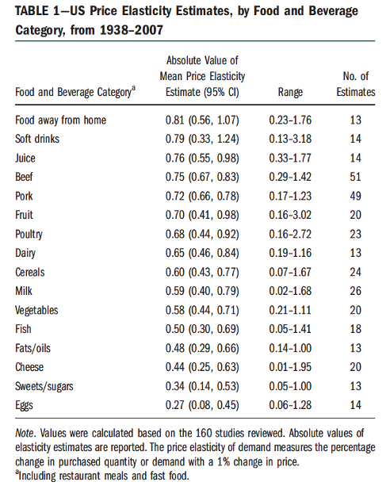

# Introduction to Economic Surplus {#surplus}

Practical cost-benefit analysis is widely used in applied economic analysis and often employs a definition of economic surplus that adds up consumer and producer surplus and potential external costs. This chapter discusses the behavioral assumptions underlying this calculation and show how to operationalize the definition of economic surplus to derive economic surplus changes and externality taxes. It employs a mathematical approach suitable applied to economic partial equilibrium analysis.

## Introduction 

### Background

This chapter introduces the classical economic perspective on economic surplus. Economic surplus is a quantitative estimate of the value that markets generate for society according to economists. Besides analysing the impacts of economic policies for societies (do policies have effects and do they work as intended?), one of the core tasks of economists is to give recommendations about what is supposed to be valuable for society (do policies add value?). 

Economic analyses of the value that markets generate also are important in debates about sustainability. What economists contribute to this debate is that they seek to analyse behavioural choices of consumers and producers using statistical techniques and mathematical modelling and that they come up with quantitative estimates of value. The contribution of this chapter is that we move from conceptual analysis of market figures to mathematical descriptions and connections to statistical measurement. We do so for partial equilibrium analysis, meaning that we focus on the analysis of a market for a single good (with multiple good, issues of substitution and complementarity comes into play).

Four conceptual pillars of economic analysis are important for applied economic analysis of surplus and this chapter aims to emphasize the structural relation between these pillars along the road:

i.	**Optimization**: market actors choose their best (feasible) option.
ii.	**Equilibrium**: market actors choose their best feasible option when interacting with others.
iii.	**Empiricism**: behavioural models need to be tested with data.
iv.	**Choice-based normativity**: choices express value of market actors and value of market actors is equal to value for society. 

The first core principle states that consumers and producers optimize when they make their choices. For consumers this implies it is assumed that they maximize their utility. A mathematical description of utility is captured by the direct utility function which maps consumption quantities and remaining money to some cardinal number. We will discuss the mathematical behavioural model underlying consumer optimization in Section \@ref(sec:conchoices) and discuss the implications for consumer value in markets. We also show at some points how this model of consumer behaviour relates to pillar (iii). 

For producers, pillar (i) implies that they minimize their costs given a production target when they are assumed to be price-takers. Section \@ref(sec:procbeh) discusses the basic cost-minimization model of producers and the implications for producer value in markets. 

The second core principle states that equilibrium in markets results from the behavioral choices and *interaction* of consumers and producers. Section \@ref(sec:econsurplus) of these lecture notes discuss partial equilibrium and implications for total economic value in markets. The discussion in these sections of the lecture notes is conceptually speaking rather basic as substitution to other markets is ignored. Some complexity is added by connecting equilibrium to the third pillar of empiricism. It is very important for you to understand the core concepts and assumptions and the calibration underlying a basic partial equilibrium model in order to understand the extensions that are provided in the weeks that follow. 

The third pillar is discussed along the way. Empirical analysis can be used to estimate the structural parameters of observed demand functions and production functions using regression techniques. These techniques relate mathematical narratives of choice behaviour to empirical data. The mathematical structure that is imposed sometimes requires that parameters in regression have particular values. Hypothesis testing can be used to see which model fits the data better. Calibration can be used to connect estimated elasticities from the literature to market demand and supply functions. Examples are provided to show how you can obtain quantitative estimates of total economic value.

Section \@ref(sec:extcosts) applies the model of market value and introduces the idea of external costs. This is a key concept in environmental economics and analyses of sustainability. From an economic perspective, external costs resulting from market trade lower the value of a market and can be a motivating factor for regulatory intervention of a government. For a classical economist a sustainable market is a market where external costs are correctly priced.  Section \@ref(sec:extcosts) discusses the regulation of an environmental externality in a market and thereby provides the necessary bridge between the economic theory and your bachelor program. Analytical examples are provided to show how you can obtain quantitative estimates of total economic value.

We will come back to the four pillars in the chapters that follow where we zoom in on the impact of bounded rationality and other views on normativity. 

## Consumer choices and consumer value {#sec:conchoices}

### Utility functions, inverse demand and demand

Why do consumers choose to consume particular meat products? What is the consumer value of newly developed vegan product? How does households' demand for solar panels respond to price decreases? To study these research questions, it is helpful to develop a model of consumer choice. For economists, models of choice are mathematical narratives about how consumers make their choices. The story of consumer choice by economists assumes that consumers optimize the choice value that they derive from the consumption of market goods given constraints they face. In this section the consumer story is partly simplified and we investigate the decision of the consumer to spend money on the market good versus spending money on other goods or services given a budget constraint. We therefore do not study market goods that are close complements or close substitutes. 

Value is mathematically conceptualized using a direct utility function that depends on the consumption levels. The direct utility function of the consumer is defined by $U(Q,G)$, where $Q$ is the demand for the market good and $G$ is the demand for the outside good. The price of the market good is given by $p$ and the price of the outside good is given by $p_G$. Both prices are given for the consumer and cannot be directly affected by their behaviour. This assumption rules out forms of bilateral bargaining about the market price between consumers and producers. 

The price for the outside good can be interpreted as the costs or price index for a basket of goods for the consumers, where the market good is excluded from this basket. When prices of products in the basket increase over time, this will impact the price of the outside good.

Net spendable income of the consumer is assumed to be exogenous and given by $Y$. This income is after tax income and can be used freely by the consumer. Total spending of the consumer is given by $pQ+p_G G$, because it is assumed that all net income is spent either on the market good or the outside good. The budget constraint of the individual is then given by:
\begin{equation}
Y - pQ - p_G G = 0.
(\#eq:budgetconstraint)
\end{equation}
From this budget constraint we can derive the consumed quantity of the outside good $G$:

\begin{equation}
G = \frac{Y-pQ}{p_G}
(\#eq:outsidegood)
\end{equation}

The quantity consumed of the outside good increases in the income level $Y$, decreases in the price of the basket of goods $p_G$, and decreases in consumer spending $pQ$ on the market good. Substituting this quantity in the direct utility gives us an expression that only has the quantity level of the market good as a choice variable: 

\begin{equation}
U \left(Q, \frac{Y-pQ}{p_G} \right) 
\end{equation}

The optimal choice of the quantity of the market good is governed by the utility of consumption (first argument) and the disutility of spending money on the market good (second argument). Optimal consumption can be derived by setting the total derivative with respect to the market quantity to 0:

\begin{equation}
\frac{dU}{dQ} = U_Q - \frac{p}{p_G}U_G = 0
\end{equation}

Here, $U_Q=\frac{\partial U}{\partial Q}$ is the marginal utility of consuming the market good. Here we use the notation $\frac{dU}{dQ}$ for the total derivative (both arguments of the utility function), and the notation $\frac{\partial U}{\partial Q}$ for the partial derivative with respect to $Q$ (only the first argument). Marginal utility of consumption is the slope of the direct utility function with respect to the first argument $Q$. Furthermore, $U_G=\frac{\partial U}{\partial G}$ is the marginal utility of consumption of the outside good. This is equal to the price of the outside good multiplied with the marginal utility of income $p_G \frac{\partial U}{\partial Y}$. The second part of the first-order condition therefore captures the disutility of paying a price $p$ for the market good. It also accounts for the relative price of the market good compared to the price for the basket of goods. From the first-order condition an implicit expression for the inverse demand curve can be derived. This expression shows that the ratio of prices is equal to the ratio of marginal utilities.

\begin{equation}
\frac{p}{p_G} = \frac{U_Q}{U_G} \longleftrightarrow p = p_G\frac{U_Q}{U_G}
\end{equation}

An implicit solution means that the price $p$ potentially appears at the right-hand side of the equation. This inverse demand curve is the maximum marginal willingness to pay (MWTP) for the good. It depends on the relative size of the marginal utilities and increases in the price of the basket of goods. For many practical purposes the price of the basket of goods is normalized to $p_G=1$ resulting in inverse demand as a function of the ratio of marginal utilities:

\begin{equation} 
p = \frac{U_Q}{U_G}
\end{equation}

The MWTP can be employed as a measure of consumer benefits. Much of the analytical work of demand analysists focusses on particular specifications that result in explicit solutions for the inverse demand curve. These explicit solutions have only exogenous parameters and quantity $Q$ at the right-hand side and can be analysed using empirical data.

### Examples of demand and inverse demand functions

To illustrate the model, we provide an example of three particular utility functions. First, we discuss a direct utility function without income effects and exponential marginal utility of consumption. Second, we discuss the well-known Cobb-Douglas utility function. This utility function captures non-linear impacts of net spendable income on direct utility. Third, we discuss a specification of the direct utility function that captures minimum threshold levels for consumption. Such a specification is particularly relevant for particular basic goods that a consumer cannot do without.

#### The exponential-linear utility function

Suppose direct utility is specified as:

\begin{equation}
U(Q,G) = \frac{A}{\alpha}\left( 1- e^{-\alpha Q} \right ) + BG
(\#eq:directutility)
\end{equation}

The marginal utility of consumption is given by the partial derivative with respect to the market good:

\begin{equation}
\frac{\partial U}{\partial Q} = Ae^{-\alpha Q} > 0.
\end{equation} 

This marginal utility is positive implying that direct utility increases when consumption of the market good increases. The marginal utility of the outside good is given by the partial derivative with respect to $G$:

\begin{equation}
\frac{\partial U}{\partial G} = B > 0.
\end{equation}

It is also positive implying more of the outside good is considered to be better. 

The direct utility is concave^[Remember, concave function have decreasing marginal returns such as in Figure \@ref(fig:marginalutility)] in the consumption of the market good and linear in the consumption of the outside good. This can be proved by investigating the second-order partial derivatives which are negative for consumption (first argument) and 0 for the outside good (second argument):

\begin{equation}
\frac{\partial^2 U}{\partial Q^2} = - \alpha Ae^{-\alpha Q} < 0, \qquad \frac{\partial^2 U}{\partial G^2} = 0.
\end{equation} 

The intuitive appeal of the assumption of concavity is that the additional utility gained from consuming an additional unit of the market good is decreasing in the consumption level. This implies that the *marginal utility* of consuming the market good is positive, but decreasing. For example, people might enjoy eating meat, but the additional enjoyment of meat consumption decreases in the consumption level. At some point meat saturation kicks in and marginal utility becomes (close to) 0. 

In line with pillar (i), the consumer is assumed to maximize utility while accounting for the budget constraint. From the budget constraint we can obtain the consumption level of the outside good: 

\begin{equation}
Y - pQ - G = 0 \longleftrightarrow G= Y - pQ.
\end{equation}

Substituting gives:

\begin{equation}
U(Q,G)=\frac{A}{\alpha}(1-e^{-\alpha Q})+B(Y - p Q).
\end{equation}

The first-order condition for utility maximisation is given by the total derivative of the direct utility function with respect to the market good:

\begin{equation}
\frac{dU}{dQ} = Ae^{\alpha Q} - pB.
(\#eq:foc)
\end{equation}

The first positive part is the marginal utility of consumption which is positive and the second negative part the marginal utility of payments for the market good. From the first-order condition one can solve for the inverse demand curve which expresses price $p$ as a function of quantity $Q$. Furthermore, one can also solve for the demand curve which expresses quantity as a function of the price. In order to have a unique solution we have to check the second-order total derivative:

\begin{equation}
\frac{dU^2}{dQ^2} = -\alpha Ae^{\alpha Q} < 0.
\end{equation}

This second-order total derivative is negative, implying that the optimum is a unique maximum. We start with solving for the inverse demand curve $p(Q)$^[Recall that an inverse demand curve is a function of $Q$ that determines $p$], which is given by:^[Recall that for an optimal utility, which is what we aim for, the condition $\frac{dU}{dQ} = 0$ should hold, so from \@ref(eq:foc) we then know that $Ae^{\alpha Q} = pB$ leading to \@ref(eq:optimalinversedemand)] 

\begin{equation}
p(Q)=\frac{A}{B} e^{-\alpha Q}.
(\#eq:optimalinversedemand)
\end{equation}

Now we have an explicit solution for the MWTP because the right-hand side of this equation only depends on $Q$ and exogenous utility parameters. At $Q=0$, the MWTP is highest and equal to $\frac{A}{B}$. For higher values of $Q$, the MWTP decreases which is in line with decreasing marginal benefits of consumption. The parameter $\alpha$ governs the steepness of this decrease. The higher the parameter $\alpha$ is, the steeper the decrease of the marginal benefits.

Using the first-order condition for utility maximisation \@ref(eq:foc), one can also derive the demand curve (again, by setting $\frac{dU}{dQ} = 0$ and then isolating $Q$): 

\begin{equation}
Q(p)=\frac{1}{\alpha}\ln(A) - \frac{1}{\alpha}\ln(p) - \frac{1}{\alpha}\ln(B)  
\end{equation}

This expression shows that demand for the market good:

1. Decreases in the price $p$ as $\frac{\partial Q}{\partial p} =-\frac{1}{\alpha}\frac{1}{p}<0$;
2. Increases in the utility parameter $A$ as $\frac{\partial Q}{\partial A} =\frac{1}{\alpha} \frac{1}{A} >0$;
3. Decreases in the utility parameter $B$ as $\frac{\partial Q}{\partial A} =-\frac{1}{\alpha} \frac{1}{B} <0$;
4. Decreases in the utility parameter $\alpha$ as $\frac{\partial Q}{\partial \alpha} =-\frac{1}{\alpha^2} \left( \ln(A) - \ln(p) - \ln (B) \right) <0$;

As this point it is useful to see how this analytical result can be connected to the third pillar: *empiricism*. The demand function can be empirically estimated using statistical techniques and data on quantities and prices. Suppose an empirical economist estimates the following linear-log regression:

\begin{equation}
Q = \beta_0 + \beta_1 \ln p + \epsilon.
(\#eq:empiricalinversedemand)
\end{equation}

From equation \@ref(eq:empiricalinversedemand) one can derive some of the utility parameters. The parameter  $\beta_1$ is expected to be negative as demand decreases in the price. The mathematical model suggests that this parameter should be equal to $\frac{1}{\alpha}$. We can therefore write $\alpha = -\frac{1}{\beta_1} > 0$. The constant parameter $\beta_0$ is---according to the behavioural model---equal to $\beta_0 = \frac{1}{\alpha}\ln(\frac{A}{B})$. We can therefore write $\ln \frac{A}{B} = \alpha \beta_0$ or $\frac{A}{B} = e^{\alpha \beta_0} = e^{-\frac{1}{\beta_1}\beta_0}$. 

The estimated parameters resulting from the regression equation therefore have a one-to-one correspondence to the underlying utility maximisation problem. An assumption that needs to be made is that the error $\epsilon$ in the regression equation is irrelevant for the analysis and captures particular measurement errors at the side of the researcher. If this is not the case, errors capture another part of the marginal utility and things become more complicated.^[An interesting question that gives a hint for solving this issue is: could you propose a direct utility function that deals with $\epsilon$ as a parameter of the direct utility function?] Dealing with unknown regression noise therefore already leads to interesting epistemological questions for applied economic research that we will assume away for now.

Furthermore, the behavioural model analyses individual choice behaviour and therefore the measurement of prices and demand should ideally be done at the individual level to stay close to the behavioural mathematical narrative that is developed.

#### The Cobb-Douglas utility function {#cobb-douglas}

One of the disadvantages of the introduced direct utility function of the previous section, is that the marginal utility of consumption of the outside good is assumed to be constant for each consumption level of the market good. The behavioural narrative therefore does not account for the plausible intuition that consumers with a lower income derive more utility from an income increase compared to consumers with a lower income (see for example @layard2008marginal). In order to account for this, we propose a Cobb-Douglas type utility function that captures decreasing marginal utility for the market good and the outside good and directly substitute the expression for the outside good:^[It is also possible to specify this utility function as: $U(Q,G)=Z Q^A G^B$. Log-linearizing gives the utility function used in the text and has no impact on the first-order condition. The constant $Z$ is irrelevant for the analysis of demand.]

\begin{equation}
U(Q,G) = A\ln(Q) + B\ln(G) = A \ln(Q) + B \ln (Y - p Q). 
\end{equation}

The first-order condition is now given by the following total derivative:

\begin{equation}
\frac{d U}{d Q} = \frac{A}{Q} - \frac{B p}{Y - p Q} = 0. 
(\#eq:cdfoc)
\end{equation}

Solving this first-order condition for the quantity level gives the following demand function:^[This solution is unique. You can check this by proving that the total second-order derivative is negative.]

\begin{equation}
Q(p) = \frac{A}{A + B}\frac{Y}{p}.
\end{equation}

The demand curve depends on the exogenous utility parameters $A$ and $B$, increases in the income level $Y$ and decreases in the price $p$. Higher income levels therefore result in higher demand for the market good. The consumer spends $p Q(p)=\frac{A}{A+B} Y$ on the market good. From the budget constraint we can work back the spending on the outside good which are equal to $Y-pQ=\frac{B}{A+B} Y$. This is an attractive aspect of the Cobb-Douglas specification: expenditure shares on the market good are directly related to relative utility parameters $\frac{A}{A+B}$. 

For empirical purposes, the demand curve can be estimated using econometric techniques. Log-linearizing the demand curve gives the following regression equation:

\begin{equation}
\ln Q = \ln(\frac{A}{A+B}) + \ln Y - \ln p + \epsilon.
\end{equation}

The Cobb-Douglas specification of utility therefore *requires* that the parameters for income and price in the demand function are $1$ and $-1$ respectively. This can be tested using statistical hypothesis testing. The inverse demand curve for this particular utility function is given by:

\begin{equation}
p(Q) = \frac{A}{A + B}\frac{Y}{Q}.
\end{equation}

A disadvantage of this specification from a behavioural perspective is that the MWTP for the first marginal unit of the good is infinite. This is because when $Q \longrightarrow 0$ then $p(Q) \longrightarrow \infty$. An advantage of this specification is that the MWTP for the market good is increasing in the net spendable income $Y$. For environmentally sustainable goods it is expected that this will be a plausible assumption.

#### A utility function that allows for minimum consumption tresholds 

We continue the discussion on demand models with a third example. It might be that individuals need to consume a minimum amount of particular basic goods such as food or energy. The Stone-Geary utility function is able to deal with this. Again, we use a log-linearized version of the utility function:

\begin{equation}
U(Q,G) = A \ln (Q - \underline{Q}) + B \ln (G - \underline{G}),
\end{equation}

In this equation $\underline{Q} <Y$ is the  minimum amount needed of the market good and $\underline{G}<Y$ the minimum amount needed for the outside good. This minimum amount of the outside good can be interpreted as consumer spending needed for basic goods which are not the market good. Utility goes to minus infinity when consumption is lower or equal to these minimum amounts. Substituting $G=Y-pQ$ from the budget constraint gives:

\begin{equation}
U(Q,G) = A \ln (Q - \underline{Q}) + B \ln (Y - p Q - \underline{G}),
\end{equation}

The first-order condition is given by the following total derivative:

\begin{equation}
\frac{d U }{d Q} = \frac{A}{Q - \underline{Q}} - \frac{B p}{Y - pQ - \underline{G}} = 0, 
\end{equation}
which can be written as:

\begin{equation}
bpQ - bp\underline{Q} = AY - ApQ - A\underline{G}. 
\end{equation}

Rearranging gives:
\begin{equation}
Qp(B+ A) = AY = Bp\underline{Q} - A\underline{G}.
\end{equation}

Solving for the demand gives:
\begin{equation}
Q(p) = \frac{A}{A+B}\frac{Y}{p} + \frac{B}{A+B}\underline{Q} - \frac{A}{A+B}\frac{1}{p}\underline{G}.
\end{equation}

The first term of the demand function is equal to the standard Cobb-Douglas demand derived in the previous section. The second term accounts for the threshold consumption of the market good. Market demand increases in the threshold demand $\underline{Q}$. The third term shows that market demand decreases in the threshold demand $\underline{G}$ as more money is needed to consume basic goods in the basket of outside goods. When the market good is not necessary and $\underline{Q} = 0$, market demand can be written as:

\begin{equation}
Q(p) = \frac{A}{A+B}\frac{Y}{p} - \frac{A}{A+B}\frac{1}{p}\underline{G} = \frac{A}{A+B}\frac{1}{p}\left(Y - \underline{G} \right).
\end{equation}

Log-linearizing this demand function gives the following regression equation:

\begin{equation}
\ln Q = \ln \frac{A}{A+B} + \ln(Y - \underline{G}) - \ln p + \epsilon.
\end{equation}

Demand is not linear in the log of the net spendable income anymore as first the necessary spending on the outside good should be accounted for. The price coefficient and the coefficient for $\ln (Y - \underline{G})$ still enter with a coefficient equal to $1$. For applied work this means that if the Stone-Geary model of behaviour is correct, one first should subtract spending on basic goods $\underline{G}$ from the net spendable income, and introduce the logged variable as an explanatory variable in the regression.

#### Demand modelling: conclusion

The take away of these three examples is that particular specifications of the direct utility function result in equations for individual demand curves that can be empirically operationalized and estimated making additional assumptions. Some specifications of the direct utility function are behaviourally more plausible whereas other specifications might be easier to operationalize using empirical data. This is the reason that economists prefer to have multiple modelling options in their toolbox. 

### Consumer benefits and surplus in markets

#### Market demand and elasticities

The behavioural models of the previous section can be viewed as models of individual choice behaviour. The demand and inverse demand functions are therefore in principal specified at the individual level. For the analysis of markets, these functions are aggregated into a market (inverse) demand function. This implies that when we analyse market quantities and prices in regression analysis, additional assumptions should be made to relate the results of these regressions to the underlying distribution of utility parameters in the population. Developing models that account for a correct mathematical aggregation to market demand curves often requires stringent assumptions on preferences.

Consider for example the Cobb-Douglas demand that is developed in section \@ref(cobb-douglas) and denote $Q_n (p)=\frac{A_n}{A_n+B_n} Y_n \frac{1}{p}$ as the individual demand. Assume we have a population of $N$ individuals. The market demand can be given as the sum of the individual demands:

\begin{equation}
Q^D(p) = \sum_{n= 1}^{N}\frac{A_n}{A_n+B_n} Y_n \frac{1}{p}=\frac{1}{p} \sum_{n= 1}^{N}\frac{A_n}{A_n+B_n} Y_n.
\end{equation}

Although aggregation is possible, it requires additional analytical assumption to be neatly done.

Because of complexity we avoid this aggregation discussion by neglecting the behavioural model underlying the decision of the population of consumers. We continue by directly interpreting the market inverse demand curve that is estimated in regressions as the total MWTP for the market good and assume the regression constant adjusts for aggregation issues. From now on we therefore use $p(Q)$ to denote the market inverse demand curve. This market inverse demand curve measures what the price of the market good would have to be for $Q$ units of it to be demanded (@varian2003intermediate, 2006, p.268).  Consumers can buy the good multiple times and are sorted *along* the inverse demand curve on the basis of their MWTP where the intuition for the derivation of the MWTP stems from the behavioural model that is developed.

The MWTPs estimated from regressions of market demand can then be interpreted as measures of consumer benefits. The total consumer benefits for the market good are in turn given by the sum of the benefits of all consumers who participate in the market. Besides looking at market data, one could also operationalise the intuition of MWTP using survey research. In a survey we could for example ask people to express their WTP for an additional unit of consumption and sort the WTPs to obtain the inverse demand function. For example, we could ask the following question:

>What would be your maximum willingness to pay for an additional unit of these vegan chicken nuggets?

The answers to these questions can serve as an input to derive the inverse demand curve and the demand curve.

For applied work we are often interested in the price elasticity of market demand. This is defined by:^[Note that the $\epsilon$ here is different from that what we normally use in regression equations.]

\begin{equation}
\epsilon = \frac{\partial Q^D}{\partial p} \frac{p}{Q^D(p)}.
\end{equation}

The definition of an elasticity is as follows: for a 1% increase in the market price, the market demand will change with $\epsilon$%. For many market goods, this elasticity will be negative as higher prices result in lower demand. When the elasticity is lower than $-1$, the market good has elastic demand. When the elasticity is in between 0 and $-1$, it has inelastic demand.

We illustrate the concept of price elasticity of demand using an example.  @brons2002price give an overview of price elasticities of demand for air travel. Figure \@ref(fig:brons) below is from their paper.

```{r fig.align='center', echo=FALSE, fig.cap = "Overview of studies on the price elasticities of market demand for air travel", label='brons', out.width="600px"}
knitr::include_graphics("./figures/brons.png")
```
For short distance air travel the median value of the price elasticity is $-1.5$. This implies that for short distance travel a $1$% increase in the price will reduce air travel for these trips with $1.5$%. For medium-distance trips the median price elasticity of market demand is given by $-1.4$ implying that a $1$% increase in the price reduces demand with $1.4$%. For long-distance flights the median is $-0.8$, implying that a $1$% increase in the price reduces demand with $0.8$%. For the assumed numbers above, long-distance flight demand is therefore inelastic whereas short distance and medium distance flights have elastic demands. are therefore less sensitive to the price compared to travellers. 

Another example of estimated price elasticities comes from a meta-analysis of @andreyeva2010impact. They give a summary of estimates of absolute price elasticities of demand for food categories in the US (displayed in Figure \@ref(fig:foodelas)). All food categories have inelastic demand as elasticities are in between $0$ and $-1$. The estimated price elasticities are between $-0.27$ (eggs) and $-0.81$ (food away from home). A $1$% increase in the price of eggs therefore results in $0.27$% lower demand. For beef the estimated elasticity is $-0.75$, implying that a $1$% increase in the price for beef results in a $0.75$% lower demand. Uncertainty in the estimates is reported with the 95% confidence intervals.

```{r fig.align='center', echo=FALSE, fig.cap = "Price elasticity estimates for food categories. ", label='foodelas', out.width="600px"}

```

#### Deriving consumer benefits

Total consumer benefits in the market are given by all the consumer benefits of those who buy the market good. An analogous continuous representation of total consumer benefits is given by the integral under the *inverse market demand function* from 0 to the equilibrium quantity:

\begin{equation}
CB = \int_0^{Q\ast} p(Q) dQ.
\end{equation}

For example, when the inverse demand curve is given by $p(Q)=\frac{A}{B} e^{-\alpha Q}$, consumer benefits can be derived analytically by using the primitive function of the inverse demand function:

\begin{align}
CB &= \int_0^{Q^\ast}  \frac{A}{B} e^{-\alpha Q} = \left[-\frac{1}{\alpha}\frac{A}{B}e^{-\alpha Q} + z  \right]_0^{Q^\ast} \\
&= \left(-\frac{1}{\alpha}\frac{A}{B}e^{-\alpha Q^\ast} + z \right) - \left(-\frac{1}{\alpha}\frac{A}{B}e^{-\alpha 0} + z \right)\\
&=\left(-\frac{1}{\alpha}\frac{A}{B}e^{-\alpha Q^\ast} \right) - \left(-\frac{1}{\alpha}\frac{A}{B} 1 \right) \\
&=\left(-\frac{1}{\alpha}\frac{A}{B}e^{-\alpha Q^\ast} \right) +\frac{1}{\alpha}\frac{A}{B}  \\
&= - \frac{1}{\alpha}\frac{A}{B}\left[e^{-\alpha Q^\ast} -1 \right] =  \frac{1}{\alpha}\frac{A}{B}\left[ 1 - e^{-\alpha Q^\ast}\right].
\end{align}

The process of the derivation of the primitive function can be viewed as reverse differentiation: the derivative of the primitive function gives back the original function (in our case the inverse demand function). It therefore can only be derived up to a particular constant $z$. The primitive function should be evaluated at the equilibrium demand $Q\ast$ and the point $0$. The difference between these function evaluations gives the area under the inverse demand function from $0$ to $Q\ast$. The third step shows that the constant $z$ then drops out and is therefore irrelevant for the outcomes.

The final result shows that consumer benefits can be numerically estimated when the parameters $\alpha$, $\frac{A}{B}$ and $Q\ast$ are known. From our earlier discussion on this inverse demand function, we had $\alpha=-\frac{1}{\beta_1} >0$ and $\frac{A}{B}=e^{-\frac{\beta_0}{\beta_1}} >0$. As $0 < e^{-\alpha Q\ast} <1$. Therefore, in line with intuition, consumer benefits always will be positive. 

Substituting the regression parameters in the expression for the consumer benefits gives an estimate for consumer benefits as a function of the observed/derived equilibrium quantity and the regression parameters of the market demand function:

\begin{equation}
\widehat{CB} = -\hat{\beta}_1 e^{-\frac{\beta_0}{\beta_1}}\left[1- e^{-\frac{Q\ast}{\beta_1}} \right].
\end{equation}

Using regression techniques in combination with assumptions on the market inverse demand curve, economists are therefore able to estimate the consumer benefits of consumption of a market good. It is important to account for the dimensions of this expression. When consumption levels are given *per year* and prices are given *in euros*, the consumer benefits for the particular market are given *in euros per year*. 

For example, consider the market for vegan chick nuggets. Assume that the total market quantity for these nuggets is given by $200,000$ pieces sold per year in The Netherlands. The estimated parameters are given by $\hat{\beta}_1=-0.08$ and $\beta_0 =1.44$. Substituting in the equation for the consumer benefits gives:

\begin{equation}
\widehat{CB} = 0.08 e^{-\frac{1.44}{-0.08}}\left[1- e^{-\frac{200,000}{-0.08}} \right] = 5,252,798 \text{ euros per year}.
\end{equation}

For this example, the market for vegan nuggets in the Netherlands therefore results in consumer benefits of about $5.25$ million euros per year. 

#### Deriving changes in consumer benefits.

Sometimes researchers are interested in changes in consumer benefits rather than the level of consumer benefits. This is especially relevant for particular policy recommendations/interventions where the change in value compared to doing nothing is analysed. Suppose there is a change in equilibrium quantity from $Q^\ast$ to $Q^{\ast\ast}$. The change in consumer benefits can then be derived using rules of integrals and is given by:

\begin{equation}
 \Delta CB = \int_0^{Q^{\ast\ast}} p(Q)dQ -  \int_0^{Q^\ast} p(Q)dQ =  \int_{Q^\ast}^{Q^{\ast\ast}} p(Q)dQ.
\end{equation}

Suppose we employ a stable Cobb-Douglas inverse demand curve over time which is derived in the previous section and defined as: $p(Q)=\frac{A}{A+B}\frac{Y}{Q}$. The change in consumer benefits can then be derived analytically:

\begin{align}
 \Delta CB &= \int_{Q^\ast}^{Q^{\ast\ast}} \frac{A}{A+B}\frac{Y}{Q} dQ = \left[\frac{A}{A+B} Y \ln Q = z  \right]^{Q^{\ast\ast}}_{Q^\ast} = \frac{A}{A+B} Y \left[\ln Q^{\ast\ast} - \ln Q^\ast \right] \\
 &= \frac{A}{A+B} Y \left[\ln \left(\frac{Q^{\ast\ast}}{Q^\ast}\right) \right].
\end{align}

This uses the fact that the primitive function of $\frac{1}{Q}$ is given by $\ln(Q)$. The last step is taken using rules of working with logarithms: $ln(x)-ln(y)=ln(x/y)$. Again, the primitive function is derived of which the derivative gives back the inverse demand function. The change in consumer benefits is positive when $Q^{\ast\ast}>Q^\ast$, and negative when $Q^{\ast\ast}<Q^\ast$. For this particular specification of the utility function the change is proportionally increasing in the income level. In order to operationalise this equation, one has to account for the dimension of the quantity level and the dimension of the income variable. For the budget constraint the net spendable income is relevant. Suppose income in the regression is given by net spendable income per month and is equal to $Y=3,500$ euros. 

Furthermore, suppose there is an increase in the consumption of vegan nuggets from $200,000$ pieces per year in 2019 to $250,000$ pieces per year in 2020. For the analysis of consumer benefits, we need the equality $\frac{A}{A+B}=e^{\beta_0}$, where $\beta_0$ is the constant of the regression. An econometrician estimates the following regression:

\begin{equation}
 Q = \beta_0 + \beta_1 \ln p + \beta_2 \ln Y + \epsilon, 
\end{equation}
and finds $beta_0 = 5.2$, $\beta_1 =-1.02$ and $\beta_2 = 0.97$.

The constant is therefore estimated at $beta_0=5.2$. The parameters before the logged price and the logged income are not significantly different from $1$. Therefore, we can assume Cobb-Douglas preferences describe choice behaviour correctly. The next step is to substitute the numerical values for $\beta_0$, $Q^\ast$ and $Q^{\ast\ast}$ in the expression for the change in consumer benefits. This results in:

\begin{equation}
\Delta CB = e^{5.2} 3500 \left[\ln \frac{250000}{200000} \right] = 141574 \text{ euros per year}.
\end{equation}

This example shows how regression results can be connected to empirical estimates of consumer benefits.

#### Deriving consumer surplus

Until now we have not accounted for the fact that the consumer also pays a price for the product. Consumer surplus is defined as the total consumer benefits minus the total consumer costs:

\begin{equation}
CS = \int^{Q^\ast_0} p(Q)dQ - p^\ast Q^\ast.
\end{equation}

Here $p^\ast$ is the equilibrium price that is observed and $Q^\ast$ the equilibrium quantity. In order to calculate consumer surplus for our vegan chicken nuggets example, this requires input on the equilibrium price. Suppose the equilibrium price is equal to $2$ euros per unit. Consumer surplus for The Netherlands is then given by:

\begin{equation}
CS=5,252,798-2 \times 200,000=1,252,798 \text{ euros per year}.
\end{equation}

To conclude: the mathematical analysis of consumer choice behaviour is useful to structure our thinking about consumer behaviour and the origins of the market inverse demand curve. This market inverse demand curve can be interpreted as the MWTP of a group of consumers with MWTPs sorted from high to low and can be estimated using regression techniques or studied using survey questions. Mathematical modelling can be employed to relate estimated parameters in regressions to the calculation of (changes) in consumer benefits where it is important to account for the dimensions of the variables.

## Poducer behaviour and surplus {#sec:procbeh}

### 	Producer cost functions and cost minimisation 

The next step is to analyse the behaviour of producers in the market. This section discusses the classical economic model that helps to understand the economic aspects of decisions of producers. It is assumed that producers minimize their costs given a production target. We start simple by assuming that there are two inputs for the production function: capital $K$ and labour $L$. The *production function* gives the production output as a function of the inputs: $f(K,L)$. The production costs for the firm are given by the *cost function* $C(K,L)$ which shows the costs for a given combination of inputs. This cost function captures the costs of capital---which are usually dependent on interest rates---and the costs of labour which can be interpreted as wages and/or overhead.

Suppose the firm seeks to produce a target quantity for the market equal to $Q$. According to the model, the firm then will minimize the costs with respect to capital $K$ and labour $L$, but given the production constraint that the target quantity is equal to the production output. Formally, this can be written as:

\begin{equation}
\displaystyle{\min_{K,L}  C(K,L)} \text{ subject to }f(K,L) = Q.
\end{equation}

As there is a constrained involved, this minimisation problem can be analysed using Lagrangian techniques. This technique rewrites the constrained optimisation problem as an unconstrained optimisation problem. First, the Lagrangian function $H$ needs to be defined. The first part of this Lagrangian function gives the goal function that needs to be minimized or maximized. The second part of this function adds a new variable $\lambda$ to the optimisation problem and multiplies this variable with the constraint:

\begin{equation}
 H = C(K,L) + \lambda(Q - f(K,L)).
\end{equation}

The original optimisation problem of the firm is then mathematically reformulated as an unconstrained problem: 

\begin{equation}
\displaystyle{\min_{\lambda, K,L} H}.
\end{equation}

To solve this unconstrained minimisation problem, we need to analyse the familiar first-order conditions with respect to capital, labour and the new variable $\lambda$ (which is the so-called Lagrangian multiplier). The three first-order conditions are given by:

\begin{align}
\frac{\partial H}{\partial \lambda} &=Q - f(K,L) = 0,\\
\frac{\partial H}{\partial K} &= \frac{\partial C}{\partial K} - \lambda\frac{\partial f}{\partial K}= 0,\\
\frac{\partial H}{\partial L} &= \frac{\partial C}{\partial L} - \lambda\frac{\partial f}{\partial L}= 0.\\
\end{align}

The first first-order condition with respect to the Lagrangian multiplier guarantees that in equilibrium, the production target is always reached. The reason is that this condition states that the production target $Q$ should be equal to the production level $f(K,L)$. The second condition guarantees optimal choice of capital by equation the marginal costs (or 'price') of capital with the marginal benefits. The third condition has a similar structure and equates the marginal costs of labour with the marginal benefits of labour. Assume a linear cost function with input prices equal to $r$ for capital and $\omega$ for labour. When the cost function is linear in inputs and input prices, the second and the third first-order condition can be rewritten:

\begin{equation}
\frac{r}{\omega} = \frac{\frac{\partial f}{\partial K}}{\frac{\partial f}{\partial L}}.
\end{equation}

Or in other words: the ratio of input prices is equal to the ratio of marginal productivities of the two respective inputs, which is the marginal rate of substitution. This result shares similarities with the result for consumer optimisation where the ratio of prices is equal to the ratio of marginal *utilities*.

Before moving on to an analytical example it is useful to reflect on the idea of the cost function. In the analysis it is assumed that the cost function only depends on the inputs. This assumption implies that firms neglect potential negative costs of production as the cost function itself is not a function of $Q$.  

### 	Specifying and interpreting the production function

To make things a bit less abstract we develop an example assuming a Cobb-Douglas type of production function and a linear cost function with input prices equal to $r$ for capital and $\omega$ for labour. Before moving into technical derivations, it is useful to interpret the production function in more detail in order to better understand what it captures. The Cobb-Douglas type production function is given by:

\begin{equation}
f(K,L) = TK^{\alpha_K}L^{\alpha_L} \qquad T >0.
\end{equation}

This function has several properties. First, both inputs are $necessary$ in order to have positive production. When there is no capital investment or no labour available, production is not possible and equals $0$. Second, the parameter $T>0$ captures the state of overall production technology of the firm. For a given combination of inputs $K$ and $L$, a higher parameter $T$ implies higher production levels. Improvements in overall technology therefore can result in higher production levels at the same level of inputs. Third, together with the parameter $T$, and the input levels $K$ and $L$,  $\alpha_K$ and $\alpha_L$ determine the marginal production impact of increasing input levels. It is plausible to assume that production is increasing in the input levels. The first derivatives with respect to the inputs show that production is increasing in the inputs:

\begin{align}
\frac{\partial f}{\partial K} &= \frac{\alpha_K}{ K} TK^{\alpha_K}L^{\alpha_L} >0 \\
\frac{\partial f}{\partial L} &= \frac{\alpha_L}{ L} TK^{\alpha_K}L^{\alpha_L} >0 \\
\end{align}
To have increasing production in the inputs $K$ and $L$ the parameters $\alpha_K$ and $\alpha_L$ should therefore be positive. 

Fourth, the production function should plausibly be concave in the level of each production input. An additional unit of an input will have lower impacts when there is already a high level of the input present. This can be investigated by looking at the second derivatives:

\begin{align}
\frac{\partial^2 f}{\partial K^2} &= \frac{\alpha_K(\alpha_K -1)}{ K^2} TK^{\alpha_K}L^{\alpha_L} < 0 \\
\frac{\partial^2 f}{\partial L^2} &= \frac{\alpha_L(\alpha_L - 1)}{ L^2} TK^{\alpha_K}L^{\alpha_L} < 0 \\
\end{align}
In order to have concave impacts we should make the assumptions $\alpha_K<1$ and $\alpha_L<1$. 
Fifth, the inputs in the Cobb-Douglas production function are complements. We can investigate this mathematically by looking at the cross-derivatives of the production function which are given by:

\begin{equation}
\frac{\partial^2 f}{\partial K \partial L} = \frac{\partial^2 f}{\partial L \partial K} = \frac{\alpha_K}{K}\frac{\alpha_L}{L} TK^{\alpha_K}L^{\alpha_L} >0
\end{equation}

These cross-derivatives are positive showing that the marginal productivity of the inputs increases in the levels of the other inputs. Therefore, the inputs are complements.

Sixth, the substitution parameters $\alpha_L$ and $\alpha_K$ of the production function have a very useful economic interpretation. They are the elasticity of production with respect to the inputs. This elasticity is defined as the percentage change in production for a percentage change in one of the inputs. For example, for labour it is given by:

\begin{equation}
\frac{\partial f}{\partial L} \frac{L}{f(K,L)} = \frac{\alpha_L}{L}TK^{\alpha_K}L^{\alpha_L}\frac{L}{TK^{\alpha_K}L^{\alpha_L}} =\alpha_L.
\end{equation}

Similarly, for capital we find:

\begin{equation}
\frac{\partial f}{\partial K} \frac{K}{f(K,L)} = \frac{\alpha_K}{K}TK^{\alpha_K}L^{\alpha_L}\frac{K}{TK^{\alpha_K}L^{\alpha_L}} =\alpha_K.
\end{equation}

In the next section we will show that these elasticities play a key role in the determination of the shape of the cost function with respect to quantity produced.

Seventh, we can investigate whether there are increasing, decreasing or constant returns to scale in production levels. When we multiply all the inputs with a fixed factor $t>1$ (for example multiplying the levels of the inputs with 2), the production function can be written as:

\begin{equation}
f(K,L) = T(tK)^{\alpha_K}(tL)^{\alpha_L} = t^{\alpha_K + \alpha_L}TK^{\alpha_K}L^{\alpha_L}
\end{equation}

Multiplying the inputs with a factor $t$, therefore leads to a multiplication of production of  $t^{\alpha_K + \alpha_L}$.^[We therefore say that the production function is homogenous of degree $\alpha_K + \alpha_L$.] When $\alpha_K + \alpha_L <1$, there will be decreasing returns to scale in production as a multiplication of the inputs with a factor $t$, leads to a multiplication of production less than $t$. When $\alpha_K + \alpha_L <1$, there is constant returns to scale in production and multiplication of the inputs with $t$ leads to multiplication of production levels with $t$. When $\alpha_K + \alpha_L >1$, there will be increasing returns to scale in production as a multiplication of the inputs with a factor $t$, leads to a multiplication of production with more than $t$. Again the input elasticities play a key role here.

### The cost function

The next step is to specify the cost function of the firm and derive the optimal cost function. We do this, because often only the costs of the firm can be observed (but not the optimal inputs). Furthermore, the cost optimal cost function plays a key role for the market behaviour of the firm. 

It is assumed to be linear in expenditures on the inputs (for our case labour and capital): $c(K,L)=rK+\omega L$. This is a reasonable assumption unless the firm can negotiate lower prices for higher amounts of the inputs. In empirical work researchers sometimes specify input prices as a function of the total market demand for these inputs (see @pillai2015drivers). Furthermore, it is assumed that costs related to production which fall outside the firm are not included. If the firm does take these costs into account, an additional term related to the target quantity can be added to the cost function and the choice of optimal target quantity can be included in the analysis. 

The Lagrangian function that describes the constrained optimisation problem of the firm as an unconstrained optimisation problem can be written as:

\begin{equation}
H = rK+\omega L + \lambda (Q - TK^{\alpha_K}L^{\alpha_L})
\end{equation}

The three first-order conditions are given by:

\begin{align}
\frac{\partial H}{\partial \lambda} &=Q - TK^{\alpha_K}L^{\alpha_L} = 0,\\
\frac{\partial H}{\partial K} &= r - \lambda\frac{\partial \alpha_K}{\partial K}TK^{\alpha_K}L^{\alpha_L}= 0,\\
\frac{\partial H}{\partial L} &= \omega - \lambda\frac{\alpha_L}{\partial L}TK^{\alpha_K}L^{\alpha_L}= 0.\\
\end{align}

The first condition ensures that the production target is reached. The second condition equates the marginal costs of capital to the marginal benefits of capital. The third condition equates the marginal costs of labour to the marginal benefits of labour. In Appendix \@ref(appderivation) we show that the optimal capital and labour are given by:

\begin{align}
K^\ast &= \frac{Q}{T}^{\frac{1}{\alpha_K+\alpha_L}}\frac{\omega}{r}^{\frac{\alpha_L}{\alpha_K+\alpha_L}}\frac{\alpha_K}{\alpha_L}^{\frac{\alpha_L}{\alpha_K+\alpha_L}},\\
L^\ast &= \frac{Q}{T}^{\frac{1}{\alpha_K+\alpha_L}}\frac{r}{\omega}^{\frac{\alpha_K}{\alpha_K+\alpha_L}}\frac{\alpha_L}{\alpha_K}^{\frac{\alpha_K}{\alpha_K+\alpha_L}},\\
\end{align}

It might be useful for you to program these expressions in order to see how the target quantity, the technology parameters, the input prices and the input elasticities relate to the optimally chosen inputs. First, the optimal inputs are non-linear in the target quantity and the shape depends on the sum of the input elasticities. With increasing returns in production, the optimal inputs are convex in the target quantity. With constant returns, the optimal inputs are linear in the target quantity and with decreasing returns in production, the inputs are concave in the target quantity. 

Second, the optimal inputs depend on the relative input prices, decrease in the own input price and increase in the input price of the other input. For the optimal choice of capital--- $\frac{\alpha_L}{\alpha_K+\alpha_L}$ is the elasticity with respect to the input price $r$: when the interest rate increases with 1% the optimal capital will decrease with $\frac{\alpha_L}{\alpha_K+\alpha_L}$%. Furthermore, $\frac{\alpha_L}{\alpha_K+\alpha_L}>0$is the elasticity of optimal capital with respect to labour prices. When labour prices are interpreted as wages this gives useful insights in how wage changes impact input substitution. Therefore, there is an important one-to-one relationship between the production elasticities and the elasticity of input prices.

Third, when technology improves and $T$ increases, the optimal inputs decrease as production per unit of input is higher. Suppose production becomes $z$ times more effective due to an increase in $T$ from $T$ to $zT$. Optimal inputs then change with a factor $\left(\frac{1}{z}\right)^{\frac{1}{\alpha_K+ \alpha_L}}$. For example, when production becomes $50$% more effective due to newly developed robot technology, and $\alpha_K+\alpha_L=1$, this implies that the new inputs are $\left(\frac{1}{1.5}\right)^{\frac{1}{1}} = \frac{2}{3}$ of the old inputs. Robot technology therefore is expected to decrease both capital and labour.

Fourth, the optimal inputs relate in a complicated way to the input elasticities via the multiplication factor. For constant returns, $\alpha_K+\alpha_L = 1$ the expressions simplify and are given by:

\begin{align}
K^\ast &= \frac{Q}{T}\frac{\omega}{r}^{\alpha_L}\frac{\alpha_K}{\alpha_L}^{\alpha_L},\\
L^\ast &= \frac{Q}{T}\frac{r}{\omega}^{\alpha_K}\frac{\alpha_L}{\alpha_K}^{\alpha_K},\\
\end{align}

Substituting the optimal inputs in the cost function gives the optimal costs for the firm as a function of the technology parameter, the production elasticities and the input prices:

\begin{equation}
C(K^\ast, L^\ast) = rK^\ast + \omega L^\ast = \left(\frac{Q}{T}\right)^{\frac{1}{\alpha_K + \alpha_L}} \omega^{\frac{\alpha_L}{\alpha_K + \alpha_L}} r^{\frac{\alpha_K}{\alpha_K + \alpha_L}}\left(\left(\frac{\alpha_K}{\alpha_L}\right)^{\frac{\alpha_L}{\alpha_K + \alpha_L}} + (\left(\frac{\alpha_L}{\alpha_K}\right)^{\frac{\alpha_K}{\alpha_K + \alpha_L}} \right). 
\end{equation}

Before moving on it is useful to draw some conclusions from this mathematical expression of the cost function. 

First, the expression depends on the target quantity in potential non-linear ways. The shape of the costs function with respect to the target quantity is governed by $\frac{1}{\alpha_K+ \alpha_L}$ and therefore depends on the sum of the input elasticities. For increasing returns in production, the sum of the input elasticities is larger than 1 and the costs are concave in the target quantity. The costs are convex in the target quantity for decreasing returns in production. The special case of constant returns in production, $\alpha_K+ \alpha_L = 1$, gives a linear cost function in the target quantity. The sum of the input elasticities of the production function therefore determine the shape of the cost function with respect to the quantity level.

Second, the derived cost function shows an inverse relation with the technology parameter $T$. The higher the level of production technology, the lower the (marginal) costs of production. The downward impact of technology improvements on costs is stronger when the sum of the parameters $\alpha_K+ \alpha_L$. The elasticity for this parameter is given by $\frac{-1}{\alpha_K+ \alpha_L}$, showing that for a $1$% increase in the technology parameter, the costs decrease with $\frac{1}{\alpha_K+ \alpha_L}$.

Third, the cost function depends in a non-linear way on the input prices $r$ and $\omega$. When wages are higher, costs of the firm will increase where the strength of the increase depends on the relative size of the technology parameters $\alpha_K$ and $\alpha_L$. For example, the elasticity of costs with respect to wages is given by $\frac{\alpha_L}{\alpha_K + \alpha_L}$: for a 1% increase in the wages, costs of the firm increase with $\frac{\alpha_L}{\alpha_K + \alpha_L}$%. For capital, a $1$% increase in the capital price leads to a $\frac{\alpha_K}{\alpha_K + \alpha_L}$% increase in the costs of the firm.

Fourth, the technology parameters $\alpha_K$ and $\alpha_L$ enter the cost function in a complicated non-linear way in the last term of the cost function. When researchers log-linearize the cost function this part ends up in the regression constant.

Fifth, from the cost function we can derive the average costs and the marginal costs:

\begin{align}
AC &= \frac{C(K^\ast, L^\ast)}{Q} =\left(\frac{1}{T}\right)^{\frac{1}{\alpha_K + \alpha_L}}Q^{\frac{1- \alpha_K - \alpha_L}{\alpha_K + \alpha_L}} \omega^{\frac{\alpha_L}{\alpha_K + \alpha_L}} r^{\frac{\alpha_K}{\alpha_K + \alpha_L}}\left(\left(\frac{\alpha_K}{\alpha_L}\right)^{\frac{\alpha_L}{\alpha_K + \alpha_L}} + (\left(\frac{\alpha_L}{\alpha_K}\right)^{\frac{\alpha_K}{\alpha_K + \alpha_L}} \right), \\
MC &= \frac{\partial C(K^\ast, L^\ast)}{\partial Q} = \frac{1}{\alpha_K + \alpha_L}\left(\frac{1}{T}\right)^{\frac{1}{\alpha_K + \alpha_L}}Q^{\frac{1- \alpha_K - \alpha_L}{\alpha_K + \alpha_L}} \omega^{\frac{\alpha_L}{\alpha_K + \alpha_L}} r^{\frac{\alpha_K}{\alpha_K + \alpha_L}}\left(\left(\frac{\alpha_K}{\alpha_L}\right)^{\frac{\alpha_L}{\alpha_K + \alpha_L}} + (\left(\frac{\alpha_L}{\alpha_K}\right)^{\frac{\alpha_K}{\alpha_K + \alpha_L}} \right)
\end{align}

Marginal and average costs are independent of the target quantity when there are constant returns to scale. For increasing returns, the average costs decrease in the target quantity and for decreasing returns average costs increase. For constant returns to scale the average and marginal costs curves are equal. This shows again the important role of the input elasticities.

At the end of this sub-section it is useful to discuss the producer results of pillar (1.) in relation to the third pillar of economic analysis: empiricism. There are two ways to investigate the structural parameters of the cost function. First, empirical economists have employed regression estimates of the Cobb-Douglas production function using realized quantities of firms as a function of the firms inputs. This can be operationalized by log-linearizing the production function:

\begin{equation}
\ln Q = \ln T + \alpha_K \ln K + \alpha_L \ln L + \epsilon
\end{equation}

Such a regression requires firm data on production quantities and levels of inputs. Statistical tests can be performed in order see whether the cost function is significantly different from linear (in quantity $Q$). These tests use $\alpha_K + \alpha_L=1$ as the null hypothesis. 

The second strategy is to run regressions directly on the cost functions. For example, @pillai2015drivers) estimates the average production cost function for the market for solar panels using average cost levels and data on input prices, realized quantities and input levels. Log-linearizing the average cost function gives the following equation:

\begin{align}
\ln AC =& -\frac{1}{\alpha_K + \alpha_L} + \frac{1 - \alpha_K - \alpha_L}{\alpha_K + \alpha_L} \ln Q + \frac{\alpha_L}{\alpha_K + \alpha_L }\ln \omega +  \frac{\alpha_K}{\alpha_K + \alpha_L} \ln r + \\
&\left( \left( \frac{\alpha_K}{\alpha_L} \right)^{\frac{\alpha_L}{\alpha_K + \alpha_L}} + \left(\frac{\alpha_L}{\alpha_K} \right)^\frac{\alpha_K}{\alpha_K + \alpha_L} \right)
\end{align}

The first and the last term of this equation can be combined in a regression constant. 

The regression equation that is estimated is then given by:

\begin{equation}
\ln AC = \beta_0 + \beta_1 \ln Q + \beta_2 \ln \omega + \beta_3 \ln r + \epsilon.
\end{equation}

Hypothesis testing can be performed to see whether parameters are in accordance with the Cobb-Douglas specification. For example, theory dictates that for Cobb-Douglas to hold we must have $\beta_2 + \beta_3 = 1$ and $\beta_1 + \beta_2 + \beta_3 = 0$. If these test fail, then the Cobb-Douglas production function is not a good approximation. Increasing returns imply that $\beta_1<0$, decreasing returns imply $\beta_1 >0$ and constant returns in production imply $\beta_1 = 0$.

When Cobb-Douglas is appropriate, we can retrieve the structural parameters of the production function from the regression estimates:

\begin{align}
\alpha_K +\alpha_L &= \frac{1 - \beta_1}{\beta_1},\\
\alpha_L &= \beta_2 \frac{1 - \beta_1}{\beta_1},\\
\alpha_K &= \beta_3 \frac{1 - \beta_1}{\beta_1},\\
T &= \frac{1 - \beta_1}{\beta_1}\left[\left(\frac{\beta_3}{\beta_2} \right)^{\beta_2} +\left(\frac{\beta_2}{\beta_3} \right)^{\beta_3} - \beta_0\right]
\end{align}

### Special case: constant average and marginal costs

The general cost function that is derived above allows us to derive simpler cases by making additional assumptions. When regression shows that it is plausible to assume that there are constant returns to scale in production, $\alpha_K + \alpha_L =1$, and the cost function simplifies and can be written as:

\begin{equation}
C(K^\ast, L^\ast) = \frac{1}{T}Qr^{\alpha_K}\omega^{1-\alpha_K}.
\end{equation}

*Average costs* are then given by $\frac{C(K^\ast,L^\ast)}{Q}$ and are constant given the assumptions made in this subsection. *Marginal costs* are given by the first derivative of the optimal costs with respect to the target quantity and are equal to the average costs:

\begin{equation}
MC = AC = \frac{\partial C(K^\ast,L^\ast)}{\partial Q} = \frac{C(K^\ast,L^\ast)}{Q}  = \frac{1}{T}r^{\alpha_K}\omega^{1-\alpha_K}.
\end{equation}

This simple expression accounts for the substitution of inputs of a firm and allows us to analyse exogenous changes in marginal costs due to changes in technology (via $T$), strength of substitution between inputs (via $\alpha_K$) and changing input prices (via $r$ and $\omega$). Because---given the assumptions---optimal costs are linear in the target quantity, marginal costs for the firm are constant per unit of production. However, this does not imply that marginal costs cannot be different for different firms as the input elasticities and the technology parameter might be different for different firms.

### Empirical examples
This section discusses two examples. First, we discuss one of the key sustainability innovations in the energy market: the production of solar panels. A second example is given for the production function of housing. Both examples are related to the key sustainability issues of climate change and spatial planning.

When there are exogenous improvements in production technology over time it is expected that the technology parameter $T$ will increase over time. Indeed, such a result has been found in the literature on solar panels. @pillai2015drivers finds an average 21% annual reduction in average production costs over the time period 2005--2012.^[They also show that average costs are decreasing in quantity levels.]

For solar panels, it is expected that capital, materials and labour are the main inputs. According to @pillai2015drivers (p.289), capital and materials are the main inputs and firms substitute these inputs in order to optimize production. The input prices for materials and capital therefore make an important contribution on the average and marginal costs of solar panels (see @pillai2015drivers, Table 4). For example, the decreasing input price for polysilicon material inputs contributes to 7% of the cost efficiency improvement over the time period 2005--2012. This result shows that input prices can be key drivers for average cost reductions of sustainable energy solutions and that the discussion on producer behaviour is related to recent research on sustainability innovations.

The second example that we discuss is related to sustainable spatial planning and more specifically to the production function of housing which is studied by @epple2010new. They estimated the production function for new housing for the greater metropolitan area of Pittsburgh. Their Cobb-Douglas function includes land inputs $R$ and non-land inputs $M$ such as building materials and capital (note that in their paper they use $L$ for land inputs, but we already used $L$ for labour, so use $R$ instead). Firms can for example choose to substitute land and materials by building houses with multiple floors. $epple2010new estimate the following production function:^[It is not entirely clear from their paper what the dimension of the production function is and what the constant 1.38 means.]

\begin{equation}
f(R,M) = 1.38 R^{0.144} M^{0.856}.
\end{equation}

The elasticity of production with respect to land is therefore given by $0.144$ which means that for a 1% increase in the amount of land inputs, housing production increases with $0.144$%. Because the elasticities add up to 1, there are constant returns to scale. The marginal cost function and the average cost function for the metropolitan Pittsburgh area are constant and can be derived as a function of the input prices for land ($p_R$) and non-land inputs ($p_M$):

\begin{equation}
MC = AC = \frac{\partial C(K^\ast,L^\ast)}{\partial Q} = \frac{C(K^\ast,L^\ast)}{Q}  = \frac{1}{1.38}p_R^{0.144}p_M^{1- 0.144}.
\end{equation}

Usually the price of land is different for different locations resulting in marginal costs of building houses which are potentially different over space. Another recent study by @combes2021production estimate the production function for newly built single-family homes for France:

>"or newly built single-family homes in France, the production function for housing is close to constant returns and is well, though not perfectly, approximated by a Cobb-Douglas function with a capital elasticity of 0.65." (Combes et al. 2021, abstract)

They show that the Cobb-Douglas production function gives a reasonable (but not perfect) approximation and that the capital elasticity is estimated at 0.65. The elasticity estimate for land is around 0.35, as the paper shows constant returns is a reasonable approximation. This elasticity estimate for land is higher than the value found for Pittsburgh. These two examples show how closely linked recent empirical results are to the theory of production functions and cost functions. 

The theory of production functions can also be linked to recent developments on circular economy. In the context of housing production there can be shortage of building materials. It is expected that this will impact the input prices for building materials and thereby leads to input substitution and higher marginal production costs of housing. When the housing market works in a more circular way, materials of old houses will be re-used and re-offered on the market. This implies that the total supply of housing production inputs will be higher when competitive circular material use is possible. 

### From firm costs to market inverse supply and supply

The next step is to relate the firm marginal costs to the market inverse supply curve. Again, the aggregation of marginal costs curves into an inverse supply curve is not trivial, but the intuition is similar as with consumer analysis. Aggregation can be done by sorting heterogeneous firms according to their marginal costs per unit of the market good. This gives the market inverse supply curve $s(Q)$ for the market good which express what the price should be for which an amount $Q$ of the market good is supplied. Marginal costs for the firm can be constant per unit of production, but this does not imply that there is no heterogeneity in marginal costs for different firms. For example, the firms might have similar input prices, but different input elasticities and technology parameters. The inverse of the inverse supply curve is the supply curve $Q^S(p)$, which shows how much is supplied at the market for a given level of the market price $p$. Empirical economists regularly estimate the price elasticity of supply which is defined as:

\begin{equation}
\kappa = \frac{\partial Q^S}{\partial p}\frac{p}{Q^{S(p)}}.
\end{equation}

For a 1% increase in the market price, the market supply will change with $\kappa$%. When the slope of the supply function $\frac{\partial Q^S}{\partial p}$ is very large, the supply function is steeply increasing in the price and supply is elastic. Supply then responds strongly to price changes. An empirical example of supply elasticities can be given using the work of @green2005metropolitan on housing supply in the US. The table in Figure \@ref(fig:green) is from their paper and shows price elasticities of supply in the range of $-0.30$ (Miami) up to $29.9$ (Dallas). These estimates are therefore widely varying over space. 

Not all estimates are significant (confidence intervals are not reported). For Pittsburgh, the elasticity is estimated at 1.43 and significant at the 1% level. This implies that a 1% increase in the price of housing will lead to 1.43% increase in the housing supply in Pittsburgh. For Atlanta, housing supply is more elastic: a 1% increase in the price of housing leads to an estimated 21.6% increase in housing supply. Later we will see how elasticities are related to policies related to prices. 

```{r fig.align='center', echo=FALSE, fig.cap = "Price elasticities of housing supply ", label='green', out.width="400px"}

```

### 	Producer surplus

For the analysis of producer surplus, it is assumed that all firms ask the same price for their product.^[Here it becomes a bit tricky when we have heterogeneous firms as there is no real price competition going on despite the fact that low marginal costs firms can offer lower prices than high marginal cost firms. We deliberately ignore profit maximizing behaviour, imperfect substitutability between products among other issues. In theory, free entry and competition would lead to marginal costs equal to the *marginal costs of the firm with the lowest costs* and profits equal to 0. Despite all these issues, the model might serve as a reasonable approximation for medium term analysis of economic surplus.]  Total revenues in the market are then given by $p^\ast Q^\ast$. Given these assumptions, there will be firms in the market who make a profit. Low-marginal cost firms do not compete other firms out of the market by offering lower prices and firms do not propose customer specific prices. In the absence of fixed costs, total costs in the market are given by the area under the supply curve. Producer surplus can be mathematically described as follows:

\begin{equation}
PS  = p^\ast Q^\ast - \int_0^{Q^\ast} s(Q)dQ.
\end{equation}

Using information on the marginal cost curve we can derive producer surplus using integral calculus. Suppose the inverse supply curve is independent of the market quantity and given by: 

\begin{equation}
s(Q) = \frac{B}{T}r^{\alpha_K}\omega^{1-\alpha_L}.
\end{equation}

Here, $B$ is a proportional constant that captures the aggregation of firms.

Substituting in the expression for producer surplus then results in:

\begin{align}
PS  &= p^\ast Q^\ast - \int_0^{Q^\ast} \frac{B}{T}r^{\alpha_K}\omega^{1-\alpha_L} dQ =  p^\ast Q\ast \left[Q \frac{B}{T}r^{\alpha_K}\omega^{1-\alpha_L} + z\right]^{Q^\ast}_0 \\
&= p^\ast Q^\ast - Q^\ast \frac{B}{T}r^{\alpha_K}\omega^{1-\alpha_L}.
\end{align}

This requires input on the equilibrium price and quantity, the technology parameter, the input prices and the production elasticity of substitution.

## Analysis of economic surplus {#sec:econsurplus}

### Introduction

Now that we have completed the analysis of the choice behaviour of consumers and consumer value in markets (section 2), and the choice behaviour of producers and producer value in markets (section 3), we continue our analysis on the second pillar of economics: the analysis of equilibrium. The assumption of equilibrium ensures that the interaction of consumers and producers in the market is properly accounted for and gives new information for the researcher. Not all consumers will buy the market good and not all potential firms will participate in selling goods on the market. Some might be interested but will not receive sufficient gains from trade. 

### Equilibrium

Demand and supply interact which may lead to equilibrium in markets. The equilibrium intuition is governed by the following two equalities:

\begin{equation}
p(Q^\ast)= p^\ast=s(Q^\ast).
\end{equation}

The first equality $p(Q^\ast)= p^\ast$ states that the marginal benefits of the equilibrium consumer at $Q^\ast$ are equal to the equilibrium price. Customers at the left of $Q^\ast$ will buy the good because their marginal WTP is higher than the equilibrium price. Customers at the right side of $Q^\ast$ will not participate in the market, because their marginal WTP is lower than the equilibrium price.

The second equality $p^\ast=s(Q^\ast)$ states that the equilibrium price should be equal to the marginal costs of production for the equilibrium quantity produced. Firms at the left of $Q^\ast$ have lower marginal costs than the equilibrium price and will therefore continue to sell their goods. Firms at the right of $Q^\ast$ have higher marginal costs than the equilibrium price and will therefore choose not to produce the good.

### Calibration of equilibrium

How to fit the conceptual model to a real market in order to do justice to the third pillar: empiricism? That is the challenge of calibration in this section. Using the equilibrium equations, it is possible to recover two unknown parameters of the demand and supply function. If one also has information about the equilibrium elasticities, it is possible to calibrate four model parameters. This is the reason that the estimation of equilibrium elasticities is an important task of empirical economists. In the previous section we have seen estimates for these elasticities for different kinds of market goods. The tables below can be used for calibration of the (inverse) market demand and supply curves given this knowledge on the estimated (equilibrium) elasticities.

```{r demand, echo = FALSE}
v1 <- c("Case I: Exponential inverse demand and exponential inverse supply",
  "Case II: Constant elasticity inverse demand and inverse supply",
  "Case III: Logged inverse demand and inverse supply",
  "Case IV: linear inverse demand and inverse supply"
)
v2 <- c(
  "$p(Q)=Ae^{-\\alpha Q}$\n
Parameter assumptions:
$A>0$, $\\alpha>0$.\n
Regression (log-linear):\n
$\\ln p = \\ln A - \\alpha Q + \\epsilon$",
"$p(Q) = AQ^{-\\alpha}$\n
Parameter assumptions:
$A>0$, $\\alpha>0$.\n
Regression (log-log):\n
$\\ln p = \\ln A - \\alpha \\ln Q + \\epsilon$",
"$p(Q)=A-\\alpha \\ln Q$\n
Parameter assumptions:
$A>0$, $\\alpha>0$.\n
Regression (linear-log):\n
$p=A- \\alpha \\ln Q + \\epsilon$ ",
"$p(Q)=A- \\alpha Q$\n
Regression (linear-linear):\n
$p=A-\\alpha Q+ \\epsilon$ "
)
v3 <- c("$Q^D (p)=\\frac{1}{\\alpha} \\ln\\left[\\frac{A}{P}\\right]$\n
Equilibrium elasticity:\n
$\\epsilon^\\ast=\\frac{\\partial Q^\\alpha}{\\partial p}\\frac{p^\\ast}{Q^\\ast}=-\\frac{1}{\\alpha}\\frac{1}{A^\\ast}$",
"$Q^D (p)=\\frac{P}{A}^{-\\frac{1}{\\alpha}}$\n
Equilibrium elasticity:\n
$\\epsilon^\\ast=\\frac{\\partial Q^\\alpha}{\\partial p}\\frac{p^\\ast}{Q^\\ast}=-\\frac{1}{\\alpha}$",
"$Q^D (p)=e^{\\frac{A-p}{\\alpha}}$\n
Equilibrium elasticity:\n
$\\epsilon^\\ast=\\frac{\\partial Q^\\alpha}{\\partial p}\\frac{p^\\ast}{Q^\\ast}=-\\frac{1}{\\alpha}p^\\ast$",
"$Q^D (p)=\\frac{A-p}{\\alpha}$\n
Equilibrium elasticity:\n
$\\epsilon^\\ast=\\frac{\\partial Q^\\alpha}{\\partial p}\\frac{p^\\ast}{Q^\\ast}=-\\frac{1}{\\alpha}\\frac{p^\\ast}{Q^\\ast}$"
)
v4 <- c(
"$s(Q)=Be^{bQ}$\n
Parameter assumptions:
$B>0$,$B<A$.\n
Regression (log-linear):\n
$\\ln MC = \\ln B  +b Q + \\epsilon$",
"$s(Q)=BQ^b$\n
Parameter assumptions:
$B>0$\n
Regression (log-log):\n
$\\ln MC = \\ln B + b \\ln Q + \\epsilon$",
"$s(Q) = B + b \\ln Q$\n
Parameter assumptions:
$B>0$\n
Regression (linear-log):\n
$MC = B + b \\ln Q + \\epsilon$",
"$s(Q)=B+bQ$\n
Regression (linear-linear):\n
$MC=B+bQ+\\epsilon$"
)
v5 <- c("$Q^S(p)=\\frac{1}{b}\\ln\\left[\\frac{p}{B}\\right]$\n
Equilibrium elasticity:\n
$\\kappa^\\ast = \\frac{\\partial Q^S}{\\partial p}\\frac{p^\\ast}{Q^\\ast} = \\frac{1}{b}\\frac{1}{Q^\\ast}$",
"$Q^S(p)=\\left(\\frac{p}{B}\\right)^{\\frac{1}{b}}$\n
Equilibrium elasticity:\n
$\\kappa^\\ast = \\frac{\\partial Q^S}{\\partial p}\\frac{p^\\ast}{Q^\\ast} = \\frac{1}{b}$",
"$Q^S(p)=e^{\\frac{p-B}{b}}$\n
Equilibrium elasticity:\n
$\\kappa^\\ast = \\frac{\\partial Q^S}{\\partial p}\\frac{p^\\ast}{Q^\\ast} = \\frac{1}{b}p^\\ast$",
"$Q^S(p)=\\frac{p-B}{b}$\n
Equilibrium elasticity:\n
$\\kappa^\\ast = \\frac{\\partial Q^S}{\\partial p}\\frac{p^\\ast}{Q^\\ast} = \\frac{1}{b}\\frac{p^\\ast}{Q^\\ast}$"
)
df <- data.frame( v1, v2, v3, v4, v5 )
kable(df, 
      align="l", 
      booktabs=TRUE, escape = F, 
      caption = 'Demand and supply elasticities and model parameters',
      col.names = c("Case description", "Inverse demand",	"Implied demand curve and equilibrium price                     elasticity of demand", "Inverse supply", "Implied supply curve and equilibrium                       price elasticity of supply")
) %>%
  kable_styling(bootstrap_options = "striped", font_size = 10)
```

Table \@ref(tab:calibrated) gives the calibrated parameters for the inverse demand and inverse supply functions based on information on the equilibrium elasticities and the equilibrium price and quantity. Equilibrium elasticities can be obtained from the literature or from an empirical analysis of demand and supply data. Equilibrium prices and quantities can be observed for the market that you are interested in.

```{r calibrated, echo = FALSE}
v1 <- c("Case I: Exponential inverse demand and exponential inverse supply",
  "Case II: Constant elasticity inverse demand and inverse supply",
  "Case III: Logged inverse demand and inverse supply",
  "Case IV: linear inverse demand and inverse supply"
)
v2 <- c(
  "$p(Q)=Ae^{-\\alpha Q}$\n
Parameter assumptions:
$A>0$, $\\alpha>0$.\n
Regression (log-linear):\n
$\\ln p = \\ln A - \\alpha Q + \\epsilon$",
"$p(Q) = AQ^{-\\alpha}$\n
Parameter assumptions:
$A>0$, $\\alpha>0$.\n
Regression (log-log):\n
$\\ln p = \\ln A - \\alpha \\ln Q + \\epsilon$",
"$p(Q)=A-\\alpha \\ln Q$\n
Parameter assumptions:
$A>0$, $\\alpha>0$.\n
Regression (linear-log):\n
$p=A- \\alpha \\ln Q + \\epsilon$ ",
"$p(Q)=A- \\alpha Q$\n
Regression (linear-linear):\n
$p=A-\\alpha Q+ \\epsilon$ "
)
v3 <- c(
  "$A = p^\\ast e^{\\alpha Q^\\ast}$",
  "$A = p^\\ast Q^{\\ast^\\alpha}$",
  "$A = p^\\ast + \\alpha \\ln Q^\\ast$",
  "$A = p^\\ast + \\alpha Q^\\ast$"
)
v4 <- c(
  "$\\alpha = - \\frac{1}{\\epsilon^\\ast} \\frac{1}{Q^\\ast}$\n$\\frac{1}{\\alpha} = -\\epsilon^\\ast Q^\\ast$",
  "$\\alpha = - \\frac{1}{\\epsilon^\\ast}$\n$\\frac{1}{\\alpha} = -\\epsilon^\\ast$",
  "$\\alpha = - \\frac{1}{\\epsilon^\\ast}p^\\ast$",
  "$\\alpha = - \\frac{1}{\\epsilon^\\ast}\\frac{p^\\ast}{Q^\\ast}$"
)
v5 <- c(
  "$B = p^\\ast e^{- b Q^\\ast}$",
  "$B = p^\\ast Q^{\\ast -b}$",
  "$B = p^\\ast - b \\ln Q^\\ast$",
  "$B = p^\\ast - b Q^\\ast$"
)
v6 <- c(
  "$b = - \\frac{1}{\\kappa^\\ast} \\frac{1}{Q^\\ast}$\n$\\frac{1}{b} = -\\kappa^\\ast Q^\\ast$",
  "$b = - \\frac{1}{\\kappa^\\ast}$\n$\\frac{1}{\\alpha} = -\\kappa^\\ast$",
  "$b = - \\frac{1}{\\kappa^\\ast}p^\\ast$",
  "$b = - \\frac{1}{\\kappa^\\ast}\\frac{p^\\ast}{Q^\\ast}$"
)
df <- data.frame( v1, v2, v3, v4, v5, v6 )
kable(df, 
      align="l", 
      booktabs=TRUE, escape = F, 
      caption = 'Calibrated model parameters for commonly used inverse demand and inverse supply functions',
      col.names = c("Case description", "Inverse demand",	"$A$", "$\\alpha$ and $1/\\alpha$", "$B$", "$b$ and $1/b$")
) %>%
  kable_styling(bootstrap_options = "striped", font_size = 10)
```

The parameters $A$ and $B$ can be calibrated using the identities for the inverse demand and inverse supply at the equilibrium. The parameters $a$ and $b$ can be calibrated using the equations we have for the price elasticities for specified demand and supply functions (see Table \@ref(tab:demand)). 
To illustrate how a market can be calibrated using elasticities from the literature we provide an example of case I: exponential inverse demand and inverse supply functions. Table  \@ref(tab:calibration) shows information we have about the equilibrium elasticities for vegan nuggets.


```{r calibration, echo = FALSE}
v1 <- c("Price elasticity of demand $\\epsilon^\\ast$",
"Price elasticity of supply $\\kappa^\\ast$",
"Equilibrium price per piece $p^\\ast$",
"Equilibrium quantity per year $Q^\\ast$"
)
v2 <- c("$-0.7$", "$1.1$", "$2.9$ euro", "$200,000$ pieces per year" )
df <- data.frame( v1, v2 )
kable(df, 
      align="l", 
      booktabs=TRUE, escape = F, 
      caption = 'Input for the calibration (numbers are illustrative and not from empirical studies)',
      col.names = c("Variable explanation", "Value")
) %>%
  kable_styling(bootstrap_options = "striped")
```

Using the first row of Table \@ref(tab:demand) we then calibrate the parameters of the inverse demand and the inverse supply function. These are given in Table \@ref(tab:modelparameters):

```{r modelparameters, echo = FALSE}
v1 <- c("Parameter of the inverse demand function $\\alpha$",
"Parameter of the inverse demand function $A$\n
(maximum MWTP in the sample)",
"Parameter of the inverse supply function $b$",
"Parameter of the inverse supply function $B$\n
(minimum marginal costs in the sample)"

)
v2 <- c("$\\alpha = \\frac{1}{\\epsilon^\\ast}\\frac{1}{Q^\\ast} = \\frac{1}{0.8}\\frac{1}{200,000} = \\frac{1}{160,000}$",
"$A = p^\\ast e^{\\alpha Q^\\ast} = 2.9 e^{\\frac{200,000}{160,000}} \\approx 10.12 \\text{ euro}$",
"$b = \\frac{1}{\\kappa^\\ast}\\frac{1}{Q^{\\ast}} = \\frac{1}{1.1}\\frac{1}{200,000} = \\frac{1}{220,000}$",
"$B = p^\\ast e^{b Q^\\ast} = 2.9 e^{-\\frac{200,000}{220,000}} \\approx 1.17 \\text{ euro}$"
)
df <- data.frame( v1, v2 )
kable(df, 
      align="l", 
      booktabs=TRUE, escape = F, 
      caption = 'Calibrated model parameters',
      col.names = c("Variable explanation", "Value")
) %>%
  kable_styling(bootstrap_options = "striped")
```

Using the calibrated inverse demand and inverse supply function one can derive the consumer benefits, the producer costs and economic surplus as we will see in the next section. The important insight here is that model parameters can be calibrated using empirical observations of equilibrium prices and quantity and empirical estimates of the equilibrium elasticities. This provides the bridge between theoretical and conceptual models and empirical observations.

### 	Analysis of economic surplus
Economic surplus (ES) generated in the market is given by the sum of consumer surplus and producer surplus. It seeks to combine pillar (iii) with a particular view on normativity (pillar (iv)): for the calculation of economic surplus it is assumed that:

1. The choices of market actors express their value attached to the market products;
2. Choice value can be fully counted as economic surplus because the choices of market actors are 'good'.

We come back to these assumptions in Chapters \@ref(erroreconsurplus and \@ref(moral).

Mathematically, economic surplus is defined by:

\begin{align}
ES = CS + PS &= \underbrace{\int_0^{Q^\ast} p(Q)dQ - p^\ast Q^\ast}_\text{Consumer surplus} + \underbrace{p^\ast Q^\ast - \int^{Q^\ast}_0 s(Q)dQ}_\text{Producer surplus}\\
&= \underbrace{\int_0^{Q^\ast} p(Q)dQ}_\text{Total consumer benefits} - \underbrace{\int^{Q^\ast}_0 s(Q)dQ}_\text{Total consumer costs}.
\end{align}

The first line shows the first way to express economic surplus: it is the sum of consumer surplus and producer surplus. Consumer surplus is the area under the inverse demand curve minus the consumer spending on the market good. Producer surplus is the producer revenues minus the total producer costs. Producer costs are equal to the area under the inverse supply curve (because it is assumed that fixed costs are 0). 

The advantage of this way of expressing economic surplus is that it is clear how the surplus is divided between consumers and producers. Sometimes national governments are only interested in the consumer surplus for a particular product for inhabitants of their own country and not in the producer surplus of firms in other countries. Therefore, it might be useful to report both $CS$ and $PS$ and to state where the benefits fall. 

There is a second way to express economic surplus, which is given by the second line of the equation. Because payments of consumers are revenues for producers, the second and the third term cancel out resulting in an equation which states that consumer surplus is equal to the consumer benefits minus the producer costs. Interestingly, one does not have to observe the equilibrium prices in order to calculate economic surplus as long as one knows the inverse demand and inverse supply curves and the equilibrium quantity. 

At this point it is also useful to investigate the point for which economic surplus is optimal. Differentiating economic surplus with respect to the equilibrium quantity gives:

\begin{equation}
\frac{\partial ES}{\partial Q^\ast} = p(Q^\ast) - s(Q^\ast) = 0
\end{equation}

This is equal to the equilibrium condition which states that marginal benefits are equal to marginal costs. The expression shows that economic surplus in the market is optimal when marginal consumer benefits are equal to marginal costs in equilibrium. In the absence of other costs and considerations, one can conclude with Adam Smith from this equation that free trade will result in the maximum economic surplus. However, one should keep in mind that together with the assumptions on rationality, equilibrium is imposed rather than empirically supported using data analysis and that particular pillar (iv) assumptions on normativity are made that might not hold in practice.

Integral calculus can be employed to derive economic surplus for particular specifications of the inverse demand and the inverse supply curve. We will illustrate this for an example. Suppose the inverse supply curve is exponentially increasing in quantity and given by:

\begin{equation}
s(Q) = B e^{bQ}, \quad B>0, \quad b >0.
\end{equation}

Furthermore, assume that the inverse demand curve is exponential and given by:

\begin{equation}
p(Q) = Ae^{-\alpha Q}, \quad A>0, \quad \alpha >0.
\end{equation}

Substitution in the expression for economic surplus gives:

\begin{align}
ES &= \underbrace{\int_0^{Q^\ast} Ae^{-\alpha Q} dQ}_\text{Total consumer benefits} - \underbrace{\int^{Q^\ast}_0  B e^{bQ}dQ}_\text{Total consumer costs}\\
&= \left[-\frac{1}{\alpha}Ae^{-\alpha Q} + z\right]^{Q^\ast}_0 -  \left[\frac{1}{b}B e^{bQ} + w\right]^{Q^\ast}_0 \\
&= -\frac{1}{\alpha}A\left(e^{-\alpha Q^\ast} - 1 \right) -\frac{1}{b}B\left(e^{b Q^\ast} - 1 \right),\\
&= \frac{1}{\alpha}A\left(1 - e^{-\alpha Q^\ast} \right) -\frac{1}{b}B\left(e^{b Q^\ast} - 1 \right).
\end{align}

This shows that economic surplus in the market can be written as a function of the observed equilibrium quantity and the structural parameters of the inverse demand and the inverse supply function. In the previous sub-section, we calibrated these structural parameters using information on equilibrium prices and equilibrium demand and the equilibrium demand and supply elasticities (see Table \@ref(tab:modelparameters)). We can now use these parameters to derive the consumer benefits, the producer costs and the total economic surplus in the market for vegan nuggets. Table \@ref(tab:econsurplusexample) provides an extension of Table \@ref(tab:modelparameters) and shows the results. We leave it to the reader to develop examples for the other cases 2--4.

```{r econsurplusexample, echo = FALSE}
v1 <- c("Consumer benefits (euros per year)",
"Producer costs (euros per year)",
"Consumer surplus (euros per year)",
"Producer surplus (euros per year)",
"Economic surplus (euros per year)"
)
v2 <- c(
  "$\\frac{1}{\\alpha}A[1-e^{-\\alpha Q^\\ast}] = 160,000 \\times 10.12 \\times [1 - e^{\\frac{200,000}{160,000}}]$\n
  $= 1,155,519 \\text{ euros}$",
  "$\\frac{1}{b}B(e^{bQ^\\ast} - 1) = 220,000 \\times 1.17 \\times (e^{\\frac{200,000}{220,000}} + 1)$\n
  $380,956 \\text{ eurors}$",
  "$CS = CB - CC$\n
   $\\frac{1}{\\alpha}A[1-e^{-\\alpha Q^\\ast}] - p^\\ast Q^\\ast = 1,155,519 - 580,000$\n
   $= 575,519 \\text{ euros}$",
  "$PS = PB - PC$\n
   $p^\\ast Q^\\ast - \\frac{1}{b}B(e^{bQ^\\ast} - 1) = 580,000 - 380,956$\n
   $= 199,044 \\text{ euros}$",
  "$ES = CB - PC = 774,563 \\text{ euros}$\n
   $= CS + PS= 774,563 \\text{ euros}$"
)
df <- data.frame( v1, v2 )
kable(df, 
      align="l", 
      booktabs=TRUE, escape = F, 
      caption = 'Economic surplus (example)',
      col.names = c("Variable explanation", "Value")
) %>%
  kable_styling(bootstrap_options = "striped")
```

## External costs and economic surplus {#sec:extcosts}

### Introduction

In the previous section we investigated mathematically the economic surplus that markets generate. This economic surplus is generated assuming free trade possibilities and equilibrium and is only related to the decisions of consumers and producers. It therefore does not account for potential other costs and benefits that fall outside the market and does not include other considerations related to rationality and normativity. 

More specifically, and related to sustainability, a challenge for the model developed in the previous section can be environmental costs that fall outside of the market. Examples of negative *external costs* of meat production/consumption for the environment are CO2 pollution, animal welfare, soil erosion, water pollution and air pollution [see @godfray2018meat].  External costs provide euro values of these negative impacts in order to make the impacts comparable with the market surplus of consumers and producers.

Economists have argued that these costs should be added to economic surplus in order to give an honest account of the surplus that markets generate. This addition of *external costs* entails a particular pillar (iv) assumption on responsibility which will be discussed in Chapter \@ref(moral). In order to account for external costs ($EC$), we add the term $e(Q^\ast)$ to the economic surplus. Economic surplus is defined as:

\begin{align}
ES &= CS + PS - EC \\
&= \underbrace{\int_0^{Q^\ast} p(Q)dQ}_\text{Total consumer benefits} - \underbrace{\underbrace{\int^{Q^\ast}_0 s(Q)dQ}_\text{Total consumer costs} - \underbrace{e(Q^\ast)}_\text{Total external costs}}_\text{Total social costs}.
\end{align}

Besides this, we also define the marginal external costs $MEC(Q)=\frac{\partial e(Q)}{\partial Q}$, which show---loosely speaking---with how much total external costs change for a change in the quantity. The total social costs are then defined as the producer costs and the external costs. The marginal social costs are given by the first derivative of the total social costs. This first derivative is equal to $s(Q)+MEC(Q)$ which signifies that marginal external costs are economically speaking just another cost component above the producer costs. Again, we can investigate optimality of the extended economic surplus function by investigating the first derivative:

\begin{equation}
\frac{\partial ES}{\partial Q^\ast} = p(Q^\ast) - s(Q^\ast - MEC(Q^\ast) = 0.
\end{equation}

This condition is different from the condition in the previous section because of the added external costs. The condition shows that---given the model assumptions---optimal economic surplus cannot be reached without intervention in the market because the behaviour of consumers and producers leads to $p(Q^\ast)-s(Q^\ast)=0$. When marginal external costs are positive, the derivative is negative, showing that improvements in economic surplus can be obtained when demand decreases. In short, this means that when positive (marginal) external costs are ignored by market actors the prices for the market goods are too low. When there are marginal external benefits, $MEC(Q^\ast )<0$, market prices are too high.

### General analysis of the consumer externality tax

One way to deal with environmental externalities is to set a consumer tax. Mathematical analysis can be employed to investigate this consumer tax. The regulator sets a tax $\tau$ and this will result in a new equilibrium price $p^{\ast R}$ and a new equilibrium demand $Q^{\ast R}$.  The tax will impact the equilibrium equation for consumers as now their marginal benefits should be higher or equal to the equilibrium price plus the tax. For the equilibrium consumer we have:

\begin{equation}
p(Q^{\ast R}) = p^{\ast R} + \tau.
\end{equation}

For the equilibrium producer, there is no change and the marginal costs should be equal to the equilibrium price:

\begin{equation}
s(Q^{\ast R}) = p^{\ast R}.
\end{equation}

The price of the producer can therefore be treated as given for the regulator. The regulator seeks to optimize welfare given the first constraint and keeping in mind that in the regulated equilibrium inverse supply is equal to the supply price. The Lagrangian is given by:^[This methodology might look a bit extensive as one can directly obtain the result using the optimal welfare condition and plugging in the equilibrium condition. Nevertheless, it helps to move to more complicated analyses. See for example: @verhoef1996second.] 

\begin{equation}
L = \underbrace{\int_0^{Q^\ast R} p(Q)dQ}_\text{Total consumer benefits} - \underbrace{\int^{Q^\ast R}_0 s(Q)dQ - e(Q^{\ast R})}_\text{Total social costs} + \underbrace{\lambda(p(Q^{\ast R}) - p^{\ast R} - \tau)}_\text{Equilibrium constraint}.
\end{equation}

The first-order conditions are given by:

\begin{align}
\frac{\partial L}{\partial Q^{\ast R}} &= p(Q^{\ast R}) - s(Q^{\ast R}) - MEC(Q^{\ast R}) + \lambda \frac{\partial p(Q)}{\partial Q} = 0 \\
\frac{\partial L}{\partial \lambda} &= p(Q^{\ast R}) - p^{\ast R} - \tau = 0 \\
\frac{\partial L}{\partial \tau} &= \lambda = 0
\end{align}

Substituting the second and third condition in the first condition as well as $s(Q^{\ast R})  =p^{*R}$ gives:

\begin{equation}
p^{*R} - \tau - p^{*R} - MEC(Q^{* R}) + 0 \frac{\partial p(Q)}{\partial Q} = 0
\end{equation}

This results in the following expression for the consumer tax:

\begin{equation}
\tau = MEC(Q^{* R})
\end{equation}

The consumer tax should therefore be equal to the marginal external costs *in the regulated equilibrium*. This is a well-known result in the field of public and environmental economics. The tax ensures that in equilibrium the optimality condition for maximizing economic surplus (including external costs) holds. In the absence of external costs, the tax will be $0$.

When marginal external costs are constant per unit of consumption, the tax will be independent of the equilibrium quantity. Total external costs can then be defined as $e(Q)=mQ$ and the consumer tax is given by:

\begin{equation}
\tau = m
\end{equation}

An example for meat production can be given based on the work of @van2010true. 

>The total (editor: marginal) external costs for conventional pork are estimated to be at least **2.06 per kg** for an average consumer price of 6.69 (PVE, 2009), or 31%. In this, animal welfare is the main factor, followed by biodiversity, animal disease and climate change.

@van2010true estimate the marginal external costs at 2.06 euros per kilogram for conventional pork which is about 1/3 of the current equilibrium price. Interestingly, animal welfare is the largest component in the external costs. Given the analytical analysis this would result in a consumer tax of $m=2.06$ euros per kilogram for conventional pork. From the analytical model we know this will improve economic surplus. Nevertheless, it is interesting to analyse with how much the surplus will change.

### Consumer tax for specific inverse demand and supply functions

This general analysis can be linked to concrete inverse demand and inverse supply functions. Suppose these are given by:

\begin{equation}
p(Q) = A e^{-\alpha Q}, s(Q) = MC
\end{equation}

Assume that the marginal external costs are constant per unit and therefore:

\begin{equation}
e(Q)=mQ.
\end{equation}

From the analysis in the previous section we already know that the tax in the regulated equilibrium is equal to the marginal external costs $m$. 

We want to study what the predicted resulting equilibrium demand is in the tax-regulated optimum. In order to investigate this research question, we will look at the equilibrium conditions for consumers and producers:

\begin{equation}
A e^{-\alpha Q^{* R}} = p^{* R} + \tau = p^{* R} + m
\end{equation}

For the equilibrium producer, there is no change and the marginal costs should be equal to the equilibrium price:

\begin{equation}
MC = p^{* R}
\end{equation}

This gives us two equations and two unknowns. Substituting the second equation into the first gives:

\begin{equation}
A e^{-\alpha Q^{* R}}  = MC + m
\end{equation}

The assumption of constant marginal costs helps to derive analytical results. Without this assumption one often has to solve the equation numerically. Solving for the equilibrium quantity in the regulated equilibrium gives:

\begin{align}
e^{-\alpha Q^{* R}} &= \frac{MC + M}{A} \\
- \alpha Q^{* R} &=\ln \left[\frac{MC + M}{A} \right] \\
Q^{* R} &= -\frac{1}{\alpha}\ln \left[\frac{MC + M}{A} \right]= \frac{1}{\alpha}\ln \left[\frac{A}{MC + M}\right]
\end{align}

This requires the intuitive additional assumption that the marginal social costs $MC+m$ should be lower than the maximum willingness to pay of the first consumer $A$.

Because marginal costs are assumed to be constant, the equilibrium price remains at $MC$ and therefore $MC=p^{* R}$, in the regulated equilibrium. With these results one can estimate the change in economic surplus in the regulated and in the unregulated equilibrium by substituting the expression for the quantity in the economic surplus function. We leave this as an exercise for the reader.

Some important assumptions are made in the analysis. First, the model suggests that the only way the consumer can avoid external costs is by not choosing to buy the product. Despite potential knowledge that consumers have, external costs are not incorporated somewhere in the decision of the consumer to choose the market good. Whether this is a reasonable account of behavioural decisions requires further investigation using for example surveys and interviews. It can be that the consumer already adds the external costs to the price that is paid when making the purchase decision, even when there is no externality tax. As consumers are increasingly aware of the impacts of consumption on climate this might be realistic. If this would be the case, the equilibrium that we as economists observe is the socially optimal equilibrium and externality taxes would lead to lower welfare. Suppose consumer partly take the external costs $eQ$ into account when buying their good. Each consumer adds additional costs $\theta e(Q^{* R})$ to the supply price when making the purchase decision with $0 \leq \theta \leq 1$. This will impact the equilibrium condition but not the value derived from the consumption and production of the market good:

\begin{equation}
L = \underbrace{\int_0^{Q^\ast R} p(Q)dQ}_\text{Total consumer benefits} - \underbrace{\int^{Q^\ast R}_0 s(Q)dQ - e(Q^{\ast R})}_\text{Total social costs} + \underbrace{\lambda(p(Q^{\ast R}) - p^{\ast R} - \theta e(Q^{* R}) - \tau)}_\text{Equilibrium constraint}.
\end{equation}

Using this Lagrangian one can derive the optimal tax:

\begin{equation}
\tau = (1 - \theta) MEC(Q^{* R})
\end{equation}

This expression confirms the intuition: when individuals fully consider marginal external costs when purchasing the good, $\theta=1$, and the tax should be $0$. When individuals ignore marginal external costs in their purchase decision, $\theta=0$, and the tax should be equal to the marginal external costs. Surveys can be used to assess which share of external costs is already accounted for when individuals make their decisions.

Second, sometimes there are other ways in which consumers take responsibility for external costs, such as real monetary compensation of climate damage. For these cases it is expected that the consumers trade the compensation costs with a direct utility benefit related to taking responsibility. When the compensation costs that are paid really reduce damage, they can be counted as benefits in the economic surplus function. The externality tax is then lower compared to the one proposed above. A way to deal with this is to include only *uncompensated* external costs in the economic surplus function. When $\theta$ is the share of compensated external costs this leads to the same expression for the tax as for the previous example.

Third, it is useful to interpret $e(Q^*)$ in more detail. Because our analysis is a partial equilibrium analysis, there can be two types of goods that generate externalities: the market good and the outside good. Strictly speaking total external costs are then a function of the consumption level of *both* goods and can be defined as $e(Q^*,G^* )=e(Q^*,Y-(p^*+\tau)Q^* )$. In practice, the introduction of a tax implies substitution of the market good to the outside good due to higher price levels, leading to higher consumption levels of the outside good. Furthermore, the tax itself has a direct impact on the consumption level of the outside good. Such a rise in consumption of the outside good can lead to additional external costs. Usually it is assumed that external costs of goods on all other markets are correctly priced. However, such an assumption is likely to be unrealistic. 

When unregulated external costs are present for the outside good these can be properly accounted for in partial equilibrium analysis. When we assume that the externality costs for the market good and the outside good are additive the external costs can be defined as $e(Q^* )=e_Q (Q^* )+e_G (Y-(p^*+\tau)Q^* )$. Here, the first term is increasing in the market good consumption and the second term is decreasing when there are positive external costs for consumption of the outside good. The second term gives the external costs of rising income levels. For sustainability analysis, one can find estimates for the external costs of the outside good by relating spendable income levels to emissions of CO2 equivalents multiplied with the price of these CO2 equivalents. The analytical analysis is more complicated, but suggests that the recommended tax should be lower when positive marginal external costs of the outside good are present. 

One of the implications of this discussion is that policy makers should target their regulations to markets which have higher marginal external costs than the marginal external costs of the average consumption basket of consumers. Otherwise there is the risk that a tax will lead to substitution of the market good to the outside goods which has higher marginal external costs.

Another lesson to be learned from this third point is that it is best to start with taxation of the most polluting market good. For example, the external costs for particular meat types that are close substitutes are higher than for others. For example, starting taxation with the most polluting meat type will therefore lead to lowest risks of regulatory failure when an externality tax is introduced.

On the other hand, one could also argue that externality taxes in other markets should also be introduced. However, it is questionable whether such a Pigouvian state with all markets regulated with optimal taxes is politically feasible and desirable. 

### Stylised solutions for the case when marginal external costs are proportional to the equilibrium price.

It is possible to obtain stylised analytical solutions when it is assumed that the marginal external costs are a proportion of the equilibrium price in the regulated equilibrium. This practical assumption is sometimes made for a quick approximation of welfare effects for applied analysis. We can then write $MEC=c_e p^{*R}=\tau$. The equilibrium conditions can then be written as:

\begin{equation}
p(Q^{* R}) = p^{* R} + \tau = p^{* R} (1 + c_e)
\end{equation}

For the equilibrium producer, marginal costs should be equal to the equilibrium price:

\begin{equation}
s(Q^{* R} )=p^{* R}.
\end{equation}

The challenge is the to find a solution for $Q^{* R}$ for the following equation:

\begin{equation}
p(Q^{* R}) = s^{* R} (1 + c_e)
\end{equation}

Analytical expressions can then be obtained for common combinations of inverse demand and inverse supply functions. Table \@ref(tab:priceregulation) gives the specifications of inverse demand and inverse supply, the equilibrium values for the unregulated equilibrium, and the equilibrium values for the regulated equilibrium. The parameter values can be obtained using the calibration procedure discussed earlier.

```{r priceregulation, echo = FALSE}
v1 <- c("Case I: Exponential inverse demand and exponential inverse supply",
  "Case II: Constant elasticity inverse demand and inverse supply",
  "Case III: Logged inverse demand and inverse supply",
  "Case IV: linear inverse demand and inverse supply"
)
v2 <- c(
  "$p(Q)=Ae^{-\\alpha Q}$\n
Parameter assumptions:
$A>0$, $\\alpha>0$\n
Regression (log-linear):\n
$\\ln p = \\ln A - \\alpha Q + \\epsilon$",
"$p(Q) = AQ^{-\\alpha}$\n
Parameter assumptions:
$A>0$, $\\alpha>0$\n
Regression (log-log):\n
$\\ln p = \\ln A - \\alpha \\ln Q + \\epsilon$",
"$p(Q)=A-\\alpha \\ln Q$\n
Parameter assumptions:
$A>0$, $\\alpha>0$\n
Regression (linear-log):\n
$p=A- \\alpha \\ln Q + \\epsilon$ ",
"$p(Q)=A- \\alpha Q$\n
Regression (linear-linear):\n
$p=A-\\alpha Q+ \\epsilon$ "
)
v3 <- c(
"$MC(Q) = s(Q)=Be^{bQ}$\n
Parameter assumptions:
$B>0$,$B<A$.\n
Regression (log-linear):\n
$\\ln MC = \\ln B  +b Q + \\epsilon$",
"$s(Q)=BQ^b$\n
Parameter assumptions:
$B>0$\n
Regression (log-log):\n
$\\ln MC = \\ln B + b \\ln Q + \\epsilon$",
"$s(Q) = B + b \\ln Q$\n
Parameter assumptions:
$B>0$\n
Regression (linear-log):\n
$MC = B + b \\ln Q + \\epsilon$",
"$s(Q)=B+bQ$\n
Regression (linear-linear):\n
$MC=B+bQ+\\epsilon$"
)
v4 <- c(
  "$A^{\\frac{b}{\\alpha + b}}B^{\\frac{\\alpha}{\\alpha + b}}$", 
  "$A^{\\frac{b}{\\alpha + b}}B^{\\frac{\\alpha}{\\alpha + b}}$", 
  "$A \\frac{b}{\\alpha + b} B \\frac{\\alpha}{\\alpha + b}$", 
  "$A \\frac{b}{\\alpha + b} B \\frac{\\alpha}{\\alpha + b}$"
)
v5 <- c(
  "$\\frac{1}{\\alpha + b} \\ln \\left[\\frac{A}{B}\\right]$", 
  "$\\left(\\frac{A}{B}\\right)^{\\frac{1}{\\alpha + b}}$", 
  "$e^{\\frac{A-B}{\\alpha + b}}$", 
  "$\\frac{A - B}{\\alpha + b}$"
)
v6 <- c(
  "$A^{\\frac{b}{\\alpha + b}}B^{\\frac{\\alpha}{\\alpha + b}} \\left(1 + c_e\\right)^{\\frac{\\alpha}{\\alpha + b}}$\n
  or:\n
  $p^\\ast \\left(1 + c_e\\right)^{\\frac{\\alpha}{\\alpha + b}}$", 
  "$A^{\\frac{b}{\\alpha + b}}B^{\\frac{\\alpha}{\\alpha + b}} \\left(1 + c_e\\right)^{\\frac{\\alpha}{\\alpha + b}}$\n
  or:\n
  $p^\\ast \\left(1 + c_e\\right)^{\\frac{\\alpha}{\\alpha + b}}$", 
  "$A \\frac{b}{\\alpha + b} B \\frac{\\alpha}{\\alpha + b} + c_e \\frac{\\alpha}{\\alpha + b}$\n
  or:\n
  $p^\\ast + c_e \\frac{\\alpha}{\\alpha + b}$",  
  "$A \\frac{b}{\\alpha + b} B \\frac{\\alpha}{\\alpha + b} + c_e \\frac{\\alpha}{\\alpha + b}$\n
  or:\n
  $p^\\ast + c_e \\frac{\\alpha}{\\alpha + b}$"
)
v7 <- c(
  "$\\frac{1}{\\alpha + b} \\ln \\left[\\frac{A}{B(1 + c_e)} \\right]$\n
  or:\n
  $Q^\\ast - \\frac{1}{\\alpha + b} \\ln [1 + c_e]$", 
  "$\\left(\\frac{A}{B(1 + c_e)} \\right)^\\frac{1}{\\alpha + b}$\n
  or:\n
  $Q^\\ast (1 + c_e)^{\\frac{-1}{\\alpha + b}}$", 
  "$e^{\\frac{A - B(1+c_e)}{\\alpha +b}}$\n
  or:\n
  $Q^\\ast e^{\\frac{-B(1+c_e)}{\\alpha + b}}$", 
  "$\\frac{1}{\\alpha + b} \\ln \\left[\\frac{A}{B(1 + c_e)} \\right]$\n
  or:\n
  $Q^\\ast - B c_e \\frac{\\alpha}{\\alpha + b}$"
)
df <- data.frame( v1, v2, v3, v4, v5, v6, v7 )
kable(df, 
      align="l", 
      booktabs=TRUE, escape = F, 
      caption = 'Equilibrium prices and quantities with and without regulation assuming a tax that is proportional to $p^{\\ast R}$',
      col.names = c("Case description", "Inverse demand",	"Inverse supply", "$p^\\ast$", "$Q^\\ast$", "$p^{\\ast R}$", "$Q^\\ast R$")
) %>%
  kable_styling(bootstrap_options = "striped", font_size = 10)
```

### Analysis of changes in economic surplus due to externality taxation

An externality tax results in changes in economic surplus. These changes can be summarized in three parts: changes in consumer surplus, changes in producer surplus and changes in external costs. Because taxes are assumed to be transfers and have no impact on the inverse demand curve, these drop out of the economic surplus function. Mathematically the change in economic surplus can be expressed as:

\begin{align}
\Delta ES &= ES (Q^{**}) - ES(Q^*) = \Delta CS + \Delta PS + \Delta EC \\
 &= -\int_{Q^{**}}^{Q^*} p(Q)dQ + \int_{Q^{**}}^{Q^*} s(Q)dQ +e(Q^*) - e(Q^{**})
\end{align}

Because of lower equilibrium demand, consumer surplus decreases, producer costs decrease and external costs also decrease. 

An analytical example can be provided using a Cobb-Douglas based inverse demand curve and constant marginal costs of production. Assume external costs are constant per unit and equal to $e(Q)=mQ$. The change in economic surplus can then be written as:

\begin{align}
\Delta ES &= -\int_{Q^{**}}^{Q^*} \frac{A}{A+B} \frac{1}{Q} +\int_{Q^{**}}^{Q^*} MCdQ + m(Q^* - Q^{**}) \\
&=-\frac{A}{A+B} \ln\left[\frac{Q^*}{Q^{**}} \right] +MC (Q^* - Q^{**}) + m(Q^* - Q^{**})
\end{align}

This requires the calculation of the new equilibrium quantity after the tax has been implemented. The equilibrium tax will be equal to the marginal external costs $m$. The supply price in the regulated equilibrium will not change and will be equal to $MC$. The equilibrium quantity after the tax is implemented is then given by:

\begin{align}
p^{**} + \tau &= \frac{A}{A+B} \frac{1}{Q^{**}} \\
MC + m &= \frac{A}{A+B} \frac{1}{Q^{**}} \\
Q^{**} &= \frac{A}{A+B} \frac{1}{MC + m}
\end{align}

The equilibrium quantity without regulation is given by the demand function:

\begin{equation}
Q^* = \frac{A}{A+B} \frac{1}{p} = \frac{A}{A+B} \frac{1} {MC}
\end{equation}

Substituting these expressions in the equation for the change in welfare gives:

\begin{align}
 \Delta ES &= \frac{A}{A+B} \ln \left[\frac{MC + m}{MC} \right] + (MC + m) \frac{A}{A+B} \left(\frac{1}{MC} - \frac{1}{MC + m} \right) \\
 &= \frac{A}{A+B} \ln \left[ \frac{MC + m}{MC} \right] +  \frac{A}{A+B} \ln \left[\frac{MC + m}{MC} -1 \right] \\
 &= \frac{A}{A+B} \ln \left[ \frac{MC + m}{MC} \right] +  \frac{A}{A+B} m \\
 &= \frac{A}{A+B}\left( \ln \left[ \frac{MC + m}{MC} \right] +m \right)
\end{align}

This can be illustrated using an example. Suppose that the marginal costs of production of a particular type of meat are equal to 6 euro per kilogram. Consumption is equal to 2 million kilograms per year. Furthermore, assume that the external costs are estimated at 2 euros per kilogram. From the equilibrium condition we have  $\frac{A}{A+B}=Q* MC=4,000,000$. Substituting these values gives the change in economic surplus when an optimal tax is implemented:

\begin{equation}
\Delta ES=4,000,000\left(\ln \left[\frac{6}{6+2} \right]+\right)=6,849,272 \text{ euros per year}.
\end{equation}
This example has showed how---given the model assumptions---one can estimate a quantitative value for the change in economic surplus resulting from a consumer tax.


## Conclusion 

This chapter shows what the behavioural underpinnings of supply and demand in markets are and how supply and demand functions can be calibrated using elasticity estimates and observations of market prices and quantities. We have also showed how economic surplus in markets can be estimated based on the inverse demand and inverse supply functions. Furthermore, an application to consumer externality taxation is given. The models that were developed are stylised and can be used as a natural starting point for further analytical and empirical development. 

