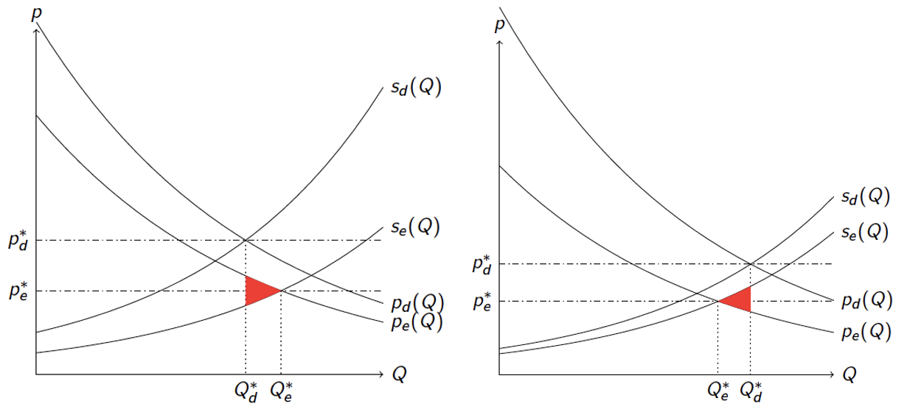
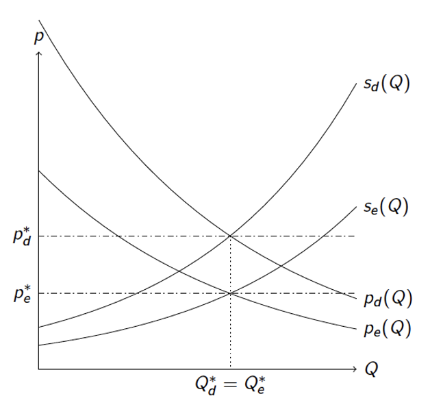
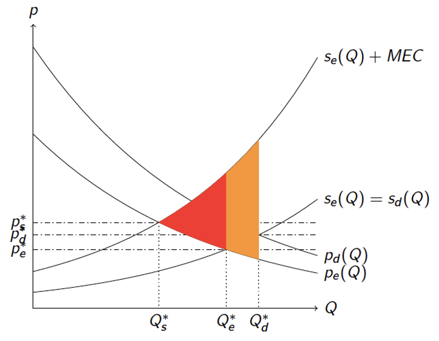

# Behavioural Error and Economic Surplus {#erroreconsurplus}

## Introduction

This chapter investigates the implications of behavioural errors for the calculation of economic surplus. The sub-field of behavioural economics started around 1950 with the pioneering works of Herbert Simon and Ward Edwards. The aim was to develop a novel perspective on rationality and choice behaviour. @laibson2015principles define behavioural economics as follows:

> Behavioural economics uses variants of traditional economic assumptions (often with a psychological motivation) to explain and predict behaviour, and to provide policy prescriptions (p.385).

From their perspective, modern behavioural economics therefore can be viewed as an extension of the neo-classical perspective. @laibson2015principles suggest that behavioural economics refines three of the key core principles of classical economics (p.386). We add to this list how the fourth pillar ‘normativity’ changes when behavioural errors are present.

(i) *Optimization*: market actors try to choose their best (feasible) option. They employ heuristics or a decision goal function for choosing amounts (utility, costs etc.).
(ii) *Equilibrium*: market actors try to choose their best feasible option when interacting with others. This results in a behavioural equilibrium.
(iii) *Empiricism*: behavioural models need to be tested with data.
(iv) *Experienced based normativity*: experiences (not choices) of market actors generate value and experienced value of market actors is equal to value for society.

Compared to the neo-classical paradigm, behavioural economics changes the first core pillar ‘optimization’ by adding the word ‘try’. In classical economic models it is usually assumed that market actors behave rationally: choices of market actors are the result of a rational optimization procedure in the sense that choices track utility value. Behavioural economics has operationalized this idea by replacing the direct utility function by other heuristics or by other kinds of direct utility functions. An example of a consumer heuristic is: buy $Q$ of the market good when it rains and $Q+2$ of the market good when it does not rain. Such a heuristic is independent of the valuation or utility considerations and is therefore difficult to connect to analysis of economic surplus without further assumptions. Examples of different conceptualization of utility functions are utility functions that account for biased processing of probabilities and loss aversion [@tversky1992advances].

The second pillar states that equilibrium in markets might be affected by behavioural errors as market actors interact with each other and is a logical result of adding behavioural error at the first pillar. According to behavioural economists, consumers and producers seek to optimize, but make behavioural errors. This in turn has impacts on how market actors interact with each other. When consumers and producers make systematic mistakes, this can impact equilibrium prices and quantities, but more in-depth analysis is needed to show what the impacts of behavourial errors is on equilibrium outcomes. 

The third pillar states that particular assumptions on the rationality of choices made by neo-classical economists should be backed up by empirical analysis. It has been argued by neo-classical economists that choices are made as if market actors are rational. @friedman1953methodology wrote about this in his famous essay ‘The methodology of Positive Economics’: 

> Consider the problem of predicting the shots made by an expert billiard player. It seems not at all unreasonable that excellent predictions would be yielded by the hypothesis that the billiard player made his shots **as if** he knew the complicated mathematical formulas that would give the optimum directions of travel, could estimate accurately by eye the angles, etc., describing the location of the balls, could make lightning calculations from the formulas, and could then make the balls travel in the direction indicated by the formulas. Our confidence in this hypothesis is not based on the belief that billiard players, even expert ones, can or do go through the process described; it derives rather from the belief that, unless in some way or other they were capable of reaching essentially the same result, they would not in fact be expert billiard players.
>
>It is only a short step from these examples to the economic hypothesis that under a wide range of circumstances individual firms behave as if they were seeking rationally to maximize their expected returns (generally if misleadingly called “profits”) and had full knowledge of the data needed to succeed in this attempt; as if, that is, they knew the relevant cost and demand functions, calculated marginal cost and marginal revenue from all actions open to them, and pushed each line of action to the point at which the relevant marginal cost and marginal revenues were equal (Friedman, 1953).

Using the analogy with the expert billiard player, @friedman1953methodology argues that there can be a complicated mathematical description of market choices that correctly *describes* behaviour even when market actors themselves are not aware of the complexities of their own behaviour. Why then, is additional behavioural economic analysis useful?

An important reason for behavioural economists to delve into the peculiarities of individual choices is that this might lead to a better *understanding* of the underlying mechanisms of choice behaviour. After all, scientists are allowed to be curious and are free to formulate hypotheses about the behaviour of individuals. A key purpose of science is to seek understanding and behavioural economists contribute to this with their empirical research.

For *prediction* of choices, understanding of the mechanisms of choice is not needed. ‘As if’ rationality can be a sufficient assumption as more complicated and realistic behavioural models might not always lead to better predictions. Prediction of choice can be tackled using econometric techniques (regression, machine learning) and does not require any underlying behavioural model of choice that describes the mechanisms. For example, one can investigate the change in the consumption of solar panels resulting from subsidies using regression techniques with demand as a dependent variable and subsidies as an independent variable. Utility maximisation and cost minimisation are not needed for these types of impact analyses but might give suggestions about what kind of control variables one can include in the regression.

The scope of the essays of Friedman is only positive or descriptive economics.^[Without normative recommendations, the field of economics reduces to the field of econometrics.] What @friedman1953methodology did not discuss in his essay is that for normative policy analysis as if rationality is not a sufficient assumption. This is because these analyses require a model about how market actors determine value. For example, the question whether the subsidy for solar panels resulted in added value for society cannot be answered using models of prediction alone. Suppose subsidies result in a significant impact on the demand for solar panels. When effectiveness would be the only purpose the recommendation would be to have very high subsidies in order to increase the demand for solar panels. 

To conclude our discussion about pillar (*iii*): the goal of the analysis (understanding, prediction, normative policy analysis) therefore determines whether *as if* rationality is an appropriate assumption. It also determines which research strategy is appropriate. When estimating economic value---and relate market outcomes to appropriate policy interventions---there is a normative component in the analysis, implying that the assumption of *as if* rationality is not sufficient. 

Pillar (*iv*) shows that there is also a change in normative perspective when using behavioural economic models for policy analysis. The reason is that there can be a divergence between the value ‘calculation’ at choice and the experienced value of market actors. This has potential impacts on the calculation of economic value and policy recommendations. Customers can be more (less) satisfied with a product than they expected at the moment of choice. Firms might overestimate (underestimate) the marginal costs of production. These biases can have impacts on equilibrium outcomes and also on the estimation of economic surplus when one assumes that it is experienced value which counts.

To illustrate the importance of behavioural errors for the economics of sustainability, it is interesting to look at an example from the literature. @busse2015psychological find that: 

> The choice to purchase a convertible or a four-wheel-drive is highly dependent on the weather at the time of purchase in a way that is inconsistent with classical utility theory. We consider a range of rational explanations for the empirical effects we find, but none can explain fully the effects we estimate.

Interestingly, @busse2015psychological show that even for expensive purchases in real markets---such as a new car---particular valuation biases stemming from the choice context can occur. In other words, the inverse demand curve that we have learned to estimate with statistical techniques potentially captures contextual valuations which might be irrelevant for the experienced value of the product. This leads to a divergence between choice value and experienced value. 

The remainder of these notes are organised as follows. Section 2 discusses the conceptual argument against neo-classical valuation and also discusses common responses. Section 3 uses choice behavioural modelling to arrive at an inverse demand curve that captures behavioural error. This section helps to develop mathematical narratives of choice that capture some of the essential ingredients of behavioural economics without delving to deeply into psychological details. Section 4 develops a simple behavioural economic surplus model graphically and mathematically and shows the implications of behavioural errors on the calculation of economic surplus. Section 5 and 6 continue by analysing the implications for externality taxation by investigating changes in economic surplus. Section 7 concludes.

## Arguments against neo-classical valuation and responses {#arguments}

### Introduction

The quantitative and methodological implications of behavioural economics for the calculation of economic surplus in markets are often not so clear. Such a calculation is needed as an input for practical cost-benefit assessments that seek to account for behavioural error. One of the methodological worries of cost-benefit practitioners who employ the micro-economic toolbox of the neo-classical economists is that behavioural errors lead to *systematic* flaws in policy recommendations because surplus calculations are incorrect. Before discussing these economic implications of behavioural error, we will discuss the qualitative argument in more detail. It has the following structure:

(A)	 Market actors make behavioural errors when valuing market goods;
(B)	Therefore, the valuations derived from the choice-based neo-classical modelling approach are incorrect;
(C)	As a result, neo-classical economic analyses of policies are mistaken as economic surplus is calculated in an incorrect way.

### Discussion of Premise A

#### Introduction

Most researchers will grant that market actors make some behavioural errors in valuation and accept premise (A). However, five objections against the move from (A) to (B) are often raised. These objections are the ‘learning objection’ (sub-section B.2), the ‘size objection’ (sub-section B.3), the ‘generalisability objection’ (sub-section B.4), the ’knowledge objection’ (sub-section B.5) and the ‘competition objection’ (sub-section B.6).

#### The learning objection

The first objection is the ‘learning objection’ which comes in three parts. Individuals learn to behave rationally because they:

(i)	learn from repeated choices (individual learning);
(ii)	learn from the behavioural errors and choices of others (social learning); 
(iii)	learn from information from other sources.

To illustrate learning with an example: A family household is likely to be able to estimate the amount of biological milk they need after some repetition. Or in the words of @friedman1953methodology: 

>"they figure it out what their optimal quantity is without knowing any of the mathematical formulas that the researcher uses to describe behavioural choice. When the household buys too much milk there will be leftovers for the next week. When there is not enough milk the household has to substitute to water or other beverages."

Such an argument is less convincing for less regular choices such as the purchase of a car, a new house or a holiday. For these choices social learning might be a relevant aspect. For example, for tourism destination choices, reviews of campings and hotels can serve as an input for valuations and can lead to more optimal behaviour of consumers under the assumption that these reviews are truthful. Customers can also learn from information provided by other sources such as science, customer protection agencies, media sources or the government.

In order to counter the learning objection, one has to show that in the presence of individual repetition, social interaction and information provision, individuals still make systematic mistakes. This is quite challenging to investigate empirically and often open for investigation for particular market goods. 

#### The size objection

The second objection against premise (A) is the 'size objection' which challenges the size of the behavioural error. When behavioural errors are present these might not be quantitatively relevant from a personal or societal perspective as the inverse demand curve which captures the WTP at choice, has not been impacted substantially. This objection has been countered by results from studies that investigated the size of behavioural error. For example, @allcott2019regressive predict in a study on sugar-sweetened beverages in the US that---given their assumptions---consumers consume 31% too much sugar-sweetened beverages on average.^[See for example @visschers2016sorting.]  This suggests that overconsumption in this market is substantial and quantitatively relevant. Furthermore, other studies have investigated food waste of consumers in order to estimate sub-optimal choice behaviour.  These studies suggest that there is structural overconsumption of food.

#### Generalisability of empirical results

The third objection is more conceptual and is called the 'generalisability objection'. It is targeted at the generalisability of empirical and experimental results and also applies to neo-classical empirical results. Does the result of @allcott2019regressive only holds for the US or not? Does the result also apply to other goods? When for some particular markets in some countries behavioural errors are quantitatively relevant this does not imply that behavioural errors are relevant for all markets. According to this third objection, premise (A) has to be studied on a case-by-case basis. 

Researchers have used meta-analyses to partly counter this objection. These meta-analyses investigate and summarize the results of many empirical studies and seek to explain structural differences in results using variables such as population characteristics, study design and setup, year of the study etc. An example of such a meta study is the study of @cadario2020healthy who investigate the effectiveness of healthy eating nudges.  They employ the definition of @leonard2008richard: 

> Nudges are defined by @leonard2008richard as "any aspect of the choice architecture that alters people’s behavior in a predictable way (1) without forbidding any options or (2) significantly changing their economic incentives. Putting fruit at eye level counts as a nudge; banning junk food does not."

Eating nudges therefore seek to change behavioural eating choices by changing the choice architecture without using economic incentives or traditional educational tools such as cooking workshops @cadario2020healthy. When nudges show that people change their behaviour for a small change in choice architecture this signals something about potential behavioural error in their original choice. @cadario2020healthy find that the type of intervention has a substantial impact on the effectiveness of eating nudges. They consider three types of interventions: cognitive, affective and behavioural (p.468). Cognitive interventions seek to provide knowledge about food choices. These nudges have lower impacts than affective interventions which are targeted at feelings about food. Affective interventions in turn have lower impacts than behavioural interventions which are targeted at changes in behaviour (p.477). For example, Figure \@ref(fig:cadario) in the paper shows that size enhancements such as smaller plates have the largest impacts @cadario2020healthy.

```{r, echo=FALSE, fig.cap = "Figure from @cadario2020healthy", label='cadario'}

```

@jachimowicz2019and is another example of a meta study on the impact of changing default options. Controlling for a number of variables related to channels and study characteristics they show that changing defaults is mainly effective in the consumer domain, but less in the environmental domain (which is the domain where policy makers seek to foster pro-environmental behaviour). Their result therefore suggests that changing the choice architecture is mainly beneficial for society when performed by producers of market goods rather than the government. 

These meta study examples show that the generalisability objection can be partly mitigated by providing systematic overviews of studies on the empirical impacts of behavioural interventions and error. As the field of empirical behavioural economics is growing rapidly, it is expected that more meta studies will be available in the next decade.

#### Knowledge objection

The fourth objection is the '*knowledge objection*', which stems from an epistemic concern at the sight of the researcher: is it possible to know as a researcher whether a market actor makes a mistake in valuation? Is it really possible to determine the difference between experienced and decision utility? Premise (A) depends on the assumption that there is some 'true' experienced utility concept: one can only determine what a valuation error is by contrasting a descriptive utility function with another 'true' experienced utility function. 

Consumers might have reasons for choice that are unobserved by the researcher. For example, it might be that households waste food because they are afraid to run out of food or want to keep food in the fridge for unexpected guests. Without asking about this, it is hard to infer from food choices only whether food waste is the result of behavioural errors in valuation. As @infante2016preference write: [according to the behavioural economics view] "the inner rational agent is trapped in a psychological shell". The process of using the 'true' preferences rather than the choice-based preference of individuals for economic surplus analysis is called ‘'preference purification' [@infante2016preference] The assumption that there are true preferences to be satisfied has motivated the use of nudging approaches in order to help individuals to make 'better' choices. 

Four methodological approaches have been offered in the literature to provide more evidence on the relationship between choice and experienced utility [@chetty2015behavioral]. The first approach is the 'direct measurement approach':

##### **Direct measurement approach**:measure experienced utility using self-reported happiness

This approach uses complementary survey techniques to measure whether experienced utility deviates from choice utility. The researcher has to make a choice whether the directly measured experienced utility captures the true (optimal) utility or whether the choice-based utility is the true utility. Often it is unclear how the two relate. Classical economists usually prefer preferences based on revealed choices. Other researchers trust the self-reported happiness surveys more. Direct measurement approaches also can include qualitative reasons behind choices that might give useful information about the 'why' of choices [see for example @mouter2021contrasting].  

The second approach discussed by Chetty (2015) is the rational context approach:

##### **Rational context approach**: use revealed preference measurements in a context where agents are known to make choices that maximize their experienced utilities; (these are called 'sufficient statistics')

When the utility is measured correctly in a context where the individual behaves rational, this experienced utility can be compared with measurements of decision utility in other contexts where behavioural errors are present in order to determine the size of behavioural errors. For example, when researchers know that there are contextual effects of the weather on car purchases [@busse2015psychological], researchers might come up with a particular context, where weather does not influence preferences. Note however, that the researcher still has to make a choice what counts as a relevant context where the individual behaves rational. 

The third approach is the structural modelling approach. 

#####	**Structural modelling approach**: build a structural model of the difference between decision and experienced utility. 

This approach uses mathematical modelling techniques with inputs from psychology and calibration based on empirical research. Examples of this approach will be given in Section II on behavioural modelling. 

@allcott2019regressive add a fourth strategy which is the rational reference group approach. 

##### **Rational reference group approach**: consumption is compared to particular reference groups who have full information on the product and its impacts. 

This approach deals with informational deficiencies of market actors. In @allcott2019regressive, the reference group are the dietarians who are assumed to have full information on the impact of sugar sweetened beverages on health. Here the researcher has to make a choice which particular group can be viewed as the group having full information. This assumes that the choices of other individuals are not based on full information and that this is the reason for a divergence in consumption between the two groups. More sophisticated analysis can add control variables to explain differences in consumption levels between the groups related to for example income, education or age. This concludes the discussion on the fourth objection whether it is possible to know as a researcher that market actors make mistakes.

#### The competition objection

The fifth objection against premise (A) is the 'competition objection. @friedman1953methodology highlights that when a firm makes systematic mistakes, it would be competed out of the market by firms that behave more rationally. Systematic monetary mistakes can be costly and thereby subject to the forces of the market. This objection has been countered by offering two types of responses. 

First, such an argumentative strategy cannot deal with *systematic* mistakes of all producers and is also invalid for the systematic mistakes that consumers make when calculating their marginal benefits. Consumers do not always pay the price for the mistakes they make when estimating their marginal benefits and are therefore not competed out of the market. Producers might all overestimate marginal costs of production leading to less entry in the market. Second, for durable and experiential goods such as cars, houses and holidays it is harder for consumers to track quantity left-overs in order to arrive at their optimal quantity. Third, not all mistakes are publicly available and known. Therefore, evaluation mistakes can remain in the presence of competition.

### Discussion of premise (B)

#### Introduction

The second premise (B) in the argument concludes from the presence of behavioural errors that marginal valuations are incorrect. For consumers this would imply that the maximum willingness to pay for a particular market good is measured incorrectly. This maximum marginal willingness to pay (MWTP) is the ratio of the marginal utility of consumption and the marginal utility of income. 

#### Examples of optimization with behavioural error that do not impact MWTP

A strategy to counter this objection is to give examples of optimization procedures that include behavioural errors (so premise (A) is granted), but do not result in a different MWTP (so premise (B) does not result). 

Suppose the direct utility with behavioural error is defined as: $U^d(Q,G)=\epsilon \times U(Q,G)$, where $\epsilon > 0$. The marginal utilities are then scaled with a factor $\epsilon$ and therefore the ratio of marginal utilities is unaffected by behavioural error. When consumers make *proportional* errors in the evaluation of the direct utility, these mistakes will drop out and the MWTP is still correctly measured. 

A similar result can be obtained for *additive* errors in direct choice utility: $U^d (Q,G)=U^e (Q,G)+ \epsilon$. The error will drop out as the *marginal* utilities govern market behaviour and choice of consumers as these show up in the first-order conditions for utility maximization. For multiplicative and additive errors in direct utility, the MWTPs are therefore correctly estimated. Premise (A) is granted, but premise (B) does not follow.

A more general third example can be given by assuming that the decision utility function is given by $U^d (Q,G)=V(U^e (Q,G))$, where V is an increasing function of the experienced utility $U^e (Q,G)$. This implies that when experienced utility increases (decreases), choice utility also increases (decreases). Using the budget constraint, the direct choice utility can be written as:

\begin{equation}
U^d (Q,G)=V(U^e (Q, y - pQ)).
\end{equation}

The first derivative for optimal choice of the market good is given by:

\begin{equation}
\frac{\partial U^d}{\partial V}(U^e_Q - pU^e_Q) = 0.
\end{equation}

As $\frac{\partial U^d}{\partial V} > 0$ this results in:

\begin{equation}
p_d = \frac{U_Q^e}{U_G^e}.
(\#eq:focutility)
\end{equation}

This shows that for choice utility functions that are increasing in the experienced utility, the experienced MWTP coincides with the rational MWTP. Although this mathematical result is quite general, it is not entirely clear what it means from a behavioural perspective and whether it makes psychological sense. Usually the choice to buy the good is made first and the experience comes afterwards.
What this discussion shows is that premise (B) does not necessarily follow from premise (A). Rational MWTPs can in principle be correctly measured in the presence of behavioural error. 

### Discussion of premise C

D.	Discussion of premise C.
Premise (C) can follow from premise (B) but requires additional analysis which will be provided in sections III and IV. Errors in evaluation of value can potentially lead to a discrepancy in the value used for decision making and the experienced value of consuming a good or service. Consumer and producer surplus can therefore be affected by behavioural errors. 

When both consumers and producers make behavioural errors or when externalities are present the impacts on economic surplus are less obvious. Without further assumptions it is unclear whether behavioural errors impact economic surplus negatively or positively. 

## Behavioural choice models with errors {#choicemodelserrors}

### Introduction

This section discusses parsimonious models of consumer choice that include behavioural biases. The focus is not on the underlying cognitive, neurological or physiological processes of why biases might arise. This is because the aim is to study the impact of behavioural error on economic surplus calculations rather than to discuss psychological aspects of behaviour that are relevant for the prediction of market choices. In line with the previous section, two kinds of direct utility functions are applied to illustrate the implications of behavioural error for economic evaluation and policy decision:

* **Direct decision utility function**: the direct decision utility for consuming a quantity $Q$ of a market good and a quantity $G$ of the outside good is given by $U^d (Q,G)$. It includes all potential behavioural biases and errors an individual can make when calculating the value for decision making. The function can also be a descriptive device for a particular heuristic decision approach of an individual.*

* **Direct experienced utility function**: the direct experienced utility function for consuming a quantity $Q$ of a market good and a quantity $G$ of an outside good is given by $U^e (Q,G)$. It includes the numerical evaluation for this consumption for the case of perfect information and knowledge resulting in no biases in the evaluation. It therefore represents the 'true' value of consumption.*


Classical economic theories usually assume that the decision utility function is equal to the experienced utility function: $U^d (Q,G)=U^e (Q,G)$. The recent interest in behavioural economics has led to attempts to provide extensions for this model for public economics [see @bernheim2018behavioral].

This section discusses the implication of such extensions for the inverse demand curve that we estimate using market data. Section \@ref(approach1) provides an example for a model where decision utility and experienced utility are fully separated. Section \@ref(approach2) develops a model where individuals satisfice rather than optimize. Section \@ref(approach3) develops a model where individuals calculate utilities on the basis of the weighted average of a decision utility function and an experienced utility function. Section \@ref(approach4) develops a model that employs direct utility weights.

### Approach 1: separated decision and experienced utility {#approach1}

We first investigate the implications of behavioural error for optimal utility and the inverse demand function when decision and experienced utility are fully separated. This implies that experienced utility has no relation at all to the choice utility. For this sub-section, the following direct linear decision utility function is assumed:

\begin{equation}
U^d (Q,G)= U^d (Q, y - pQ)
\end{equation}
where $G=Y-pQ$, stems from the budget constraint. Behavioural errors in valuation can therefore occur for both the market good (the decision value of consumption) and the composite good (the decision value of remaining money). Taking the first derivative of the decision utility function gives the first order-condition for decision utility maximisation:

\begin{equation}
U^d_Q - U^d_G p = 0.
\end{equation}

Here, $U_Q^d \equiv \frac{\partial U^d (Q)}{\partial Q}>0$ is the marginal decision utility for consuming the market good and $U_G^d \equiv \frac{\partial U^d (Q)}{\partial G}>0$ the marginal utility of the outside good which is equal to the marginal utility of income in equilibrium. Using the first-order condition one can derive the inverse demand curve:

\begin{equation}
p_d = \frac{U_Q^d}{U_G^d},
(\#eq:focdu)
\end{equation}
which is the well-known ratio of marginal decision utilities. 

The question is: does it matter? Do consumers loose utility because of the behavioural errors in evaluation? And will this impact economic valuation estimates? Or more formally: are behavioural errors a sufficient condition for biased policy evaluation? In order to answer this question, we have to analyse the counterfactual case of perfect rationality. Suppose that the consumer would be perfectly rational. For that case the optimal the inverse demand is given by: 
\begin{equation}
p_e = \frac{U_Q^e}{U_G^e},
(\#eq:focexpu)
\end{equation}
This looks very much like the result of Eq. \@ref(eq:focdu). The only thing that changes in the expression for the inverse demand are that we now have a ratio of the marginal *experienced* utilities. 

The marginal choice utilities result in demand choice $Q$ which is in turn evaluated by the experienced utility function. For policy analysis, the only thing that matters in the end is whether the demand Q that is chosen is optimal. This demand determines the final consumer benefits based on the experienced willingness to pay in Eq. \@ref(eq:focexpu).

Consider the following case. John has a very complicated and biased decision utility function and makes all kinds of errors in the marginal utility of income and in the marginal utility derived from buying solar panels. However, this results in a consumption level of the good which is exactly equal to the case of the decision based on experienced inverse demand (Eq. \@ref(eq:focdu). Therefore $Q^\ast_e = Q^\ast_d$. The implication for John is that in terms of experienced utility---and in terms of economic value---there is no impact of the behavioural errors of John on the optimal experienced utility. 

Only when there is a divergence between $Q^\ast_e$ and $Q^\ast_d$. there is an impact on economic value and for these cases the question is: how much? The answer to that question of course depends on the divergence between the marginal decision utility and the marginal experienced utility as captured by the respective inverse demand curves. When the experienced utility function is very flat around the optimal demand, sub-optimal choices of demand due to behavioural errors do not impact valuations a lot.^[You can make a graph with a concave experienced utility function, optimal demand and sub-optimal demand to visualize this.]  This leads us to an intermediate conclusion:

*Behavioural errors are not a sufficient condition for errors in the calculation of economic value. This implies that the assumption of perfect rationality of consumers is not a necessary condition for a correct calculation of economic value. The quantitative impact of sub-optimal choice of demand depends on the steepness of the experienced utility function around the optimum. This is captured by the second-order derivative of the experienced utility function.*

Or in other words: it depends. Practically speaking the flatness of the experienced utility curve can be investigated by asking question about changes in experienced value such as happiness when a particular good or service is consumed in higher or lower levels. 

### Approach 2: satisficing and the inverse demand curve {#approach2}

One of the founding fathers of behavioural economics, Herbert Simon suggested that persons are not optimizing, but satisficing [@simon1957models]. In the context of market analysis satisficing means that market actors consume and produce quantities that give 'good enough' utility or costs rather than optimal utility or costs. In mathematical terms this implies that persons do not set the first-order condition for utility maximisation or cost minimisation exactly to $0$. The point of satisficing is not that decision utility and experienced utility are different, but rather that the first pillar 'optimisation' is incorrect. This gives satisficing models of behaviour a distinct flavour.

Suppose a representative individual has an income level $Y$ and spends money on the market good $Q$ and some composite or outside good $G$. The price of the composite good is assumed to be exogenous and is normalised to $1$. The price of the market good is given by $p$. The consumer can choose $Q$ and $G$ but has to account for the budget constraint. 

For the rational case the first-order condition for utility maximisation results in Eq. \@ref(eq:focutility) . This is the well-known result that the inverse demand curve is defined by the ratio of two marginal experienced utilities. For specified direct experienced utility functions, the first-order condition can also be solved to obtain the optimal quantity $Q^*$.

Now suppose the representative consumer is satisficing rather than optimizing. This potentially leads to sub-optimal demand choices. Mathematically speaking, satisficing can be modelled by adding an error term in the first-order condition. This error term $e^{-aE}\epsilon$ is related to the effort provision of a consumer $E$. The parameter $a>0$ governs the strength of the impact of effort on the error. When the individual provides infinite effort, $E\rightarrow \infty$ this error term will vanish to $0$. When the consumer provides no effort, $e^{-aE}\epsilon=\epsilon$. The parameter $\epsilon$ is assumed to be bounded from below and above. It can be interpreted as the size of the error for consumers who do not provide any effort. The satisficing condition can then be written by:

\begin{equation}
- U^e_G p + U^e_Q + e^{-aE}\epsilon = 0.
\end{equation}

The inverse choice demand function is then given by:

\begin{equation}
p_d = \frac{U_Q^e +  e^{-aE}\epsilon}{U_G^e} = \frac{U_Q^e}{U_G^e} + \frac{e^{-aE}\epsilon}{U_G^e}.
\end{equation}

Compared to the experienced inverse demand curve (Eq. \@ref(eq:focdu)), satisficing therefore results in an inverse choice demand curve which shifts inwards or outwards with $\frac{U_Q^e}{U_G^e}$. The sign and size of this shift depends on the effort provision, the size and sign of the error and the marginal utility of income. The rational model is a limiting case that results for $\epsilon =0$, and/or $E \rightarrow \infty$. 

Until now it is assumed in this subsection that the consumer is not aware of the cognitive biases implying that it is assumed that effort provision is exogenous. An open question in this model is therefore how optimal effort can be determined assuming that an individual makes a trade-off between the benefits of effort provision and the costs of sub-optimal consumption. As in the previous section, it is likely that the curvature of the utility function around the optimum plays a role here. This curvature is captured by the second derivate of the utility function. When this second derivative is strongly negative, sub-optimal consumption has a large impact on utility. For these cases, it is then more likely that the individual will provide more effort when making choices. When the utility function is very flat around the optimum, consumption mistakes resulting from satisficing are not very costly for the consumer and therefore it is likely that the effort that is provided by the individual to reduce error is low. 

### Approach 3: System I and system II thinking {#approach3}

A third approach to model behavioural error is to define decision utility as the weighted average of System I and System II utility. This terminology was made popular by @kahneman2011thinking, and is based in the work of @stanovich2000individual.  Loosely speaking, System I can be interpreted as the brain system which is heuristic and makes fast decisions. System II is the slow thinking system which makes decisions upon deliberation and reflection. Instead of choosing to model behaviour with one system or the other, it makes sense to account for both systems when writing down a direct utility function. Therefore, we define direct utility as the weighted average of system I and system II perceived utility:

\begin{equation}
U^d (Q,G)= \varphi U^I (Q, G) + (1 - \varphi) U^{II} (Q, G). 
\end{equation}

This specification of utility assumes the individual has at least some partial knowledge about the experienced utility when making the decision, but is also partly governed by the 'heuristic' System I decision utility which is assumed to be irrelevant for evaluation purposes. The parameter $0 \leq \varphi \leq 1$, governs how system I utility and system II utility are weighted. When $\varphi=1$, system I utility is completely governing the decision of the consumer. When $\varphi=0$, we obtain the rational or neo-classical case where decision utility is equal to experienced utility. 

When we assume that experienced utility is equal to system II utility,  $U^{II} (Q,G)=U^e (Q,G)$, and we obtain:

\begin{equation}
U^d (Q,G)= \varphi U^I (Q, G) + (1 - \varphi) U^e (Q, G).
\end{equation}

Substituting $G=Y-pQ$, and taking the total derivative gives the first-order condition for utility maximisation:

\begin{equation}
-p \varphi U_G^I + \varphi U_Q^I - p (1 - \varphi) U^e_G +  (1 - \varphi) U^e_Q = 0 \end{equation}

Collecting the terms around the price gives:

\begin{equation}
-p (\varphi U_G^I + (1 - \varphi) U^e_G) +  \varphi U_Q^I + (1 - \varphi) U^e_Q = 0 \end{equation}

Solving for the price gives the implicit solution for the inverse demand curve:

\begin{equation}
p_d = \frac{ \varphi U_Q^I + (1 - \varphi) U^e_Q }{\varphi U_G^I + (1 - \varphi) U^e_G}
\end{equation}

The inverse demand curve can therefore be expressed as a ratio of weighted averaged system I and system II marginal utilities. When $\varphi =1$, the inverse demand curve is completely independent of the decision utility and the model of section II.A arises. When $\varphi=0$, we obtain the rational or neo-classical case where inverse demand is the ratio of marginal experienced utilities.

Some progress can be made by making additional assumptions on how experienced marginal utility and system I marginal utilities relate. Suppose that these marginal utilities are proportionally related so that we can write:

\begin{equation}
U^I_Q = c_Q U^e_Q,
(\#eq:uiq)
\end{equation}
and:
\begin{equation}
U^I_G = c_G U^e_G.
(\#eq:uig)
\end{equation}

When consumers are unaware of the potential benefits of additional consumption of the good, $c_Q<1$. When they are too optimistic about the consumption benefits of the good, $c_Q>1$. Similarly, consumers can be unaware of the potential of using the money for other purposes leading to $c_G<1$. When consumers are too optimistic about the potential of spending their money otherwise, $c_G>1$. 

Substituting the expressions for the decision utility functions into the expression for the inverse demand curve gives:
\begin{equation}
p_d = \left(\frac{ \varphi c_Q + (1 - \varphi) }{\varphi c_G + (1 - \varphi) } \right) \frac{U^e_Q }{U^e_G}\equiv b_c p_e 
\end{equation}
Given the assumptions in Eq. \@ref(eq:uiq) and \@ref(eq:uig), the experienced demand curve $p_e$ is shifted with a *proportional constant* factor $b_c = \frac{ \varphi c_Q + (1 - \varphi) }{\varphi c_G + (1 - \varphi) }$. This proportional shift is very useful for the analysis of economic value and gives a structural relationship between the experienced and the decision inverse demand curve. When $c_Q<c_G$, there will be an *underestimation* of marginal benefits as $b_c<1$. When $c_Q>c_G$, there will be an *overestimation* of marginal benefits, and $b_c>1$. The case  $c_Q=c_G$ is the special case where behavioural errors are present, but without impacts for the marginal benefits of consumers as the marginal utilities are shifted with the same proportion.

This again highlights the important fact that the MWTP is a ratio of marginal utilities. Behavioural errors can occur when consumers are not rational about the marginal utility of consumption ('benefits of additional consumption'), or the marginal utility of remaining money ('benefits of additional income'). Note that it is assumed that the parameter $0 \leq \varphi \leq 1$ is exogenous. For more complicated models of behaviour, this parameter can be made dependent on the degree of information and the effort provision of the individual. 

### Approach 4: direct utility weights. {#approach4}

The fourth approach uses structural modelling and incorporates direct utility weights that capture misperceptions in the benefits in consumption of the market good and the outside good. The advantage of this approach is that the conceptualization of behavioural error is very transparent and that adjustments of existing specifications of direct utility can be used. We will illustrate this approach using an exponential-linear direct utility function defined as:

\begin{equation}
U^d (Q,G) = w_1 \frac{A}{a}\left(1 - e^{-aQ}\right) + w_2 BG
(\#eq:explin)
\end{equation}
In Eq. \@ref(eq:explin) $w_1$ is a perception weight related to the direct utility of consumption of the market good. Benefits of the market good are overestimated when $w_1>1$, and underestimated when $w_1<1$. In a similar way, $w_2>1$ describes the case of overestimation of the benefits of remaining money and $w_2<1$ the case of underestimation of the benefits of remaining money. 

Substituting the amount for the outside good $G=Y-pQ$ and taking the total derivative gives:
\begin{equation}
\frac{dU^d}{dQ} = w_1 A e^{-aQ} - p w_2 B = 0.
\end{equation}
The inverse choice demand function including behavioural errors is then given by:
\begin{equation}
p_d = \frac{w_1}{w_2}\frac{A}{B}e^{-aQ}.
\end{equation}
The experienced inverse demand results for $w_1=w_2=1$. The experienced inverse demand curve lies above the decision inverse demand curve when proportional errors in the evaluation of the market good utility are larger than proportional errors in the evaluation of the benefits of remaining money ($w_1<w_2$).

Again, this model shows a plausible behavioural underpinning for proportional shifts in the inverse demand function as we can define $b_c=\frac{w_1}{w_2}$. When there are no income effects this approach also works for more complicated specifications of the direct utility function. In the presence of income effects things become more complicated. The interested reader might try this using a Cobb-Douglas direct utility function.

### Conclusion

This section has showed that for plausible behavioural utility functions one can obtain proportional shifts in the inverse demand function due to behavioural error. There are several ways to obtain more information about the size of behavioural error. First, error can be operationalised by asking customers' MWTP before and after consuming the good. When the two diverge this can be a sign that behavioural error is present.

Second, other methods can be employed to obtain the weights in the direct utility function. For example, one can ask customers to grade the market good before and after consumption using satisfaction surveys. When a customer grades the good in utility due to experience. The ratio between decision and experienced utility is then given by $1/1.25$ and this provides an argument to set $w_1=0.8$. Whether it is possible to disentangle satisfaction related to price payments and actual use of the good is an interesting open question.

Third, one can investigate whether consumers think they have chosen the optimal amount of the good after experiencing the good.

## Behavioural errors and economic social surplus {#beherrorsurplus}

### Implications of behavioural errors for consumer surplus

This section shows what the implications of behavioural error are for the calculation of economic social surplus. For simplicity it is assumed in this section that consumers pay a price $p^*$ for the good and that this price will not change as a result of behavioural error. Define $p_d (Q)$ as the decision inverse demand curve and $p_e (Q)$ as the experienced inverse demand curve. Figure \@ref(fig:beherrors) shows the implication of behavioural errors for experienced consumer surplus.

```{r, echo=FALSE, fig.cap = "implications of behavioural errors on consumer surplus", label='beherrors'}

```

The left panel of Figure \@ref(fig:beherrors)  shows the case of *underestimation* of the marginal value of an additional unit consumption: the decision marginal willingness to pay is lower than the experienced marginal willingness to pay. From the previous section we know that there can multiple sources for this underestimation. 

As expected, this underestimation of value results in an equilibrium quantity level which is lower than the optimal level as $Q^*_e > Q^*_d$. This will lead to a loss in consumer surplus. But how large is this loss compared to the case of full rationality? 

The consumer surplus for the left panel is equal to the area under the experienced inverse demand curve up to the equilibrium demand $Q^*_d$. When behavioural errors are present, the consumer benefits are therefore equal to $A+C+D$. The consumer costs are equal to the area $D$. Consumer surplus in the presence of behavioural error is then equal to consumer benefits minus consumer costs: $A+C$.

When consumers are perfectly rational, the consumer surplus is again equal to the area under the experienced inverse demand curve. As the marginal willingness to pay for the good is higher for perfect rationality, the equilibrium consumption is higher and equal to $Q^*_e$. This results in consumer benefits equal to $A+B+C+D+E+F$, consumer costs equal to $D+E+F$ and consumer surplus equal to $A+B+C$. Behavioural errors therefore lead to a loss in consumer surplus equal to $B$. This area is equal to the net benefits of those who do not participate in the market because they underestimate the marginal value of consumption.

Next, consider the second case of overestimation of the marginal value of consumption as depicted by the right panel of Figure \@ref(fig:beherrors). Again, the optimal amount is not consumed, but now the market demand is higher than optimal. Consumer surplus is equal to the area under the experienced inverse demand curve $(A+C+E)$, minus the consumer costs $(C+E+D)$, resulting in the area $A-D$.  

In the presence of perfect rationality, the consumption will be equal to $Q^*_e$. This leads to consumer surplus equal to $A$. When there is an overestimation of the marginal benefits of consumption of the market good, there is a *loss* in consumer surplus equal to the area $D$. This area is equal to the net loss in surplus because of the additional entry of consumers due to misperception of marginal benefits. The experienced marginal willingness to pay for these consumers is lower than the price and therefore their net contribution to total consumer surplus is negative. From this discussion on Figure \@ref(fig:beherrors) we arrive at the following observation related to consumer surplus:

*When optimal market demand is not equal to decision market demand, consumer surplus is negatively affected by behavioural errors. The bias goes only via the channel of higher or lower consumption of the market good.*

What is true at the individual level is therefore also true at the market level. This is because for the consumers who do not change behaviour in the market when they become more rational there is no change in their consumption decision. These consumers buy the good anyways, regardless of whether their marginal decision willingness to pay is biased or perfectly rational. Therefore, their experienced marginal benefits will not change when they become more rational. Even when the decision marginal willingness to pay is much more complicated graphically, it is only the equilibrium demand together with the experienced inverse demand curve that determines what the size of consumer surplus is and what the size of the losses are related to behavioural error. Behavioural errors therefore mainly impact the decisions of the consumers who are close to the equilibrium level: the so-called marginal consumers.^[Note that marginal does not mean unimportant here, but rather consumers who are at the margin of changing their choice.] Providing information to those who are in doubt is therefore most relevant.

Figure \@ref(fig:beherrors2) shows the particular case of a market where the equilibrium consumption demand is 'coincidentally' equal to the optimal demand. This case is important as it shows that behavioural error is not a sufficient condition for losses in calculations of consumer surplus. The consumer surplus for rational and boundedly rational choice is in both cases equal to the area $A$.

```{r, echo=FALSE, fig.cap = "Behavioural error without losses in consumer surplus", label='beherrors2'}

```

A mathematical definition of economic social surplus in the presence of behavioural error is given by:
\begin{equation}
CS = \int_0^{Q_d^*} p_e(Q)dQ - p^*Q_d^*
(\#eq:cserror)
\end{equation}
The first part of Eq. \@ref(eq:cserror) are the consumer benefits which are given by the integral under the experienced inverse demand curve up to the equilibrium decision demand. The second part are the consumer costs which are equal to the equilibrium decision demand multiplied by the price. In line with Figure \@ref(fig:beherrors2), this expression is equal to the case of perfectly rational behaviour when the equilibrium demand with behavioural error is equal to the optimal demand with rationality: $Q_d^* = Q^*_e$.

A survey question for consumers to investigate their behavioural errors is therefore: Do you consume too much or too little of a particular good upon reflection? The answers might give an indication of whether market choice demand is above or below rational demand based on the experienced marginal benefits.

The results depend on the assumption that equilibrium prices do not adjust due to behavioural errors of consumers. The next sub-sections will analyse this assumption in more detail.

### The impact of behaviour error on supply decisions and producer surplus

The next step is to gain insights on the impact of behavioural errors of firms on supply decisions. These firms are assumed to minimize costs given a production target resulting in a total cost function that is potentially a function of the production level. It is assumed that fixed costs are zero. Total costs in the market are given by the area under the inverse experienced supply curve. Figure \@ref(fig:firmerror) shows the implications of behavioural errors of firms on market equilibrium. 

```{r, echo=FALSE, fig.cap = "The implications of behavioural errors of firms on market equilibrium. Note that the figures schematically summarize the argument and potentially amplify the difference between $s_d (Q)$ and $s_e (Q)$ for clarity reasons. In reality the errors might be smaller or larger", label='firmerror'}

```

The left panel of Figure \@ref(fig:firmerror) shows the decision inverse supply function $s_d (Q)$ which can be interpreted as the perceived marginal production costs for a group of firms. Because consumers can make behavioural errors, equilibrium arises from the intersection of this decision inverse supply curve with the inverse decision demand curve $p_d (Q)$. This results in an equilibrium price equal to $p^*_d$. The equilibrium quantity and the equilibrium price are lower compared to the case of perfect rationality of firms. The right panel shows the opposite situation, where firms make behavioural errors leading to a lower equilibrium price and higher equilibrium demand compared to the case of perfectly rational firms.

What are the implications of behavioural errors of firms for producer surplus? The left panel of Figure \@ref(fig:firmerror) shows the situation where the marginal costs of production are overestimated. The total producer revenues in the market are then equal to the area $A+B+C+D+E$. The total producer costs are equal to the area under the experienced supply function which is equal to $E$. Producer surplus in the presence of behavioural error, is then equal to $A+B+C+D$.

For the case of perfectly rational firm decisions, demand will increase resulting in producer benefits equal to $C+D+E+G+H$. Producer costs are equal to $E+H$ and therefore producer surplus is equal to $C+D+G$. The difference with the bounded rationality case is then given by $G-A-B$, which is smaller or larger than $0$ depending on the change in demand. Overestimation of marginal costs can therefore lead to an increase in producer surplus in the market (but at the expense of consumer surplus as prices increase).

The right panel shows the case where the marginal costs are underestimated by firms. This leads to a lower price and higher equilibrium demand. Producer surplus is equal to the producer revenues $(C+D+E+I+J)$ minus the producer costs $(B+D+E+F+G+H+I+J)$ and is therefore equal to $C-B-F-G-H$. 

Producer surplus can also be written in mathematical terms:
\begin{equation}
PS = p_d^* Q_d^* - \int_0^{Q_d^*} s_e(Q)dQ.
(\#eq:pserror)
\end{equation}

The first part of Eq. \@ref(eq:pserror) are the producer revenues, whereas the second part are the total experienced or real costs in the market (as fixed costs are assumed to be equal to 0). When $Q_d^* = Q_e^*$ producer surplus coincides with the rational case.

Before moving on it is useful to reflect a bit more on the nature of behavioural error for producers. A difference with consumers is that for particular sectors, producer surplus is really monetary: both the benefits and the costs are of a monetary nature. Consider, for example the case of solar panels. It is reasonable to assume that firms that make solar panels are well aware of the costs of production and their benefits of selling the solar panels. This is not the case for consumers: consumer spending is monetary, but the inverse demand is a monetized preference summarized in the maximum marginal willingness to pay. A preference is less tangible and might lack the direct 'feedback' of monetary spending and revenues. 

Many firms in the right panel of Figure \@ref(fig:firmerror) will make a structural loss as the experienced supply curve lies above the equilibrium price. At some point these firms literally pay the price for their behavioural errors. Only the firms with $s_e (Q)< p_d^*$ will make positive profits. For an equilibrium in the market, it is therefore more plausible that the situation of the left panel occurs: firms overestimate marginal costs, for example because they are not minimizing expected costs, but do something else. 

This argumentation might be less convincing for sectors where supply decisions use inputs which are non-monetary, less tangible and/or more difficult to process by producers. 

Consider for example supply decisions on sustainability research. When scientists have to estimate the amount of labour they invest in research proposals they can make mistakes and underestimate the marginal costs of research. When we observe structural extra work by scientists this might be related to behavioural biases related to labour supply and time: the decision supply curve is then below the experienced supply curve.  

### Behavioural error and total economic surplus {#totalsurplus}

This sub-section brings together the insights of the previous sections and shows the total economic surplus when behavioural errors are present at the demand and the supply side. It thereby investigates how equilibrium economic value is affected by behavioural errors. We can distinguish 4 conceptual cases:

I.	Producers overestimate marginal costs and consumers overestimate marginal benefits;
II.	Producers overestimate marginal costs and consumers underestimate marginal benefits;
III.	Producers underestimate marginal costs and consumers overestimate marginal benefits;
IV.	Producers underestimate marginal costs and consumers underestimate marginal benefits

Only case I will be discussed graphically and the other cases are left to the reader. But before doing this, we add up consumer surplus and producer surplus to obtain a mathematical expression for total economic surplus in the presence of behavioural error:

\begin{align}
ES = CS + PS =& \int_0^{Q_d^*} p_e(Q)dQ - p^*Q_d^* + p_d^* Q_d^* - \int_0^{Q_d^*} s_e(Q)dQ \\
=& \int_0^{Q_d^*} p_e(Q)dQ - \int_0^{Q_d^*} s_e(Q)dQ
\end{align}

This mathematical expression holds for all conceptual cases. The well-known insight that remains here is that payments of consumers are revenues of producers. When regulators are not interested where the economic surplus ends up this 'dampens' the impact of behavioural errors of consumers (producers) as these are partly mitigated by benefits for producers (consumers).^[Following classical economic analysis, we ignore the potential normative relevant issue of the source/reason of payments and benefits. Consumers can benefit from behavioural errors of producers and producers can benefit from behavioural errors of consumers.] Compared to the rational case, the only thing that changes is $Q_d^*$ which is in line with the earlier observation that behavioural errors materialize in sub-optimal choice of demand.

From this economic surplus equation, we can also learn that there is exactly one point for which economic surplus is optimal. Differentiating $ES$ with respect to $Q_d^*$ gives $p_e (Q_d^*)-s_e (Q_d^*)=0$, which is satisfied when $Q_d^* = Q_e^*$ as it then shows the equilibrium condition for perfect rationality.^[The second derivative of $ES$ is equal to the slope of the inverse demand curve (negative) minus the slope of the supply curve (positive) which implies that economic surplus is strictly concave in $Q$. Therefore, there is only one solution for optimal economic surplus which economic surplus is optimal when experienced inverse demand is downward and the experienced supply curve is not downward sloping. ]  

Figure \@ref(fig:losssurplus) shows the impact of behavioural errors for two possible constellations of case I. Equilibrium arises at the point where the decision inverse supply curve is equal to the decision inverse demand curve. 

```{r, echo=FALSE, fig.cap = "Loss of economic social surplus because of behavioral errors for Case I", label='losssurplus'}

```

The left panel shows the case where equilibrium demand is higher than optimal. The right panel shows the case where equilibrium demand $Q_d^*$ is lower than optimal. The red area indicates the economic surplus loss because of behavioural errors. This area occurs in the left panel because for the consumers between $Q_e^*$  and $Q_d^*$ the experienced marginal costs of production are higher than their experienced marginal benefits. In the right panel it occurs because for the consumers between $Q_d^*$ and $Q_e^*$  the marginal costs of production are lower than the marginal experienced willingness to pay. More economic surplus could be gained when demand moves closer to the optimal demand. In the absence of externalities, the *economic surplus* loss resulting from behavioral errors can be written as the difference between the two experienced curves:
\begin{equation}
\Delta ES = \int_{Q_e^*}^{Q_d^*} p_e(Q) dQ -  \int_{Q_e^*}^{Q_d^*} s_e(Q) dQ 
\end{equation}
This formula exactly represents the red 'triangles' in Figure \@ref(fig:losssurplus). The economic surplus loss formula is the same for all cases I--IV introduced above. It can be operationalised by assuming particular forms for the experienced inverse demand and inverse supply curves. The figure and the formula show that the economic surplus loss is governed by the difference between $Q_d^*$ and $Q_e^*$.

Figure \@ref(fig:nolosssurplus) shows the special case where behavioural errors are present without losses in economic surplus. When choice demand is equal to optimal demand, no economic surplus losses occur despite the fact that consumers and producers make behavioural errors. Nevertheless, this figure shows that behavioural errors lead to higher equilibrium prices compared to the optimal case. 

```{r, echo=FALSE, fig.cap = "Behavioural error without economic surplus losses", label='nolosssurplus'}

```

The increase in prices results in an increase in producer surplus for those firms producing on the market. The higher prices for consumers do not impact economic surplus as these are transfers from consumers to the producers. Despite the fact that behavioural errors are made at both sides of the market and that prices are higher compared to the rational case; economic surplus is at the optimal level. Higher prices resulting from behavioural error at the consumer level are therefore not sufficient to conclude that economic surplus goes down.

## Behavioural error and policy recommendations

### Behavioural errors and information provision

Figure \@ref(fig:nolosssurplus) suggests a paradoxical issue when behavioural errors are made and information is provided to consumers or producers in order to help them to make more rational choices: economic surplus can go down. The popular view of behavioural policy intervention interprets errors as a particular form of externalities as they lead to a sub-optimal demand choice in markets (@chetty2015behavioral, figure 9). 

As the impacts of behavioural error do not fall upon other actors in and outside the market, but can be viewed as internal costs for the market actors themselves, these are usually referred to as *internalities*. Examples of internalities can be health effects related to cycling, smoking, drinking alcohol or eating meat. When individuals underestimate the impacts of their consumption on their own health, this is a negative internality. One of the policy interventions to combat internalities is the provision of information (cognitive interventions), the change of feelings about the product (affective interventions) and programs to change behaviour (behavioural interventions).

Suppose information is provided to firms in Figure \@ref(fig:nolosssurplus) and the decision inverse supply curve becomes equal to the experienced inverse supply curve. The result of this is that equilibrium decision demand $Q_d^*$ will move upwards. Because equilibrium demand then moves further away from the socially optimal demand, an economic surplus loss will occur. 

A similar result is obtained for providing information to consumers: when consumers in Figure \@ref(fig:nolosssurplus) become perfectly rational due to information, equilibrium decision demand becomes lower than the optimal demand. For the case shown in Figure \@ref(fig:nolosssurplus), this results in an economic surplus *loss* compared to the situation without a policy. This somewhat paradoxical result only occurs when there are behavioral errors at the demand *and* the supply side. When errors are made only by producers or only by consumers, providing (costless) information is beneficial because equilibrium decision demand moves into the direction of the optimal demand. We can summarize this analysis in the following observation about behavioural error internalities:

*Costless information increases economic surplus when it moves equilibrium demand closer to the optimal demand. This is always the case when only one side of the market makes behavioral errors (either consumers or producers).*

There is of course a key normative discussion point here that requires attention. There might be an intrinsic value of providing information for more rational choices. This intrinsic value is now excluded from the analysis. However, when one accepts that this intrinsic value is utilitarian, it can be included as a benefit that adds positively to economic surplus when information is provided. This might result in provision of information even when this does not enhance economic surplus.

### Pricing of internalities

Besides information provision, one can also use a price instrument to regulate internalities. This price instrument requires input on the relationship between the decision and the experienced demand and supply curves. Suppose we can define the decision inverse demand curve as a proportion of the experienced inverse demand curve: $p_d (Q)= b_c p_e (Q)$. Section \@ref(choicemodelserrors) gave a mathematical behavioural underpinning for such a proportional relationship. The parameter $b_c$ has a useful interpretation: when behavioral errors result in an inverse demand curve with (on average) 10% higher maximum willingness to pay for consumers, $b_c=1.1$. Similarly, we can write $s_d (Q)= b_p s_e (Q)$ for producers, where $b_p$ indicates how strong the shift in the experienced marginal costs is due to behavioral errors. For example, when $b_p=1.05$, producers overestimate the marginal costs of production by 5%. 

Now suppose a regulator introduces a consumer tax $\tau$ in order to regulate error internalities. The regulator seeks to optimize economic surplus subject to the constraint that marginal decision benefits are equal to the supply price plus the consumer tax.

Errors will impact the equilibrium demand via the equilibrium conditions.  Optimizing economic surplus using Lagrangian techniques results in a tax equal to (see Appendix \@ref(apperror)):
\begin{equation}
\tau = p^{*R} \frac{b_c - b_p}{b_p}.
(\#eq:opttau)
\end{equation}
In this expression, $p^{*R}$ is the *equilibrium supply price* in the regulated equilibrium. This supply price does not include the tax. For the case of constant marginal costs, firms do not adjust their price after the tax is introduced and $p^*=p^{*R}=MC$. The consumer price paid is equalto $p^{*R} + \tau$. The tax is therefore proportional to the equilibrium supply price and can deal with all four conceptual cases discussed in section \@ref(totalsurplus). Three numerical examples are provided below.

Suppose consumers overestimate benefits with 10% and producers are perfectly rational. Marginal costs are independent of the quantity and equal to $p^*=p^{*R}=MC= 10$ euros. Then the tax will be equal to $\tau=p^{*R}  \frac{1.1-1.0}{1.0}=10 \frac{1}{10}=1$ euro. This tax is equal to 10% of the equilibrium supply price in the regulated equilibrium. 

When producers overestimate marginal costs with 5% and consumers overestimate marginal benefits with 10%, the tax will be equal to $\tau=p^{*R}  \frac{1.1-1.05}{1.05}=10 \frac{0.05}{1.05}=0.47$ euro. This tax is equal to 4.7% of the equilibrium supply price in the regulated equilibrium. 

Suppose, producers underestimate the marginal costs of doing research with 10% and consumers overestimate the benefits with 5%. This results in a tax equal to: $\tau=p^{*R} \frac{1.05-0.90}{0.90}=10 \frac{1}{6}$, which is about 17% of the equilibrium supply price in the regulated equilibrium. These three examples show how to do *what-if* analysis when the exact size of behavioural error is unknown. 

Table \@ref(tab:beherror) gives an overview of the cases discussed in section \@ref(totalsurplus), the parameter assumptions and the implications for the sign of the tax. When the sign is negative a subsidy is justified to increase demand. For Cases I and IV, both a tax or a subsidy can apply depending on the sign of the difference $b_c-b_p$. This is because equilibrium demand can be lower, higher or equal to the optimal demand. For Case II there has to be a subsidy in order to move the equilibrium demand closer to the optimum. Case III shows the opposite result and always results in a tax. As discussed before, cases I and II are more likely to occur than cases III and IV. 

```{r beherror, echo = FALSE}
v1 <- c("I", "II", "III", "IV")
v2 <- c("Producers overestimate marginal costs and consumers overestimate marginal benefits;",
"Producers overestimate marginal costs and consumers underestimate marginal benefits;",
"Producers underestimate marginal costs and consumers overestimate marginal benefits;",
"Producers underestimate costs and consumers underestimate marginal benefits;")
v3 <- c(
  "$b_c>1; b_p>1$",
  "$b_c<1; b_p>1$",
  "$b_c>1; b_p<1$",
  "$b_c<1; b_p<1$"
)
v4 <- c(
  "Positive when $b_c>b_p$\n 
Negative when  $b_c<b_p$\n
Zero when $b_c=b_p$
",
  "Negative",
  "Positive",
  "Positive when $b_c>b_p$\n 
Negative when  $b_c<b_p$\n
Zero when $b_c=b_p$"
)
df <- data.frame( v1, v2, v3, v4 )
kable(df, 
      "html", 
      align="l", 
      booktabs=TRUE, escape = F, 
      caption = 'Behavioral error and the sign of an error internality tax',
      col.names = c("Case", "Case description", "Parameter assumptions", "Sign of the tax")
) %>%
  kable_styling(bootstrap_options = "striped")
```

For the analysis the assumption is made that the parameters $b_c$ and $b_p$ do not change when a particular policy is implemented. A behavioral interpretation could be that consumers and producers are not aware of the behavioral decision errors they make. When the parameters $b_c$ and $b_p$ are behavioral choice parameters things become more complicated as consumers and producers then optimally gather information themselves to reduce their behavioural errors. Nudges, information provision and taxes might have an impact on this behavioral process leading to more complicated tax expressions. 

## Behavioral errors and pricing of consumption externalities

### Introduction

Consumption externalities occur in markets when the experienced marginal social costs are higher than the experienced marginal costs. There can be so-called negative or positive side effects of consumption that are not captured in the market behavior of producers and consumers. The negative side effects usually gain most attention by policy makers.

Suppose external costs are given by $e(Q)$ and marginal external costs by $MEC \equiv \frac{\partial e(Q)}{\partial Q}$. Then marginal experienced social costs are given by $s_e (Q)+MEC$. A tax is then justified in order to move to the socially optimal equilibrium, where marginal experienced consumer benefits are equal to marginal experienced social costs. But before analyzing this we ask ourselves the question: how do behavioral errors impact economic surplus losses due to external costs?

```{r, echo=FALSE, fig.cap = "economic surplus losses, externalities and behavioral errors", label='econsurplusexterrors'}

```

Figure \@ref(fig:econsurplusexterrors) indicates the situation where marginal costs are overestimated by firms as $s_d (Q)>s_e (Q)$. Consumers are assumed to be fully rational. Equilibrium demand in the unregulated equilibrium is below the socially optimal demand $Q_s^*$. Therefore, the red area indicates the potential economic surplus gain from a taxation policy that results in real marginal social costs equal to marginal private experienced benefits.

A policy that leads to better information for suppliers will bring the decision supply curve $s_d (Q)$ closer to the experienced supply curve $s_e (Q)$. This leads to *higher* equilibrium consumption. Because of the external costs this will lead to an additional economic surplus *loss* equal to the orange area. An internality and an externality interact with each other: behavioral errors and the marginal external costs. This might lead to suboptimal policies when one of these effects is ignored when formulating a policy.

Figure \@ref(fig:figure7) shows another conceptual case where equilibrium demand is higher compared to the fully rational case. In this figure it is assumed that producers behave fully rational and consumers overestimate the marginal benefits of consumption. Information provision to consumers can lead to an economic surplus gain equal to the orange area. An *additional* policy that taxes the externality will lead to an economic surplus gain equal to the red area. Internalities and externalities can also be regulated with a single tax. Such a policy would lead to an economic surplus gain equal to the red plus the orange area.

```{r, echo=FALSE, fig.cap = "economic surplus losses, externalities and behavioral errors", label='figure7'}

```

Ignoring behavioural errors in decision making leads to potential loss of economic surplus. There are three possible conceptual situations each having particular implications for the assessment of policy success. 

First, there is the potential to obtain a higher gain in economic surplus as the regulated equilibrium quantity ends up to be lower than the socially optimal quantity $Q_s^{**} >Q_s^*$. The tax could have been set higher, but because of the regulator did not account for the behavioural errors it is lower than optimal. Such a result is in general acceptable as the policy moves demand closer to the social optimum.

Second, it could be that the regulated equilibrium quantity is higher than the socially optimal equilibrium quantity: $Q_s^{**} <Q_s^*$. The tax is too high and this will likely result in opposition.

Third, there can be cases where a tax is not beneficial at all because behavioral errors lead to the socially optimal demand: $Q_s^{**} - Q_s^*$ Behavioral errors than coincidentally result in equilibrium demand equal to socially optimal demand.

This discussion suggests that there are strong qualitative similarities with the discussion in section \@ref(totalsurplus) (around Figure \@ref(fig:losssurplus)). In Figure \@ref(fig:losssurplus) it was found that policies that move equilibrium demand closer to the demand under perfect rationality increase economic surplus. This qualitative conclusion remains true in the presence of consumption externalities, but now optimal (social) demand $Q_s^*$ is the relevant benchmark. When externality taxes move the equilibrium demand closer to $Q_s^*$ these taxes are beneficial for society (according to the model). 

### A combined externality-internality tax

We can approach the analysis in an analytical way by optimizing the economic surplus function (including external costs $e(Q)$) with respect to the tax. Let $MEC=\frac{\partial e(Q)}{\partial Q}$ be the external costs for example related to pollution. The tax then seeks to correct simultaneously for the internality and the externality. Equilibrium is determined by the intersection of the decision inverse demand and the decisions inverse supply curve. The optimal tax is then given by:

\begin{equation}
\tau = p^{*R} \frac{b_c - b_p}{b_p} +b_c MEC.
\end{equation}

The first part is isomorphic ('equal of form') to the earlier derived internality tax expression of Eq. \@ref(eq:opttau). In the presence of external costs an additional term is added to this tax expression which multiplies $b_c$ with the marginal external costs. 

When consumers overestimate marginal benefits, $b_c>1$, the recommended tax is higher compared to the case of perfectly rational consumers. The reason is that the observed equilibrium quantity is below the quantity under perfect rationality. 
When consumers underestimate marginal benefits, $b_c<1$, the externality tax should be lower compared to the perfectly rational case. Behavioural errors of suppliers do not have a direct impact on the second part of the tax expression. When the tax is targeted at suppliers instead of consumers this would not be the case.


## Discussion and conclusion

There are enough examples from the recent literature that market actors can make valuation errors or use heuristics when they are making choices. The lessons of behavioural economists are therefore important inputs for those who work on applied economic policy analysis. Economists who seek to make assessments have the task to investigate whether their assessment and policy recommendations are robust for behavioural errors. Asking consumers whether they consume the right amount of a particular good upon reflection in surveys might help to gain information about the size of behavioural error biases.

The discussion in the previous sections has showed under fairly general assumptions what the implications of behavioural errors in partial equilibrium could be. However, still input is needed on the experienced supply and demand curves. If it is not possible to measure these curves, one still cannot derive the economic surplus effects of policies without making additional assumptions about the approximate proportional relationship between the decision and experienced demand and supply curves.

In order to develop stylized cases, this chapter assumes proportional behavioural errors which are helpful for interpretation and rough quantitative estimates of how behavioural errors impact recommendations. In the absence of empirical information, such a *what-if* analysis is often the best option available for practical economists doing cost-benefits analysis for public policy. 

For externality tax recommendations the sign of the impact of behavioural errors on externality taxes is not clear beforehand. This implies that economists should be cautious in their recommendations when knowledge and evidence about the size and sign of behavioural errors is lacking for particular markets, unless one is willing to assume that the neo-classical model is the correct model for a particular market by default.

As section \@ref(arguments) shows, from a normative perspective the regulation of internalities is still controversial as there can be many objections to the idea of regulating and observing structural behavioural error that are counterintuitive at first sight. For example, should a meat tax include the potential health effects or not when individuals deliberately make their choices? Should cycling be subsidized when there are also accident externalities present? Again, the use of surveys to investigate perceptions of what is internal and external for consumers can help here. Furthermore, analysis of the acceptance of particular policies targeted at internalities might be useful. The case of smoking might provide a good benchmark example of regulating internalities where freedom of choice is limited by addiction to the market good. Whether such an argument is also applicable for other market goods is open for investigation. 
