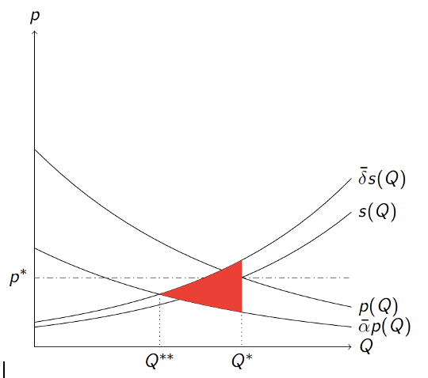

# Moral Considerations and Economic Surplus^[These lecture notes are based on the paper ‘Moral Considerations and Economic Surplus’ (working paper). Please do not distribute these lecture notes without permission.] ^[The author gratefully acknowledges the contribution of the Dutch Organization for Scientific Research (NWO Responsible Innovation grant---313-99-333). Furthermore, the content of these lecture notes benefited from the authors’ participation in a seed money project from the [Amsterdam Sustainability Institute](https://www.agci.vu.nl/en/). I am indebted to many people inside and outside academia for their invaluable thoughts and responses.] {#moral}

## Introduction

These lecture notes introduce another definition of economic surplus ('the economic pie’) that allows for moral considerations. It specifically investigates moral considerations related to the normative validity of counting costs and benefits of consumers and producers and external costs as economic social surplus. Why is this important? In the first week we have seen that the classical perspective of economic value rests on four pillars: (*i*) optimisation, (*ii*) equilibrium, (*iii*) empiricism and (*iv*) choice-based normativity. The implication of this perspective is that choices of market actors perfectly track value for society. 

The second week provided an extended perspective using insights from psychology. According to this perspective there can be a difference between choice-based value and experienced based value. Given particular assumptions it can be justified that experienced value is the right metric to measure instead of choice-based value. As we have seen, this has implications for policy interventions related to information provision and externality taxation.

This chapter questions the results of chapter \@ref(surplus) from a different angle: there can be moral considerations related to the choices of market actors that lead to the question whether it is justified to include the value of consumers, producers and the external costs completely in the economic surplus calculation. 

Before moving on, it is useful to illustrate why moral considerations are important. Consider a pork producer who is active in the market for pork. The government has set specific rules for pork production for those who want to become active in this market. With the aim of lowering marginal costs, the pork producer ignores some of these rules related to animal welfare without providing good reasons and without changing external costs. The producer rationally trades off lower marginal costs with the probability of getting a fine when being caught. According to the economic model of value developed in chapter \@ref(surplus) this leads to an *increase* in producer surplus in the market of pork and thereby into an increase is economic surplus. The example suggests that there are normative limits for behaviour by consumers and producers in markets that might not be captured in behavioural choice. 

Or consider a philosopher of animal welfare who considers the eating of pork to be morally problematic because pigs are sentient beings 'like us'. If the reasoning of this philosopher is correct, counting consumer benefits fully as social surplus is likely to be questionable. 

These two examples at least illustrate that the choice-based normativity perspective (chapter \@ref(surplus)) and experienced-based normativity (chapter \@ref(erroreconsurplus)) might not be shared by all persons and groups in society. In these lecture notes we therefore change the 4th pillar 'normativity' from choice-based to morally-based evaluation. 

How to deal with this in cost-benefit analysis? 

The key question to investigate here is: "What should count as 'better or worse off'?" [@atkinson2009economics;@sandel2013market]. This normative question can be investigated from different viewpoints: the individual level, the community level and the societal level. 

At the *individual level*, consumers and producers make moral commitments to their own perspective on the good life. They might want to eat less meat, fly less and might want to lower their carbon emissions by making more sustainable choices. However, these moral commitments and targets are not always reached leading to a discrepancy between the individuals’ perspective on the good life and their actual choices. Most persons are aware of this gap between their goals and actual behaviour in their personal lives. For example, sometimes individuals make promises to particular sustainability targets to others but do not keep these promises. Another example is the observation of flight shame which suggests that individuals have an independent reflective moral attitude (conscience) towards their own behaviour. Even when choices (Chapter \@ref(surplus))  and experiences (Chapter \@ref(erroreconsurplus)) are valuable and decisions are made to buy the product, this suggests that these choices might not be evaluated as truly ‘good’ by the individual.  

At the *community level*, individuals participate in communities who determine (partly or fully) what counts as valuable. Community membership can be voluntary or non-voluntary and membership of communities results in particular duties and customs. Communities entail particular minimum standards of behaviour for consumers and producers based on the community values. These standards can be viewed as partly independent of the preferences that are expressed by consumers and producers in their day-to-day market choices. For example, an activist participating in a ‘climate change community’ is likely to be held accountable for behavioural choices: only ‘telling the truth’ is likely not sufficient according the community standards.

At the *societal level*, individuals participate in the common project of living together. Governments can formulate particular minimal sustainability standards for market participants which in turn can lead to particular duties and customs for market actors. This was illustrated with the example of the pork producer above. Furthermore, governments can ask market participants to make concrete commitments in terms of sustainability. Goals can act as targets for moral excellence and result in obligations. 

In order to count something as valuable for society these different viewpoints can play a role and can result in a discrepancy between choice-based value and morally weighted social value. In line with the results of Chapter \@ref(erroreconsurplus) this can imply that the social optimum is not reached even when there are no external costs. Note that the different viewpoints do not restrict choice of market actors but seek to foster a plural perspective on what should count as valuable.  

The remainder of this chapter is structured as follows. First, Section II gives an overview of several strategies that are employed to deal with moral considerations when valuing market outcomes. This section motivates why an adjustment of economic surplus is needed when moral considerations are present. Section III develops a novel analytical specification of economic surplus and sections IV and V discuss the implications for pricing. Examples are provided along the way. Section VI concludes.

## Dealing with moral considerations at the valuation stage   

### Introduction

This section discusses four general approaches to deal with moral considerations when analysing (changes) in economic social surplus. The first approach is the ethical checkbox approach (section II.B), the second approach is the economizing ethics approach (section II.C), the third approach is the ethicizing economics approach (section II.D). The fourth approach is the qualitative valuation approach (section II.E). These approaches are not necessarily perfect substitutes but can be employed in a complementary way. 

### Ethical checkbox approach

The first approach to deal with moral considerations is the ‘ethical checkbox’ approach (ECH). This approach analyses moral considerations independently of economic surplus assessments using a list of *necessary* ethical requirements or rules for the behaviour of market actors. It is closely related to the ‘independent doctrine’ which views (micro-)economics as separate from ethics [see @high1985economics, p. 4--6, for a brief history]. The advantage of the ECH approach is that it gives room to the realm of moral and ethical reasoning for guiding market practices. This circumvents that ethical considerations are fully overtaken by utilitarian and game-theoretic arguments of economists when policy recommendations are given. When moral considerations are of a different kind than (monetized) utilitarian consumer value or producer profits and transcend consumer and producer choice behaviour such a separation seems useful and justified. When the ethical checkboxes are ticked, micro-economists can employ the standard definition of economic social surplus which is---in the absence of externalities---assumed to be equal to the sum of consumer and producer surplus. 

A disadvantage of the ECH approach is that it ignores the loss of economic social surplus resulting from consumers and producers in the market who do not act according to the ethical checkbox. The example of the pork producer who violated the rules illustrates this. Furthermore, the ECH approach also ignores other moral considerations that are not part of the checkbox but are nevertheless important for individual market actors, the communities they participate in or for society. This is because the standard specification of economic social surplus is based on choice-based normativity (pillar (*iv*)). The ECH approach assumes that costs and benefits should be counted without further normative consideration by the individual, the community or society. Consumer and producer moral responsibility do not enter the equations insofar this responsibility is not fully expressed in the particular market under consideration. The normative evaluation of public policies for markets is of course affected by this implicit assumption of moral *excellence* of market actors. As a result, it is questionable whether the assumed economic social surplus function correctly measures economic social value in the presence of (remaining) moral considerations.

### Economizing ethics approach

The second approach to deal with moral considerations when calculating economic social surplus is the ‘economizing ethics’ approach (ECE). This approach views moral considerations as (monetized) utilitarian internalities or externalities and has been applied to analyse repugnant markets, morality and identity, public policy decisions with an ethical component and regulations in the social domain [@lazear2000economic; @benabou2011identity;  @roth2018marketplaces; @chorus2018taboo; @mouter2021contrasting].

A good aspect of ECE is that it might enhance understanding of individuals choice behaviour when moral considerations for private or public decisions are present [@chorus2015models]. Furthermore, it frankly acknowledges that ignoring moral considerations in markets can lead to a loss of utilitarian value for people inside and outside these markets. @posner2017moral (p. 1812) write: 

> Our simple answer, put too briefly, is that on welfarist grounds, moral commitments can matter, and that when people would suffer a welfare loss when their moral commitments are violated, regulators should ask: how much are people willing to pay to honor those commitments?

And in another section of this paper @posner2017moral (p. 1840) write: "*Our major goal is to acknowledge rather than to resolve the measurement problem and to insist on the basic principle: people **experience** welfare losses from social outcomes that offend their moral commitments, even if those outcomes do not involve their own wealth or health. Private willingness to pay is the best way to measure those losses.*" The ECE approach therefore assumes that all experiences should count including experiences of moral losses or gains by third parties due to the market choices of consumers and producers.

ECE might also explain descriptively why there are societal laws that put restrictions on market trade. This is because the loss of monetized moral value by third parties can go beyond the value of market transactions, but is related to the actual market behaviour of consumers, producers and the regulator. According to the ECE approach, including the monetized utilitarian externalities stemming from moral considerations thereby can lead to better estimates of (changes in) economic surplus. Furthermore, an advantage of the ECE approach for economists is that it can be operationalized using empirical choice data in combination with the micro-econometric toolbox of applied economists. It is possible to ask persons what their willingness to accept is for violating a particular moral consideration in order to measure the external effects.

A disadvantage of the ECE approach is that it often fails to make normative sense for assessments of decisions outside markets. Without acknowledging distinct social domains with their corresponding distinct core values, rules and customs, it feels like bringing the hockey-stick of economic efficiency to join a field where teams play basketball. 

### Ethicizing economics approach

The third approach is the ‘ethicizing economics’ (ETE) approach which is explored in this paper. There are two different ways the ETE approach has been implemented in the literature. First, in the climate change literature, this approach has been pursued to deal with distributional effects using a novel specification of the social welfare function that employs a single ethical perspective such as prioritarianism instead of ECE [@spash1997ethics]. 

The second ETE approach which is pursued in these lecture notes, seeks to operationalise diverse normative ideas about what is socially valuable by re-specifying economic social surplus using ethical parameters. Such a normative *diversity* might even be present at the level of the individual as a mixture of deontological, virtue and consequential arguments play a role in the reflection on behavioural choices of market actors [see @van2007beyond;@white2009defense]. Economists are well equipped to study consequences, but other moral considerations related to duties and virtues have received less attention. What kinds of considerations can we think of?

Deontology is the study of duties:

> The word deontology derives from the Greek words for duty (deon) and science (or study) of (logos). In contemporary moral philosophy, deontology is one of those kinds of normative theories regarding which choices are morally required, forbidden, or permitted. In other words, deontology falls within the domain of moral theories that guide and assess our choices of what we ought to do (deontic theories).[Stanford Encyclopedia of Philosophy](https://plato.stanford.edu/entries/ethics-deontological/)

Deontological moral considerations therefore are therefore related to what market actors ought (not) to do and not what they are actually doing. This type of moral considerations results in particular duties. For now, it is sufficient to notice that such moral considerations can exist for particular markets of interest. 

Moral considerations related to virtue focus on moral character:

> It may, initially, be identified as the one that emphasizes the virtues, or moral character, in contrast to the approach that emphasizes duties or rules (deontology) or that emphasizes the consequences of actions (consequentialism).[Stanford Encyclopedia of Philosophy](https://plato.stanford.edu/entries/ethics-deontological/)

Besides moral character, virtue ethics also focusses on motivations and intentions behind the choices of market actors. According to this perspective, choosing polluting goods for utilitarian reasons is not sufficient when there are no appropriate motivations or reasons given. 

The framework for cost-benefit analysis developed in Chapter \@ref(surplus) does not deal with these moral considerations and leaves out normative reflection at the individual, community and societal level in the calculation stage. For example, a virtue ethicist focussing on sustainability practices might want to count the benefits of flying to Barcelona for the funeral of a family member differently than the marginal benefits of a person who goes 5 times per year on holidays by air travel ‘just for fun’. Motivations can matter for counting benefits and costs according to this view.

The ETE approach acknowledges that the mathematical specification of economic social surplus is a moral enterprise itself and that it can impact economists’ normative recommendations for optimal economic policies. Furthermore, the plural version of it acknowledges that there are multiple reasonable normative positions each resulting in a particular specification of the economic ‘pie’. Counting producer costs and benefits fully---as we did in week Chapter \@ref(surplus)---is just one of the normative perspectives.

Working directly on the economic social surplus function seems to be more in line with the arguments developed by moral philosophers from schools and traditions that focus on virtues and duties. The intuition of the difference between the ECE approach and the ETE approach is illustrated by structuring the argument. The ECE approach proceeds as follows:

(A)	 Consumer choices of market good $Q$ are morally questionable for sound moral considerations $R$.
(B)	Consumer benefits for $Q$ are not adjusted in the economic surplus.
(C)	Additional external costs are counted for violation of moral considerations $R$ by consumers.

This follows the ideas of @posner2017moral who propose to monetize external costs and results in a model that is equivalent to the model in Chapter \@ref(surplus) with additional external cost terms.

The ETE approach instead, deals directly with the moral consideration when specifying the economic surplus:

(A)	Consumer choices of market good $Q$ are morally questionable for sound moral considerations $R$.
(B)	Then in order to account for moral consideration $R$ in studies of the market in $Q$, it is reasonable to adjust the consumer benefits for $Q$ downwards using an ethical parameter.

Both approaches account for moral considerations but do this in a different manner depending on whether researchers find ECE or ETE more appropriate.

### Qualitative valuation approach

The fourth approach to deal with moral considerations is the qualitative valuation (QUV) approach. For this approach the quantitative calculation of exact changes in economic surplus is less relevant. The QUV approach can highlight which values are relevant for normative policy decisions on markets or decisions in other spheres of society [@klamer2017doing;@wempe2018reframing]. 

It is valuable for at least six reasons. First, it can enhance reciprocal understanding of those involved in valuation by fostering the conversation about the values underlying regulatory and market choices. Second, it acknowledges that normative preferences for public policies can partly be socially constructed for example by reading, role switching or by a deliberative process. Third, it is helpful for articulating which moral considerations are relevant for market valuation and why. Fourth, QUV can be helpful for the selection of competent persons for policy decisions. Fifth, an advantage of the QUV approach can be that the conversation is open and not dictated by a pre-defined analytical valuation method. Sixth, qualitative motivations developed by participants in the QUV approach can be helpful for policy makers articulating their motivations for their public policies [see for example @mouter2021contrasting, section 5].

A disadvantage of the QUV approach is that no *quantitative* estimation of impacts and value are provided that allow for a comparison of different economic policy interventions in markets including the status quo of doing nothing. Therefore, quantitative questions such as: ‘how high should an externality tax on good $X$ be?’ or ‘what is the loss of economic social value of changes in the market for $X$?’ cannot be answered using the QUV approach only. A second disadvantage is that it is harder to reach consensus, as heterogeneous opinions are sometimes hard to weigh when they are based on qualitative statements only. A third disadvantage is that the outcomes of the QUV approach depend on the quality of expression of the people who are involved. This might disadvantage those with less rhetorical and verbal qualities. 

### Contributions of the remainder of this chapter

There is no good reason to assume *a priori* that the assumption of moral excellence of consumers, producers and regulators in markets is valid. Furthermore, different groups in society or different experts might define moral excellence in different ways, and in some markets the assumption of moral excellence might be more valid than in others. According to @sen2000discipline (p. 952): 

> sensible cost-benefit analysis demands something beyond the mainstream method, in particular, the invoking of explicit social choice judgments that take us beyond market-centered valuation.

The aim of the remainder of this chapter is to offer a novel specification for the economic pie that allows for diverse normative considerations related to economic social surplus. The methodological approach allows for the inclusion of three kinds of moral considerations. Moral considerations related to: 

(i)	marginal consumer benefits;
(ii)	producer marginal costs;
(iii)	external costs. 

In order to show the impacts for economic policy recommendations, the new conceptualisation of economic social surplus is applied to the optimal taxation of a consumption externality. Such an exercise is useful to gain intuition on how moral considerations and ethical parameters can impact standard economic policy recommendations. The externality taxes seek to efficiently price positive or negative side effects resulting from market transactions while still allowing for trade in the market. But what is defined as ‘efficient’ of course depends on the definition of the economic pie by the researcher. Something, we already discovered in Chapter \@ref(erroreconsurplus). 

### Scope

Before moving on, it is good practice to think about the scope of the model: where can it be applied, and for which decisions can it not be applied? The model of this week is applicable for the analysis of the taxation of a consumption externality in existing markets with remaining moral considerations. It is not applicable for the analysis of whether a market should be opened or closed by a government. This class of policy decisions leads to other kinds of moral considerations related to offering choice opportunities. This raises fundamental freedom questions of which the analysis is beyond the scope of this academic course. 

Furthermore, distributional concerns, price and tax discrimination, bounded rationality of market actors (Chapter \@ref(erroreconsurplus).), strategic firm interactions, limited information, general equilibrium and bargaining between consumers and producers are ignored. This is done for clarity of exposition and argumentation and to stay close to how practical cost-benefit is often operationalized. 

## Redefining the economic pie

###	The advisory committee

This section redefines the economic ‘pie’ for a stylised partial equilibrium model of a single good or service mathematically and graphically. Suppose that an advisory committee is summoned that has $N$ members. Assume that each member $n$ of this advisory committee receives a weight $\omega_n \geq 0$ and that these weights sum up to $1$. Depending on the kind of market, the committee could consist of the full population of a region, city, country or the world, a group of representative elected officials, representatives of particular communities, representatives of responsible advisory institutions, a group of (scientific) experts or a weighted combination of all these groups. Membership of the committee can be based on experience, knowledge and expertise and/or on the degree that the expert represents a community or population of interest or simply on the status of being a citizen.

We will not discuss how this advisory committee *should* look like, what the requirements of membership should be and what the procedural process of deliberation should be. The mathematical description also abstracts away from potential strategic considerations within the advisory committee. 

It is assumed that all normative positions of the committee members are in principle correct or internally consistent and are based on correct information about the consequences of behaviour. This pragmatic assumption is inconsistent with the observation that in the presence of objective moral considerations there can be mutual exclusive positions where given the underlying (meta-)ethical assumptions the moral reasoning of only one or several of the committee members is correct.^[See @singh2020moral for a recent discussion on expert agreement, disagreement and the (non-)existence of objective moral facts.]

### Adjusted consumer surplus

Total monetized consumer benefits for the market are denoted by $\int_0^{Q^*}p(Q)dQ$ where $Q$ is the demand for the good or service. The marginal consumer benefits are given by $p(Q)$. This market inverse demand function reflects the maximum marginal willingness to pay for a group of anonymous consumers and is assumed to be independent of consumers’ income levels.  In equilibrium, marginal consumer benefits are equal to the private costs, resulting in an equilibrium demand of $Q^*$. It is assumed that all consumers all have the same private access costs and pay the same equilibrium price $p^*$ for the good or service. From a normative perspective the assessment of marginal consumption benefits of the consumer as reflected by the consumers’ marginal willingness to pay deserves more investigation. 

When there are moral considerations related to consumers’ marginal benefits, member $n$ of the committee can adjust the consumer benefits with an ethical weight $0 \leq \alpha_n \leq 1$. This adjustment can be based on moral considerations and reasons related to consumer responsibility. Committees can use survey data and interviews to learn more about the reasons and intentions of consumers or investigate whether the consumption choice has been made under free conditions or is the result of addiction. The adjustment of marginal consumer benefits does not entail that choice *should* be restricted or forbidden.  

Moral considerations relating to consumer behaviour can lead to scaling down consumer benefits in particular markets. Eq. \@ref(eq:acs) adjusts the consumer surplus for moral considerations related to consumer marginal benefits: 

\begin{equation}
ACS = \sum_{n=1}^N \omega_n \left(\int_0^{Q^*} \alpha_n p(Q)dQ - p^* Q^*\right) = \bar{\alpha} \int_0^{Q^*} p(Q)dQ - p^* Q^*,
(\#eq:acs)
\end{equation}
where $\bar{\alpha} = \sum_{n=1}^N \omega_n \alpha_n$ is the weighted average sum over all committee members for the ethical parameters for consumer benefits.^[An additional assumption is required for a valid model: at least one committee member needs to have $\alpha_n>0$. It is not necessary to have a weighted average: a majority voting decision on the weights is also possible, although this fully leaves out the normative perspectives of particular minorities in the advisory committee.] In the presence of moral considerations, consumer benefits are therefore adjusted downwards. Adjusted consumer surplus estimates in markets with moral considerations will therefore decrease in comparison to the case where moral excellence of consumers is assumed ($\bar{\alpha} = 1$). 

At this point it is helpful to provide an illustration how the model can be operationalized for practical policy analysis. Suppose an advisory committee on the economic value of the pork market is summoned. There are 10 representatives invited for this committee. Each of them has received an equal weight $\omega_n=0.1$. 

Table \@ref(tab:representatives) below provides an overview of the ethical weights the representatives propose for the marginal benefits of consumers and their reasons for choosing these weights. It includes a wide range of voices and reasons from society, institutes and advocacy groups. 

```{r representatives, echo = FALSE}
v1 <- c(
"Citizen representative.",
"Next generation representative.",
"Consumer representative.",
"Producer representative.",
"Governmental representative (chair of the committee).",
"Economist (specialization: environmental economics)",
"Philosopher (specialization: animal ethics)",
"Ecologist (specialization: biodiversity)",
"Climate activist representative.",
"Animal representative."
)
v2 <- c(
 "$\\omega_1 = 0.1$", 
  "$\\omega_2 = 0.1$", 
  "$\\omega_3 = 0.1$", 
  "$\\omega_4 = 0.1$", 
  "$\\omega_5 = 0.1$", 
  "$\\omega_6 = 0.1$", 
  "$\\omega_7 = 0.1$", 
  "$\\omega_8 = 0.1$", 
  "$\\omega_0 = 0.1$", 
  "$\\omega_{10} = 0.1$"
)
v3 <- c(
 "$\\alpha_1 = 0.6$", 
  "$\\alpha_2 = 0.5$", 
  "$\\alpha_3 = 1$", 
  "$\\alpha_4 = 1$", 
  "$\\alpha_5 = 0.6$", 
  "$\\alpha_6 = 1$", 
  "$\\alpha_7 = 0.7$", 
  "$\\alpha_8 = 0.6$", 
  "$\\alpha_9 = 0$", 
  "$\\alpha_{10} = 0$"
)
v4 <- c(
"Using a survey, we estimated what the average citizen weight for consumer marginal benefits in the pork market is for our country. It is estimated at $\\alpha_1=0.6$.",
"Consumption of pork meat leads indirectly to sustainability impacts for future generations. Consumers have a duty of care for these generations and have the opportunity to choose otherwise. However, changing food habits can be difficult as we know from our own experience. Therefore, we set $\\alpha_2=0.5$.",
"Consumers have the possibility to choose healthy sustainable meat substitutes but they do not want them and do not value them high enough at the moment. There is no need to scale down their benefits as their choice is made under free conditions and there is no pork meat addiction.",
"We produce for the market and respond to consumers’ needs and wants. Consumers are free to change these needs and wants if they want to live up to their own moral standards. There is no need to adjust marginal consumer benefits.",
"As a government we want to be neutral among normative perspectives when evaluating policies. We therefore will take the average weights of the other committee members as they represent the different voices in society.",
"No scaling of consumer benefits is needed because full information about sustainability impacts is available for quite some time. Therefore, it seems that the current direct utility function of consumers gives the most appropriate evolutionary social fit for consumers.",
"For those consumers who commit themselves to the no-harm principle in ethics and see no distinct difference between animals and humans, scaling down consumer benefits is reasonable. Research for our country shows that 30\\% of the people commit themselves to the combination of these principles but still consume meat.",
"Consumers have a responsibility for harm against nature. The systemic and well-known impacts of climate change on biodiversity require a reconsideration of estimated consumer benefits in this market.",
"The time for action is NOW as human extinction is coming near. No consumer benefits should be counted in the social surplus as consumption of meat substantially contributes to climate change.",
"It is time for animal empathy. Imagine that you would be born in this world as a pig instead of a human? Would you find it appropriate to be eaten by another species for money?"
)
df <- data.frame( v1, v2, v3, v4 )
kable(df, 
      align="l", 
      booktabs=TRUE, escape = F, 
      caption = 'Representatives and weights. Numbers are chosen for illustration.',
      col.names = c("Committee member", "Decision weight", "Recommended weight for consumer marginal benefits", "Reasons")
) %>%
  kable_styling(bootstrap_options = "striped")
```

The average ethical weight for consumer marginal benefits is given by the following weighted sum:

\begin{equation}
 \bar{\alpha} = \sum_{n=1}^N \omega_n \alpha_n = 0.1 \sum_{n=1}^{10} \alpha_n = 0.6
\end{equation}

This shows that the average consumer weight results in counting 60% of the consumer marginal benefits. According to this committee, the counted consumer benefits will therefore be 40% lower compared to the model of Chapter \@ref(surplus). (Note that numbers and reasons are chosen for illustration).

It might be helpful for you to reflect on the reasons and their relationship to the ethical weights. Do you think the reasons behind the weights are convincing? Which expert is closest to your own opinion on the topic? Do you think there are other reasons that should be included? What do you think about assigning the experts an equal weight $0.1$?

Figure \@ref(fig:moralconsiderations) summarizes this section with a graphical illustration of the impacts of averaged ethical weights for consumer surplus in markets. It shows that market equilibrium is established at the point where the inverse demand is equal to the supply price $p^*$. In the presence of moral considerations related to consumer benefits, the inverse demand applied for evaluation shifts inwards with a factor $\bar{\alpha} < 1$. As equilibrium demand remains at $Q^*$, the counted total consumer benefits are equal to $A+B$ and are $C+D$ lower compared to the case $\bar{\alpha} = 1$ which is the classical case of Chapter \@ref(surplus). Consumer surplus is given by $(A+B)-(B+D)=A-D$. This is lower compared to the consumer surplus calculation that ignores moral considerations ($A+C$).

```{r, echo=FALSE, fig.cap = "Moral considerations and adjusted consumer surplus", label='moralconsiderations'}

```

### Adjusted producer surplus

Producer behaviour is described by a market inverse supply function $s(Q)$ that shows the minimum price for which a total of Q units are supplied by a group of anonymous firms. The area under this inverse supply function up to the equilibrium demand gives the total costs for all firms in the market. It is assumed that fixed costs are zero. Given the assumptions made, the area above this inverse supply curve up to the equilibrium price then measures the total net profits in the market. As in the basic micro-economic model, firms are assumed to be price-takers and general equilibrium and potential market power considerations are ignored. Furthermore, it is assumed that costs for production inputs can be counted as real societal costs instead of transfers to other firms or workers.  

Moral considerations related to the marginal costs can be related to the investments of firms to produce goods or services. When there are moral considerations related to capital costs, labour, natural resources, (raw) materials and information/data used for production, these producer costs can be adjusted upwards by committee members applying an ethical weight $\delta > 1$. 

Moral considerations related to capital costs can be present when it is unclear where the money comes from that is used to finance the business. When money comes from illegal or doubtful criminal sources or when there is evidence of financial fraudulent behaviour this gives a reason to adjust the marginal cost curve upwards (see @reurink2018financial for an overview of such moral considerations).

There are many examples of moral considerations to correct producer costs upwards related to labour. Firms might have lower production costs because they use forced labour or child labour of children who cannot go to school (probably indirectly via subcontracting). Suppose that the counterfactual option of fair production would be to produce at a marginal cost curve that is 5% higher. When committee member n considers subcontracted forced and/or child labour to be morally problematic (s)he can adjust the total costs using $\delta_n=1.05$. In line with the ETE approach, this correction does not include the external costs of forced labour but seeks to account for the intrinsic moral quality of the production process of the firms in the market that make use of this labour.

Moral considerations related to resources and raw materials can be important as well. For example, when materials of products cannot be re-used in the production process this might be viewed as intrinsically less valuable for ecological oriented committee members. Taking the moral considerations related to (iii) and (iv) into account, the adjusted (equilibrium) producer surplus can be written as:

\begin{equation}
APS = \sum_{n=1}^N \omega_n \left(p^*Q^* - \int_0^{Q^*}\delta_N s(Q) dQ\right)= p^*Q^* - \bar{\delta} \int_0^{Q^*} s(Q) dQ,
\end{equation}
where $\bar{\delta} = \sum^N_{n=1}\omega_n \delta_n$ are the weighted average sums of the producers’ related ethical weights over all representatives. Moral considerations lead to higher producer costs compared to the standard model of Chapter \@ref(surplus). In highly controversial markets there is no reason why this adjusted producer surplus cannot be negative.

At this point it is useful to illustrate the model in this subsection using an example. Table \@ref(tab:scalingmarginal) summarizes the weights and the reasons of the representatives. All numbers are chosen for illustrative purposes. 

```{r scalingmarginal, echo = FALSE}
v1 <- c(
"Citizen representative.",
"Next generation representative.",
"Consumer representative.",
"Producer representative.",
"Governmental representative (chair of the committee).",
"Economist (specialization: environmental economics)",
"Philosopher (specialization: animal ethics)",
"Ecologist (specialization: biodiversity)",
"Climate activist representative.",
"Animal representative."
)
v2 <- c(
 "$\\omega_1 = 0.1$", 
  "$\\omega_2 = 0.1$", 
  "$\\omega_3 = 0.1$", 
  "$\\omega_4 = 0.1$", 
  "$\\omega_5 = 0.1$", 
  "$\\omega_6 = 0.1$", 
  "$\\omega_7 = 0.1$", 
  "$\\omega_8 = 0.1$", 
  "$\\omega_9 = 0.1$", 
  "$\\omega_{10} = 0.1$"
)
v3 <- c(
  "$\\delta_1 = 1.1$", 
  "$\\delta_2 = 1.1$", 
  "$\\delta_3 = 1$", 
  "$\\delta_4 = 1$", 
  "$\\delta_5 = 2.2$", 
  "$\\delta_6 = 1$", 
  "$\\delta_7 = 1.25$", 
  "$\\delta_8 = 1.8$", 
  "$\\delta_9 = 1.8$", 
  "$\\delta_{10} = 10$"
)
v4 <- c(
"Using a survey, we found out what the average citizen weight for producer marginal costs in the pork market is for our country. It is estimated at $\\delta_1=1.1$.",
"Production of pork meat leads to sustainability impacts for future generations. Producers have a duty of care for these generations but have limited opportunities to switch jobs. Therefore, we set $\\delta_2=1.1$.",
"Consumers have the possibility to choose healthy sustainable meat substitutes and production will follow demand. There is no need to scale up marginal producer costs.",
"There are some issues with production and animal welfare, but that is normal in many markets. There is no need to adjust marginal costs.",
"As a government we want to be neutral among normative perspectives. We therefore will take the average weights of the other committee members as they represent different voices in society.",
"No scaling is needed because full information about impacts is available. Therefore, it seems that the current marginal cost function gives the most appropriate evolutionary social fit for consumers. Producers already make a rational trade-off between following the rules and the probability to get caught.",
"For those producers who commit themselves to the no-harm principle in ethics and see no distinct difference between animals and humans, scaling up marginal costs is reasonable. Survey research shows that no producers in the market commit themselves to the combination of these principles. However, 10\\% of the producers produce at 20\\% lower marginal costs because they do not follow the governmental rules of production. The marginal costs should therefore be scaled up with $1/0.8=1.25$.",
"Producers have a responsibility for harm against nature. The systemic impacts of climate change on biodiversity require a reconsideration of marginal costs in this market. Producing meat in a biological sustainable way would imply marginal costs which are 80\\% higher. Therefore, I recommend 
$\\delta_8=1.8$.",
"The time for action is NOW as extinction is coming near! Producing meat in a biological sustainable way would imply marginal costs which are twice as high. Therefore, I recommend $\\delta_9=1.8$.",
"It is time for animal empathy. Imagine that you would be born in this world as a pig instead of a human? Would you find it appropriate to be killed by your boss for money? The true benchmark here is the sustainable production of animal friendly LAB-meat which has marginal costs which are a factor 10 higher. Therefore, I recommend $\\delta_10=10$."
)
df <- data.frame( v1, v2, v3, v4 )
kable(df, 
      align="l", 
      booktabs=TRUE, escape = F, 
      caption = 'Scaling of marginal costs of production. All numbers are chosen for illustration.',
      col.names = c("Committee member", "Decision weight", "Recommended weight for consumer marginal benefits", "Reasons")
) %>%
  kable_styling(bootstrap_options = "striped")
```

The average weight for the marginal costs is given by:

\begin{equation}
 \bar{\delta} = \sum_{n=1}^N \omega_n \delta_n = 0.1 \sum_{n=1}^{10} \delta_n = 2.228.
\end{equation}

This implies that counted marginal costs are about 223% higher than the real marginal costs. It is useful for you to reflect on the different reasons behind the chosen ethical weights. Do you consider their reasoning to be valid? Are there other reasons that should have been brought to the table? Which representative most closely matches your own perspective?

```{r, echo=FALSE, fig.cap = "Moral considerations and producer surplus.", label='psmoral'}
knitr::include_graphics("./figures/psmoral.png")
```

Figure \@ref(fig:psmoral) summarizes this sub-section with a graphical illustration of the impacts of moral weights on the determination of producer surplus in markets. The figure shows that equilibrium is established at the point where the market inverse supply curve $s(Q)$ is equal to the equilibrium price as firms with higher marginal production costs will not produce for a lower price. In the presence of moral considerations, the market inverse supply curve applied for evaluation shifts upwards with a factor $\bar{\delta} > 1$. As equilibrium demand remains at $Q^*$ regardless of how costs are counted, the counted producer costs in the economic social surplus are then $E+G+H$. This is $E+G$ higher compared to the case where $\bar{\delta}= 1$. Total counted producer surplus is equal to $F-E$. This is $G+E$ lower compared to the neo-classical case.

A key difference with the model developed in Chapter \@ref(erroreconsurplus) is that the producers do not adjust prices according to the normative standard that is set at the evaluation stage. Therefore $s(Q)$ is used to determine the equilibrium price (and not  $\bar{\delta}s(Q)$).

### Adjusted economic surplus

In the absence of external costs, the adjusted equilibrium social surplus is given by the sum of the adjusted consumer and producer surplus:

\begin{equation}
  AES = ACS + APS = \bar{\alpha} \int_0^{Q^*} p(Q)dQ - \bar{\delta} \int_0^{Q^*} s(Q) dQ.
  (\#eq:adjsocsur)
\end{equation}

Eq. \@ref(eq:adjsocsur) shows that moral considerations bring down the consumer benefits and raise the producer costs. Figure \@ref(fig:moralloss) shows the welfare loss that follows from the assumption of moral excellence of consumers and producers. Equilibrium demand $Q^*$ results from the intersection of the inverse demand curve $p(Q)$ and the inverse supply curve $s(Q)$. $Q^{**}$ would be the socially optimal quantity as it is determined by the intersection of weighted marginal consumer benefits and weighted marginal producer costs.


```{r, echo=FALSE, fig.cap = "Welfare loss following from the moral excellence assumption", label='moralloss'}

```

The red ‘triangle’ then indicates the loss of welfare due to the moral excellence assumption. As the demand in equilibrium is higher than optimal, there is a loss of surplus for the consumers between $Q^*$ and $Q^{**}$, as for these consumers counted consumer costs are higher than counted consumer benefits. The key insight can be summarized as:

> According to the model, the assumption of moral excellence of market actors leads to structural overconsumption in markets as the socially optimal demand is always lower than the equilibrium demand in the unregulated situation.”

The result in Figure \@ref(fig:moralloss)  is qualitatively different compared to behavioral welfare economic models with behavioral errors made by consumers and producers. These behavioral errors can lead to higher or lower ‘experienced’ inverse demand curves and to higher orlower ‘experienced’ inverse supply curves. As we have seen in Chapter \@ref(erroreconsurplus), this can result both in equal, lower or higher equilibrium demand than the socially optimal demand under perfect rationality. This is not the case for the conceptual model developed for this chapter: because of the moral excellence assumption optimal demand will always be lower than observed demand. 

## Taxation and moral consideration

Because market surplus is not equal to the socially optimal surplus a regulator can correct for this using a price instrument. Such a price instrument does not interfere with the freedom to consume or produce and does not have to be a substitute for using policy measures to combat remaining injustice in the market. The assumption that the ethical parameters are independent of the equilibrium price and quantity helps to obtain some stylized results. 

Appendix \@ref(apptax) shows that the equilibrium tax expression that optimizes the adjusted social surplus Eq. \@ref(eq:adjsocsur) is given by:

\begin{equation}
 \tau = p^{*R} \frac{\bar{\delta} - \bar{\alpha}}{\bar{\alpha}}.
   (\#eq:taxmoral)
\end{equation}

The first observation is that this tax is non-negative as the equilibrium price in the regulated equilibrium ($p^{*R}$) is positive and $\bar{\delta} \geq 1 \geq \bar{\alpha} \geq 0$. In the presence of moral considerations, it is therefore economically justified to impose a positive tax that corrects for the fact that in the unregulated equilibrium, consumers and producers in the market ignore moral considerations. This observation is consistent with the discussion around Figure \@ref(fig:moralloss): socially optimal demand is below equilibrium demand in the unregulated equilibrium.

Second, because the ethical weights enter proportionally, the tax in Eq. \@ref(eq:taxmoral) is proportional to the equilibrium price $p^{*R}$ in the regulated equilibrium. This result does not hold anymore when ethical weights are functions of the demand.

Third, moral considerations related to consumer benefits raise the tax as decreasing $\bar{\alpha}$} is equivalent with shifting the adjusted market inverse demand curve inwards. The level of the tax increases in $\bar{\delta}$}---as intuitively---moral considerations related to producer costs are equivalent with shifting the market inverse supply curve upwards, leading to a lower socially optimal equilibrium demand. 

Fourth, a stylized example is useful to gain some intuition about the potential quantitative importance of moral considerations. Using the recommended ethical weights in Tables \@ref(tab:representatives)  and \@ref(tab:scalingmarginal) results in a tax recommendation of:

\begin{equation}
\tau=p^{*R}  \frac{2.228-0.6}{0.6}=2.71 p^{*R)}.
\end{equation}

This is a substantial tax equal to 271% of the equilibrium price, but based on the numbers chosen for illustrative purposes in Tables \@ref(tab:representatives)  and \@ref(tab:scalingmarginal). Moral considerations therefore potentially play a large role in policy decisions.

Fifth, the tax has a similar analytical structure as the tax developed in Chapter \@ref{erroreconsurplus}. Assuming $\bar{\alpha} = \frac{1}{b_c}$  and $\bar{\delta} =\frac{1}{b_p}$, gives the result of week \@ref{erroreconsurplus}.. The reason is that moral considerations scale the inverse demand and the inverse supply curve in as shown in Figure \@ref(fig:moralloss) and behavioural errors scale these curves in a similar proportional way. Note however, that the reasons for doing so are entirely different. Furthermore, prices do not adjust to the ethical weights. This is different in Chapter \@ref{erroreconsurplus} where prices adjust with the behavioural errors of consumers and producers.     

## Externality taxation and moral considerations

### Moral considerations related to the kind of externality 

The last category of moral considerations that this chapter deals with stems from the application to the taxation of externalities by a regulator: the kind of external effect determines whether it should be regulated using a tax.

This category of considerations does justice to the intuition and to discussions on good governance in political science: for some external effects imposing a tax is more reasonable than for others. Intrinsic considerations, social customs, governance goals, value and externality tolerance and moral reasons might therefore ‘overrule’ (part of the) utilitarian external costs. As @medema2007hesitant (p. 339) discussing Mill writes: 

>Indeed, even where government intervention may be warranted, the appropriate form of such action will vary, depending on the **nature** of the market failure.” (PK: bold emphasis added).

Members of the advisory committee therefore have to decide on their weight for the external costs in the economic social surplus to do justice to these moral considerations. Define $0 \leq \eta_n \leq 1$ as the weight attached to the externality. Then the weighted external costs over all committee members are given by $\bar{\eta}e(Q)$, where $\bar{\eta} = \sum_{n=1}^N \omega_n \eta_n$ is the average weight over all committee members. Again, it is assumed for simplicity that the ethical weights $\eta_n$ of committee members do not depend on the equilibrium quantity. An example for the motivated choice of ethical weights by the representatives is given in Table \@ref(tab:scalingexternal). 

```{r scalingexternal, echo = FALSE}
v1 <- c(
"Citizen representative.",
"Next generation representative.",
"Consumer representative.",
"Producer representative.",
"Governmental representative (chair of the committee).",
"Economist (specialization: environmental economics)",
"Philosopher (specialization: animal ethics)",
"Ecologist (specialization: biodiversity)",
"Climate activist representative.",
"Animal representative."
)
v2 <- c(
 "$\\omega_1 = 0.1$", 
  "$\\omega_2 = 0.1$", 
  "$\\omega_3 = 0.1$", 
  "$\\omega_4 = 0.1$", 
  "$\\omega_5 = 0.1$", 
  "$\\omega_6 = 0.1$", 
  "$\\omega_7 = 0.1$", 
  "$\\omega_8 = 0.1$", 
  "$\\omega_9 = 0.1$", 
  "$\\omega_{10} = 0.1$"
)
v3 <- c(
  "$\\eta_1 = 0.8$", 
  "$\\eta_2 = 1$", 
  "$\\eta_3 = 0.5$", 
  "$\\eta_4 = 0$", 
  "$\\eta_5 = 0.81$", 
  "$\\eta_6 = 1$", 
  "$\\eta_7 = 1$", 
  "$\\eta_8 = 1$", 
  "$\\eta_9 = 1$", 
  "$\\eta_{10} = 1$"
)
v4 <- c(
"Using a survey, we found out what the average citizen weight for external costs in the pork market is for our country. It is estimated at $\\eta_1=0.8$.",
"Production of pork meat leads to sustainability impacts for future generations. All external costs should be counted $\\eta_2=1$.",
"External costs should be diminished by consumer and producer choices. However, it is fair when part of the external costs are incorporated in the price.",
"In other markets external costs are allowed. Why is the pork market so special?",
"As a government we want to be neutral among normative perspectives. We therefore will take the average weights of the other committee members as they represent different voices in society.",
"External costs should be dealt with as this is consistent with a utilitarian view on society.",
"The utility of animal choices is not incorporated in the economic surplus. Therefore, external costs should be fully counted.",
"Producers have a direct responsibility for harm against nature and consumers an indirect responsibility. External costs should be counted.",
"The time for action is NOW as extinction is coming near! External costs should be counted fully to mitigate the negative side effects.",
"From an animal perspective it is best to count external costs fully"
)
df <- data.frame( v1, v2, v3, v4 )
kable(df, 
      align="l", 
      booktabs=TRUE, escape = F, 
      caption = 'Scaling of the external costs. All numbers are chosen for illustration.',
      col.names = c("Committee member", "Decision weight", "Recommended weight external costs", "Reasons")
) %>%
  kable_styling(bootstrap_options = "striped")
```

The average weight for the external costs is given by:
\begin{equation}
 \bar{\eta} = \sum_{n=1}^N \omega_n \eta_n = 0.1 \sum_{n=1}^{10} \eta_n = 0.81.
\end{equation}

This implies that counted external costs are about 19% lower than the real marginal costs. Note that the numbers in Table \@ref(tab:scalingexternal) are chosen for illustration.

### Application: pricing consumer externalities that are external to the market

The insights of Sections III.A and III.B can be used to adjust the economic social surplus and to investigate the implications for the optimal taxation of consumption externalities. For simplicity it is assumed that these externalities do not affect the generalized prices of consumers in the market. Adding adjusted external costs leads to the following adjusted economic social surplus:^[Eq. \@ref(eq:adjsocsur2) excludes monetized moral utilitarian external costs to remain consistent with the ethicizing economics approach as discussed in Section II. In principle these moral externalities could be added, but only for those members in the committee who consider the ECE approach to be more appropriate. This would result in a blended approach of the ECE and ETE approaches. For reasons of clarity and the argument given in Section II, this blended approach is not pursued in this paper.]

\begin{equation}
  AES = \bar{\alpha} \int_0^{Q^*} p(Q)dQ - \bar{\delta} \int_0^{Q^*} s(Q) dQ - \bar{\eta} e(Q^*).
  (\#eq:adjsocsur2)
\end{equation}

The implicit equilibrium expression for the first-best externality tax is given by (see Appendix \@ref(apppricing) for the interested reader):

\begin{equation}
 \tau = p^{*R} \frac{\bar{\delta} - \bar{\alpha}}{\bar{\alpha}} + \frac{\bar{\eta}}{\bar{\alpha}}MEC,
   (\#eq:taxmoral2)
\end{equation}
where $p^{*R}$ is the price in the regulated equilibrium. This tax expression has two analytical terms. The first component is equal to the tax Eq. \@ref(eq:taxmoral) derived in Section II. 

The second term in Eq. \@ref(eq:taxmoral2) is related to the external costs. It multiplies the marginal external costs in the regulated equilibrium MEC with a factor $\frac{\bar{\eta}}{\bar{\alpha}}$, which is equal to $\bar{\eta}$ in the absence of moral considerations related to consumer benefits and governmental taxation. Suppose the external costs are fully counted implying $\bar{\eta} = 1$. This results in the following simplified tax expression:

\begin{equation}
 \tau = p^{*R} \frac{\bar{\delta} - \bar{\alpha}}{\bar{\alpha}} + \frac{1}{\bar{\alpha}}MEC,
   (\#eq:taxmoral3)
\end{equation}

Counting consumer benefits for 50% then implies a recommended externality tax which is 100% higher compared to the recommended standard Pigouvian tax that internalizes marginal external costs. When giving recommendations for pricing consumption externalities, moral considerations can therefore interact in a non-linear way and potentially have substantial quantitative implications. 

## Conclusion and discussion

This chapter shows that moral considerations can have implications for economic policy valuation as these considerations go to the root of the normative matter: the specification of economic social surplus or the so-called economic ‘pie’. This specification is at the heart of the concept of economic efficiency operationalized in micro-economic policy analysis. When externalities are absent, Section III shows that---from an economic perspective---taxation is justified because ‘free’ markets do not lead to the optimization of economic social surplus adjusted for moral considerations. This contrasts with the idea:

> $\ldots$ that competitive equilibrium is efficient since the time of Marshall [@lazear2000economic p. 102].

Section IV extends the model to account for moral considerations related to external costs. This section also shows how the expressions for first-best Pigouvian consumption taxes are affected by moral considerations. When there are only moral considerations related to consumer benefits, this can have substantial impact on recommended externality taxes: half the consumer slice, twice the externality price. Moral considerations therefore interact with externality pricing and are not simply additive monetized external costs.

Ignoring moral considerations when calculating economic social surplus implicitly assumes moral excellence of consumers and producers. This leads to the ignorance of other normative perspectives in the valuation stage of a policy intervention in a market. This insight is especially relevant for the current use of practical cost-benefit analysis for public policies, because for these decisions moral considerations that transcend market valuations of consumers and producers are often relevant. Whether a proposed policy can be labeled as ‘efficient’ or ‘optimal’ therefore depends on the specification of the economic pie, which in turn depends on the underlying ethical assumptions that are made.

The proposed adjustment of economic social surplus in this paper is pragmatic in that it allows for a wide variety of normative views related to consumer, producer and governmental behavior. For the purpose of public policy evaluation such an impartial calculation of economic social surplus using a weighted average of normative perspectives seems reasonable, but of course this pragmatism is a normative perspective as well.  

One could argue that in the proposed model non-utilitarian moral considerations related to duties of consumers and producers are implicitly monetized via the taxation rules. This is a valid concern, but comparatively speaking---and as stated in the introduction---the plural ethicizing economics approach is preferred over the approach that ignores these moral considerations altogether when calculating economic surplus (‘ethical checkbox’) or the approach that explicitly monetize the ignorance of these moral considerations (‘economizing ethics’) as it *directly* deals with the moral considerations when specifying the economic ‘pie’ without taking an external costs ‘detour’. Furthermore, the proposed calculation of economic surplus still allows for an ethical checkbox or other social and law considerations that can overrule or complement tax recommendations based on economic social surplus calculations. The use of moral externality taxes is therefore not a substitute for action to reduce grave and tragic injustice and external costs in markets. 

A benefit of the approach is that room is given for considerations related to voice and exit [@hirschman1970exit]. ‘Exit’ considerations are captured by market choices of consumers and producers. If they do not want to produce or consume the good they can choose something else. ‘Exit’ is properly accounted for in the behavioural choices of consumers and producers. ‘Voice’ considerations in our context are related to the different normative perspectives in society related to what should be counted as valuable. The ethical weights are helpful instruments to give different voices a place in the normative stage of the analysis.
