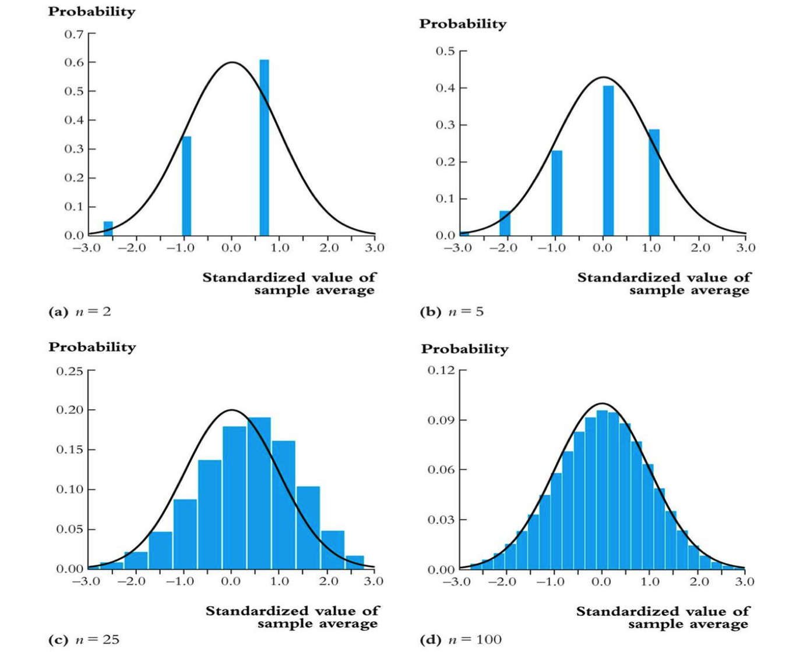
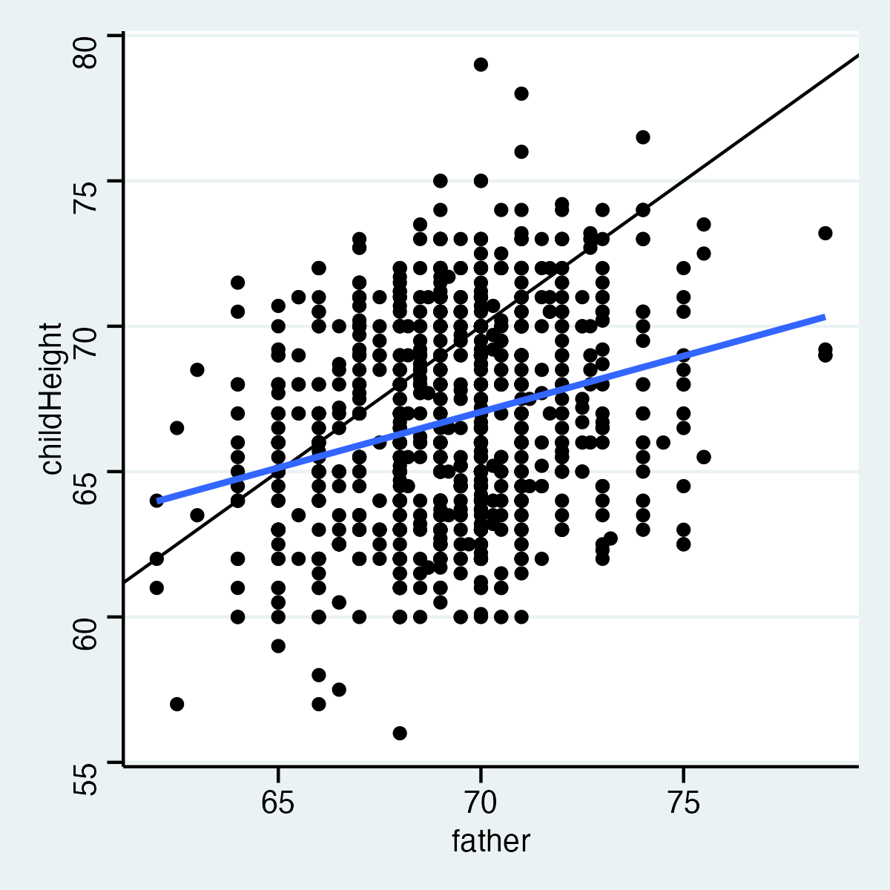
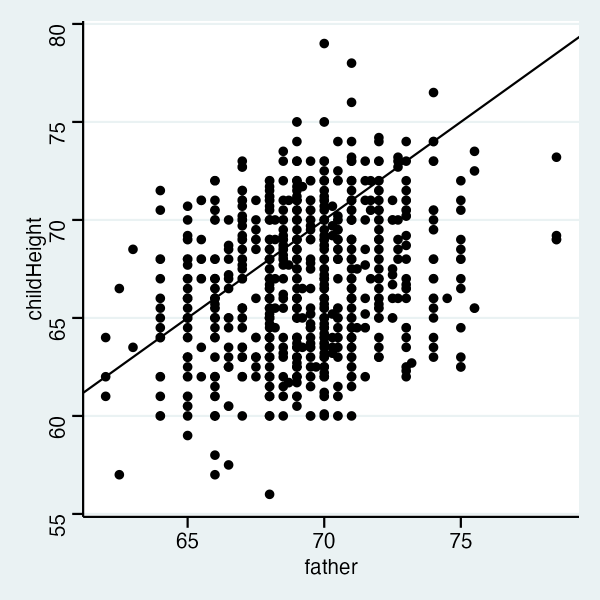
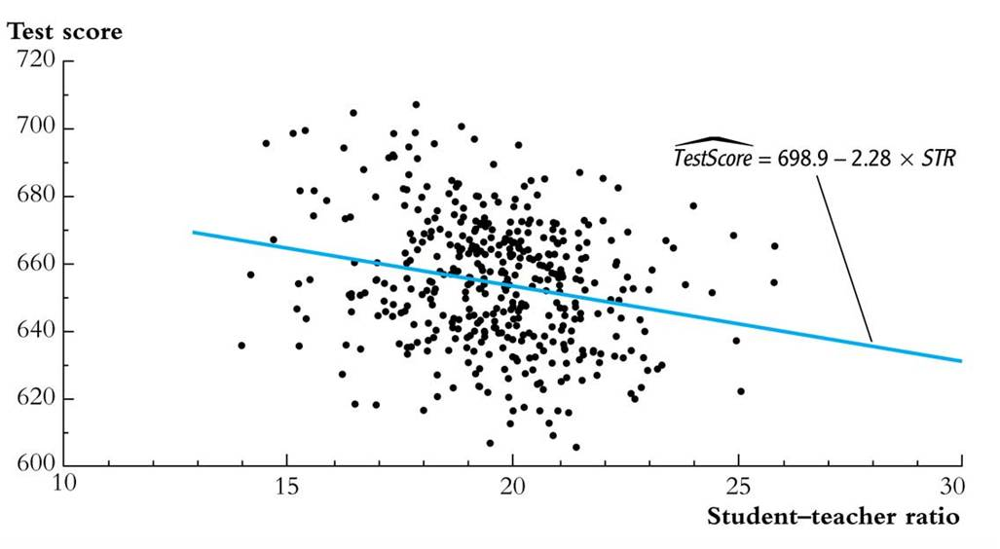
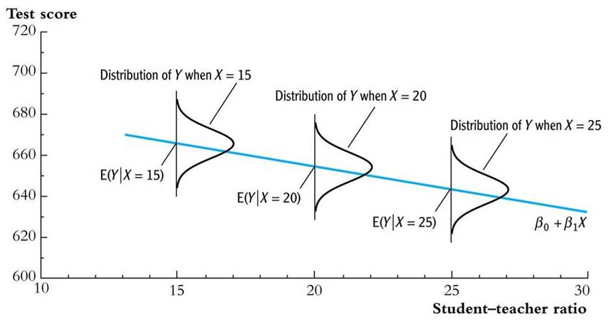
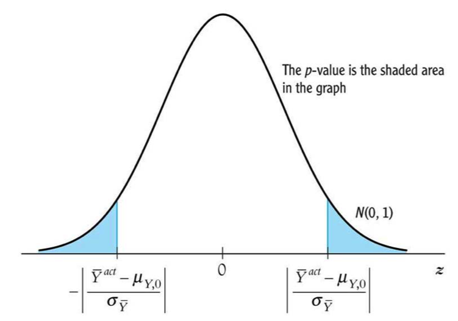

# Regression analysis in the social sciences

## Introduction

Why should we have something as applied econometrics in the social sciences? That is because we have theories as in Chapters (\@ref(surplus))--(\@ref(moral)) and those theories contain variables such as in the direct utility function of equation \@ref(eq:directutility):

\begin{equation}
U(Q,G) = \frac{A}{\alpha}\left( 1- e^{-\alpha Q} \right ) + BG.
\end{equation}

Here the quantities for the market good $Q$ and the outside good $G$ are to considered to be *known*---also often referred to as data. In theoretical work they are fictional or sometimes simulated. A certain amount of consumption of the market good and the outside good lead then some level of utility which an economist want to maximise.  

This second part of the course is therefore about using data to quantify (socio-economic) parameters. Moreover, we focus on measuring **causal** effects, instead of mere correlations. Note, that in an ideal world, we would like conducting experiments as to measure a causal relation of a phenomenon $X$ on $Y$. However, we almost always only have observational data on, for example demand and prices. In the second part of this course and syllabus with difficulties arising from using observational data to estimate these causal effects and to rewrite models as \@ref(eq:directutility) such that we can actually *use* data to tease out values for---in this case---$A$ and $\alpha$.

This chapter is organised as follows. The next section addresses the problem of finding a *relation* between some $X$ and some $Y$. Here, we follow example in the well-known textbook of \@stock2003introduction where we look at the relation between school class size and school class performance. At the same time, we also introduce some `STATA` commands. Thereafter, section \@ref(secstatframe) deals with the statistical framework that is needed for applied econometrics. Note that we assume that the reader already had a course in introductionary statistics and provide only the basic concepts most important for this course in Appendix \@ref(appreviewstat). 

## So, what is the problem? {#secproblem}

As explained in the introduction above, applied econometrics aims to give the policy maker well-informed values for variables she needs. She needs these variables basically for two things:

1. **Causal inference**: The policy maker wants to assess the effect of a change in one variable (typically called $X$) on another variables (often called $Y$).
2. **Prediction**: If you know what variable $X$ is, what should $Y$ then be?

Nowadays, most applied econometric techniques are concerned with causal inference, not so much with prediction. Even more, the techniques often applied are beneficial for correct causal inference, but might harm prediction. However, see that without correct causal inference (so knowing the **true** causal effect) prediction is always cumbersome. That is why current methods such as machine learning methods first focus on finding the correct causal mechanism (even without sometimes specifying what that may be) and then optimize prediction. 

Thus, finding (causal) mechanism helps the scientist or policy maker in assessing the outcomes of a particular (policy) intervention. In the economic realm one could think about trying to assess the following quantities:

- To what extent do people eat less meat if we increase the prices with 1% (using a meat-tax)?
- If we increase Dutch dikes with one meter, how much less flood risk will there be?
- How much do classes perform better is we reduce class-sizes with one student?


```{stata, collectcode=TRUE}
use "./data/caschool.dta", clear
summarize str testscr
```

```{stata scatterplot, echo=1, results="hide"}
scatter str testscr
quietly graph export scatter.svg, replace
```


Numerical evidence

1. estimation
		
  - Compare average test scores in districts with low STRs to those with high STRs
    
2. hypothesis testing
    
  - Test the "null" hypothesis that the mean test scores in the two types of districts are the same, against the ``alternative'' hypothesis that they differ
      
3. confidence intervals
	  
  - Estimate an interval for the difference in the mean test scores, high v. low STR districts

Initial data analysis
Compare districts with "small" (STR $<$ 20) and "large" (STR $\geq$ 20) class sizes:

```{r smalllarge, echo = FALSE}
v1 <- c(
"Small", "Large"
  )
v2 <- c(657.4, 650.0)
v3 <- c(19.4, 17.9)
v4 <- c(182, 238)
df <- data.frame( v1, v2, v3, v4 )
kable(df, 
      "html", 
      align="l", 
      booktabs=TRUE, escape = F, 
      col.names = c("Class size", "Average score", "Standard deviation", "$n$")
) %>%
  kable_styling(bootstrap_options = "striped")
```
			
1. estimation of $\Delta$ = difference between group means
2. Test the hypothesis that  $\Delta = 0$
3. Construct a confidence interval for $\Delta$

Estimation

\begin{eqnarray}
\bar{Y}_{small} - \bar{Y}_{large} &=& \frac{1}{n_{small}} \sum_{i=1}^{n_{small}}Y_i - \frac{1}{n_{large}} \sum_{i=1}^{n_{large}} Y_i \\
&=& 657.4-650.0\\
&=&7.4
\end{eqnarray}
Is this a large difference in a real-world sense?

1. Standard deviation across districts = 19.1
2.  Difference between 60$^{\mathrm{th}}$ and 75$^{\mathrm{th}}$  percentiles of test score distribution is $667.6 - 659.4 = 8.2$
3.  Is $\Delta$ big enough to be important for school reform discussions, for parents, or for a school committee?

Hypothesis testing

Difference-in-means test:  compute the $t$-statistic^[page 94 of syllabus statistics],
\begin{equation}
t = \frac{\bar{Y}_s - \bar{Y}_l}{\sqrt{\frac{s^2_s}{n_s} +\frac{s^2_l}{n_l} }} = \frac{\bar{Y}_s - \bar{Y}_l}{SE(\bar{Y}_s - \bar{Y}_l)}
\end{equation}
where $SE(\bar{Y}_s - \bar{Y}_l)$ is the *standard error* of
$(\bar{Y}_s - \bar{Y}_l)$,
- the subscripts $s$ and $l$ refer to "small" and
  "large" STR districts
- $s_s^2 = \frac{1}{n_{small}}\sum_{i=1}^{n_s}(Y_i - \bar{Y}_s)^2$

Compute the difference-of-means t-statistic:
\begin{equation}
t = \frac{\bar{Y}_s - \bar{Y}_l}{\sqrt{\frac{s^2_s}{n_s} +\frac{s^2_l}{n_l} }}  = \frac{657.4 - 650.0}{\sqrt{\frac{19.4^2}{238} +\frac{17.9^2}{182} }} = \frac{7.4}{1.83} = 4.05
\end{equation}

- $|t|>1.96$, so reject (at the 5% significance level) the null hypothesis that the two means are the same
- Easier with Stata: `ttest testscr, by(small)`

Confidence interval


-  A 95\% confidence interval for the difference between the means is:
\begin{equation}
(\bar{Y}_s - \bar{Y}_l)\pm 1.96 \times SE(\bar{Y}_s - \bar{Y}_l) = 7.4 \pm 1.96 \times 1.84 = (3.7, 11.0)
\end{equation}
- Two equivalent statements:
  1. The 95\% confidence interval for $\Delta$ doesn't include 0
  2. The hypothesis that $\Delta = 0$ is rejected at the 5\% level

## Statistical framework {#secstatframe}

Population, random variable, and distribution}

- Population
    - The group or collection of all possible entities of interest (school districts)
    - We will think of populations as infinitely large ($\infty$) 

- Random variable $Y$
    - Characteristic of entity (district average test score, district $STR$)
    - Unknown, before measurement ($y$)\newline

- probability distribution is a mathematical function that
provides the probabilities of occurrence of all different possible outcomes in an *experiment*: e.g., $\Pr(Y = y)$  $\forall y$

First 2 moments of a population distribution}
- Mean = expected value (expectation) of $Y$
    - $E(Y) = \mu_Y$
    - Long-run average value of $Y$ over repeated realizations of $Y$:
      - $\frac{1}{n}\sum_{i = 1}^{n}y_{i}$\newline

- Variance = $E(Y - \mu_Y)^2$
    - $\sigma^2_Y$
    - measure of the squared spread of the distribution

Standard deviation = $\sqrt{\text{variance}} = \sigma_Y$

Joint distributions and covariance
- Random variables $X$ and $Z$ have a joint distribution
- The covariance between $X$ and $Z$ is:
\begin{equation*}
cov(X,Z) = E[(X- \mu_X)(Z- \mu_Z)] = \sigma_{XZ}
\end{equation*}
- The covariance is a measure of the linear association between $X$ and $Z$; its units are units of $X \times$ units of $Z$
- $cov(X,Z) > 0$ means a positive relation between $X$ and $Z$
- If $X$ and $Z$ are independently distributed, then $cov(X,Z) = 0$ 
- The covariance of a r.v. with itself is its variance:
\begin{equation*}
cov(X,X) = E[(X-\mu_X)(X - \mu_X)] = E[(X - \mu_X)^2] = \sigma^2_X
\end{equation*}

The correlation coefficient
\begin{equation*}
corr(X,Z) = \frac{cov(X,Z)}{\sqrt{var(X)var(Z)}} = \frac{\sigma_{XZ}}{\sigma{_X}\sigma{_Z}} = r_{XZ}
\end{equation*}
$-1 \leq corr(X,Z) \leq 1$\newline
- $corr(X,Z) = 1$ means perfect positive linear association
- $corr(X,Z) = -1$ means perfect negative linear association
- $corr(X,Z) = 0$ means no linear association

The correlation coefficient measures linear association

```{r, echo=FALSE, fig.cap = "Correlation coefficient", label='corrcoef'}
knitr::include_graphics("./figures/Sheet27.png")
```

Conditional distributions and conditional means

- Conditional distributions
    - The distribution of $Y$, given value(s) of some other random variable, $X$
    - Ex: the distribution of test scores, given that $STR < 20$ 
- Conditional means
- conditional mean = mean of conditional distribution = $E(Y|X = x)$  (important concept and notation)
Example: $E(Test scores|STR < 20)$ = the mean of test scores among districts with small class sizes

Difference in means
\begin{equation*}
\Delta = E(Test scores|STR < 20)-  E(Test scores|STR \geq 20)
\end{equation*}

- Other examples of conditional means:

- Wages of all female workers ($Y$ = wages, $X$ = gender)
- Mortality rate of those given an experimental treatment ($Y$ = live/die; $X$ = treated/not treated)

- If $E(X|Z)$ = const, then $corr(X,Z) = 0$ 
- The conditional mean is another term for the group mean


So, where does all this uncertainty come from anyway?

- We will assume *random sampling*

- Choose an individual (or district, firm, etc.) at random from the population 

- Randomness and data

- Prior to sample selection, the value of $Y$ is random because the individual selected is random
- Once the individual is selected and the value of $Y$ is observed, then $Y$ is just a number---not random
- The data set is $(Y_1, Y_2,\dots, Y_n)$, where $Y_i$ = value of $Y$ for the $i^{\mathrm{th}}$ individual (district, entity) sampled
-  Note: S\&W use capital $Y_{i}$ instead of $y_{i}$. The subscript $i$ denotes a realisation

Distribution of $Y_1$,\ldots, $Y_n$ under simple random sampling

- Because individuals \#1 and \#2 are selected at random, the value of Y$_1$ has no information content for $Y_2$.  Thus:


- $Y_1$ and $Y_2$ are independently distributed
- $Y_1$ and $Y_2$ come from the same distribution, that is, $Y_1$, $Y_2$ are identically distributed
- That is, under simple random sampling, Y$_1$ and Y$_2$ are independently and identically distributed (i.i.d.).
- More generally, under simple random sampling, Y$_i$, $i = 1$,\ldots, $n$, are *i.i.d*.


- This framework allows rigorous statistical inferences about *the mean* $\bar{Y}$ of population distributions using a sample of data from that population \ldots


The sampling distribution of $\bar{Y}$
$\bar{Y}$  is a random variable, and its properties are determined by the *sampling distribution=* of $\bar{Y}$

- The elements in the sample are drawn at random.
- Thus the values of $(Y_1,\ldots, Y_n)$ are random
- Thus functions of $(Y_1,\ldots, Y_n)$, such as $\bar{Y}$, are random: had a different sample been drawn, they would have taken on a different value
- The distribution of $\bar{Y}$ over different possible samples of size $n$ is called the sampling distribution of $\bar{Y}$.
- The concept of the sampling distribution underpins all of econometrics (*frequentists* statistics)


Example: simple binomial random variables


Example:  Suppose $Y$ takes on 0 or 1 with the probability distribution, $\Pr[Y = 0] = 0.22$, $\Pr(Y =1) = 0.78$
Then
\begin{eqnarray*} 
\mu_{Y} &=& p \times 1 + (1-  p) \times 0 = p = 0.78\\
\sigma^2_Y&=& E[Y - \mu_{Y}]^2 = p(1 - p) \\
&=& 0.78 \times 0.22 = 0.17
\end{eqnarray*}
The sampling distribution of $\bar{Y}$ depends on $n$.
Consider $n = 2$. The sampling distribution of $\bar{Y}$ is,
\begin{eqnarray*} 
\Pr(\bar{Y}  = 0) &= 0.22^2 &= 0.05 \\
\Pr(\bar{Y}  = 1/2) &=  2 \times 0.22 \times 0.78 &= 0.34\\
\Pr(\bar{Y}  = 1) &= 0.78^2 &= 0.61
\end{eqnarray*}

The sampling distribution of $\bar{Y}$ when $Y$ is binomial ($p = 0.78$)}

`set obs 10000`
`generate Y = rbinomial(2,0.78)/2` 
`hist(Y), fraction`

And what if we consider $n = 5$, and $n = 100$?

Mean and variance of sampling distribution of $\bar{Y}$, ctd.
\begin{eqnarray*}
E(\bar{Y}) &=& \mu_Y\\
Var(\bar{Y}) &=& \frac{\sigma_Y^2}{n}
\end{eqnarray*}

- Implications
    - $\bar{Y}$ is an *unbiased* estimator of $\mu_Y$ (that is, $E(\bar{Y}) = \mu_Y$)
    - var($\bar{Y}$) is *inversely proportional* to $n$
    - Thus the standard error associated with $\bar{Y}$ is $\sqrt{\frac{\sigma_Y^2}{n}}$ (larger samples, less uncertainty but square-root law)

The sampling distribution of $\bar{Y}$ when $n$ is large
For small sample sizes, the distribution of $\bar{Y}$ is complicated,
but if $n$ is large, the sampling distribution is \alert{simple}

- as $n$ increases, the distribution if $\bar{Y}$ becomes more tightly centered around $\mu_Y$ (the *Law of Large Numbers*)
- moreover, the distribution of $\bar{Y}$ becomes normal (the *Central Limit Theorem*)
- $\bar{Y}$ is approximately distributed $N(\mu_Y,\frac{\sigma^2_Y}{n})$ \newline
- "Standardized" $\bar{Y} = \frac{\bar{Y}-\mu_Y}{\sigma_Y/\sqrt{n}}$  is approximately distributed as $N(0,1)$ \newline
- The larger is $n$, the better is the approximation.


Sampling distribution of *standardized* average when $p = 0.78$}
```{r, echo=FALSE, fig.cap = "Sampling distribution", label='samplingdist'}

```


## Univariate regression

### Genesis: *regression towards the mean*

Where does regression comes from?


```{r, echo=FALSE, fig.cap = "Relation heigh fathers and height children", label='galton2'}

```

```{r, echo=FALSE, fig.cap = "Relation heigh fathers and height children", label='galton1'}

```

### Regression with one regressor

Linear regression allows us to *estimate*, and make *inferences* about, *population* slope coefficients.  Ultimately our aim
is to estimate the *causal* effect on $Y$ of a unit change in $X$---but for now, just think of the problem of fitting a	straight line to data on two variables, $Y$ and $X$.

Statistical inference

- Estimation}:
    - How should we draw a line through the data to estimate the (population) slope (answer: ordinary least squares).
		- What are advantages and disadvantages of OLS? \newline

- Hypothesis testing:
    - How to test if the slope is zero? 
    
- Confidence intervals:
    - How to construct a confidence interval for the slope?

Linear regression: some notation and terminology

- The population regression line:

Test Score = $\beta_0$ + $\beta_1$ STR

\begin{eqnarray}
	\beta_1& =& \text{slope of population regression line} \\
	&=&   \frac{\Delta Testscore}{\Delta STR}\\
	&=& \text{change in test score for a unit change in STR}
\end{eqnarray}
		
- Why are $\beta$$_0$ and $\beta_1$  "population" parameters?
- We would like to know the population value of $\beta$$_1$.
- We don't know $\beta$$_1$, so must estimate it using data.

The population linear regression model and general notation}

\begin{equation}
	Y_i = \beta_0 + \beta_1 X_i + u_i, \qquad i\ldots n
\end{equation}

- $X$ is the independent variable or regressor
- $Y$ is the dependent variable
- $\beta$$_0$ = intercept, $\beta$$_1$ = slope
- $u_i$ is the regression error
- The regression error consists of omitted factors, or possibly measurement error in the measurement of $Y$. In general, these omitted factors are other factors that influence $Y$, other than the variable $X$

```{r, echo=FALSE, fig.cap = "bla", label='unire'}
knitr::include_graphics("./figures/Lecture1_sheet8.png")
```


The ordinary least squares estimator (SW Section 4.2)

		
- How can we estimate $\beta$$_0$ and $\beta$$_1$ from data?
- We will focus on the least squares (ordinary least squares or OLS) estimator of the unknown parameters $\beta$$_0$ and $\beta$$_1$, which solves,
\begin{equation}
	\min_{b_0,b_1} \sum^n_{i=1} \left[Y_i - (b_0 + b_1 X_i) \right]^2
\end{equation}

The OLS estimator, predicted values, and residuals}
-The OLS estimators of the slope $\beta$$_1$ and the intercept $\beta$$_0$ are:

\begin{eqnarray}
	\hat{\beta}_1 &=& \frac{\sum^n_{i=1}(X_i - \overline{X})(Y_i - \overline{Y})}{\sum^n_{i=1}(X_i - \overline{X})^2} = \frac{s_{XY}}{s^2_X}\\
	\hat{\beta}_0 &=& \overline{Y} - \hat{\beta}_1\overline{X}
\end{eqnarray}
		
- The OLS predicted values $\hat{Y}_i$ and residuals $\hat{u}_i$ are:

\begin{eqnarray}
	\hat{Y}_i &=& \hat{\beta}_0 + \hat{\beta}_1 X_i, \qquad i = 1, \ldots, n\\
	\hat{u}_i &=& Y_i - \hat{Y}_i, \qquad i = 1, \ldots, n
\end{eqnarray}

```{r, echo=FALSE, fig.cap = "bla", label='cloud'}
knitr::include_graphics("./figures/Lecture1_sheet13.jpg")
```

- Estimated slope  = $\hat{\beta}_1 = -2.28$
- Estimated intercept = $\hat{\beta}_0 = 698.9$
- Estimated regression line: $\widehat{TestScore} = 698.9 - 2.28 \times STR$

Interpretation of the estimated slope and intercept}
	$\widehat{TestScore} = 698.9 - 2.28 \times STR$

- Districts with one more student per teacher on average have test scores that are 2.28 points lower.
- That is, $\frac{\Delta TestScore}{\Delta STR} =-2.28$
- The intercept (taken literally) means that, according to this estimated line, districts with zero students per teacher would have a (predicted) test score of 698.9.
- This interpretation of the intercept makes no sense---extrapolates the line outside the range of the data---, the intercept is not economically meaningful.

Predicted values & residuals
```{r, echo=FALSE, fig.cap = "bla", label='sheet15'}

```
- One of the districts in the data set is Antelope (CA) for which $STR = 19.33$ and $TestScore = 657.8$
- Predicted value: $\hat{Y}_{Antelope}= 698.9 - 2.28 \times 19.33 = 654.8$
- Residual: $\hat{u}_{Antelope} = 657.8 - 654.8 = 3.0$

OLS regression: STATA output

```{stata, collectcode=TRUE}
regress testscr str, robust
```

We will discuss the rest of this output later)

## Least squares assumptions

\begin{equation}
Y_i = \beta_0 + \beta_1 X_i + u_i, \qquad i = 1 \dots n
\end{equation}


1. The conditional distribution of $u$ given $X$ has mean zero, that is, $E(u \mid X = x) = 0$.
    - This implies that $\hat{\beta_1}$ is *unbiased*
2. $(X_i,Y_i), i =1 \ldots n$ are i.i.d.
    - This is true if $X$, $Y$ are collected by simple random sampling
    - This delivers the sampling distribution of $\hat{\beta_0}$ and $\hat{\beta_1}$
3. Large outliers in $X$ and/or $Y$ are rare.
    -  Outliers can result in meaningless values of $\hat{\beta_1}$

Least squares assumption 1: $E(u \mid X = x) = 0$.

```{r, echo=FALSE, fig.cap = "Assumption 1", label='ass1'}

```

Example: $TestScore_i = \beta_0 + \beta_1 STR_i + u_i$, $u_i$ = other factors

- What are some of these other factors?
- Is $E(u|X = x) = 0$ plausible for these other factors?

Least squares assumption 1, ctd.

Consider an ideal randomized controlled experiment:

- $X$ is *randomly* assigned to people (students randomly assigned to different size classes; patients randomly assigned to medical treatments).
- Because $X$ is assigned randomly, all other individual characteristics---the things that make up $u$---are *independently* distributed of $X$
- Thus: $E(u \mid X = x) = 0$
- In actual experiments, or with **observational* data, we will need to think hard about whether $E(u|X = x) = 0$ holds.

Least squares assumption 2: $(X_i,Y_i), i = 1 \dots n$ are i.i.d.


This arises automatically if the entity (individual, district) is sampled by simple *random sampling8:
the entity is selected then, for that entity, $X$ and $Y$ are observed (recorded).  

Possible violations:
- snowballing
- temporal correlation
- spatial correlation


Least squares assumption 3: Large outliers are rare

A large outlier is an \alert{extreme} value of $X$ or $Y$


- However, the substance of this assumption is that a large outlier can strongly \alert{influence} the results

OLS can be sensitive to an outlier:


```{r, echo=FALSE, fig.cap = "Outlier", label='outlier'}
knitr::include_graphics("./figures/Lecture1_sheet29.jpg")
```

- Is the lone point an outlier in $X$ or in $Y$?


## Hypothesis testing

Hypothesis testing

**Reject** the \textbf{null}-hypothesis. That is, test 

- $H_0: E(Y) = \mu_{Y,0}$ vs. $H_1: E(Y) \neq \mu_{Y,0}$  

Note: you actually test whether the data *you* have corresponds with the null-hypothesis: or 
- What is the probability that your data ($D$) might be right *given* the null-hypothesis ($H_0$): $\Pr(D|H_0)$

Terminology

Some terminology for testing statistical hypotheses:

- $p$-value = probability of drawing a statistic (e.g., $\bar{Y}$) *at least as adverse* to the null as the value actually computed with your data, \textbf{assuming} that the null hypothesis is true.
- The significance level of a test is a *pre-specified* probability of incorrectly rejecting the null, when the null is true.
- Calculating the $p$-value based on $\bar{Y}$:

\begin{equation*}
 p\text{-value} = \Pr_{H_0}[|\bar{Y} - \mu_{y,0}| > |\bar{Y}^{act} - \mu_{y,0}|]     
\end{equation*}
where $\bar{Y}^{act}$ is the value of $\bar{Y}$ actually observed

Calculating the $p$-value, ctd.
- To compute the $p$-value, you need the to know the sampling distribution of $\bar{Y}$, which is complicated if $n$ is small.
- If $n$ is large, you can use the normal approximation (CLT):
	\begin{eqnarray*}
							p\text{-value}& = &   \Pr_{H_0}[|\bar{Y} - \mu_{y,0}| > |\bar{Y}^{act} - \mu_{y,0}|]\\
              & = &   \Pr_{H_0}[|\frac{\bar{Y} - \mu_{Y,0}}{\sigma_Y/\sqrt{n}}| > |\frac{\bar{Y}^{act} - \mu_{Y,0}}{\sigma_Y/\sqrt{n}}|]\\
              & = &   \Pr_{H_0}[|\frac{\bar{Y} - \mu_{Y,0}}{\sigma_{\bar{Y}}}| >    |\frac{\bar{Y}^{act} - \mu_{Y,0}}{\sigma_{\bar{Y}}}|]\\
							&\simeq& \text{probability under left + right } N(0,1) \text{ tails}
	\end{eqnarray*}
	where $\sigma_{\bar{Y}}$ = std. dev. of the distribution of $\bar{Y}  = \sigma_Y/\sqrt{n}$.

Calculating the $p$-value with $\sigma_Y$ known:

```{r, echo=FALSE, fig.cap = "Hypothesis testing", label='pvalues'}

```

- For large $n$, $p$-value = the probability that a $N(0,1)$ random variable falls outside $|(\bar{Y}^{act} - \mu_{Y,0})/\sigma_{\bar{Y}} | = |t|$
- In practice, $\sigma_{\bar{Y}}$ is unknown; it must be estimated

What is the link between the $p$-value and the significance level?

The significance level is pre-specified. For example, if the pre-specified significance level is 5\%,

- you reject the null hypothesis if $|t| \geq 1.96$
- equivalently, you reject if $p \leq 0.05$
- The $p$-value is sometimes called the marginal significance level.
- Often, it is better to communicate the $p$-value than simply whether a test rejects or not---the $p$-value contains more information than the ``yes/no'' statement about whether the test rejects.


```{r, echo=FALSE, fig.cap = "Significance in the social sciences", label='significance'}
knitr::include_graphics("./figures/significance.jpg")
```
Confidence intervals}
- A 95\% confidence interval for $\mu_Y$ is an interval that contains the true value of $\mu_Y$ in 95\% of repeated samples.

- \begin{equation*}
\bar{Y}\pm1.96 \frac{s_Y}{\sqrt{n}}
\end{equation*}
A 95\% confidence interval can always be constructed as the set of values of $\mu_Y$ not rejected by a hypothesis test with a 5\% significance level.


## Conclusion and discussion
