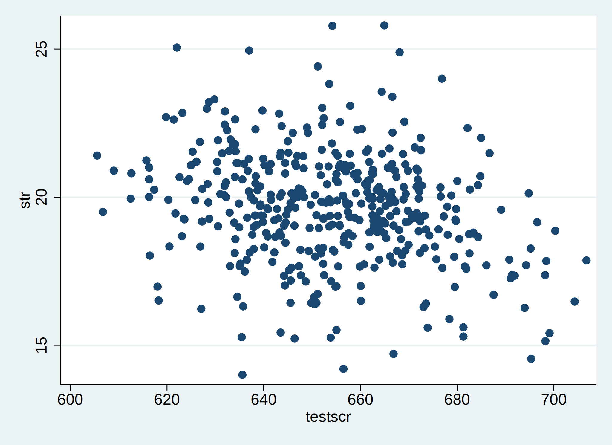

# Regression analysis in the social sciences

Why should we have something as applied econometrics in the social sciences? That is because we have theories as in Chapters (\@ref(surplus))--(\@ref(moral)) and those theories contain variables such as in the direct utility function of equation \@ref(eq:directutility):

\begin{equation}
U(Q,G) = \frac{A}{\alpha}\left( 1- e^{-\alpha Q} \right ) + BG.
\end{equation}

Here the quantities for the market good $Q$ and the outside good $G$ are to considered to be *known*---also often referred to as data. In theoretical work they are fictional or sometimes simulated. A certain amount of consumption of the market good and the outside good lead then some level of utility which an economist want to maximise.  

This course is about using data to measure **causal** effects. Ideally, we would like an experiment, but almost always we only have observational data
on returns to education (aka wages), housing prices or commuting flows. The second part of this course and syllabus with difficulties arising from using observational data to estimate causal effects

- confounding effects (omitted factors)
- simultaneous causality
-  measurement error

## So, what is the problem?

```{stata, collectcode=TRUE}
use "./data/caschool.dta", clear
summarize str testscr
```

```{stata scatterplot, echo=1, results="hide"}
scatter str testscr
quietly graph export scatter.svg, replace
```



## Statistical framework

## Univariate regression

## Least squares assumptions

## Testing of coefficients
