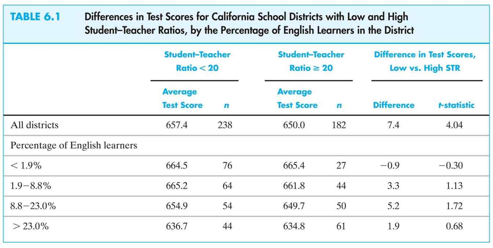
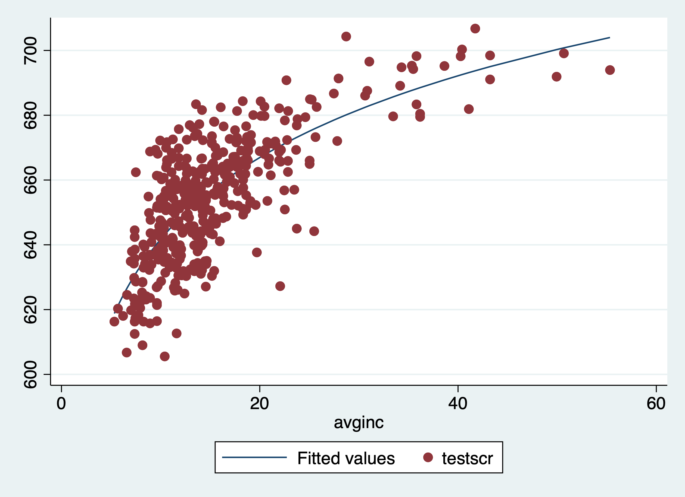
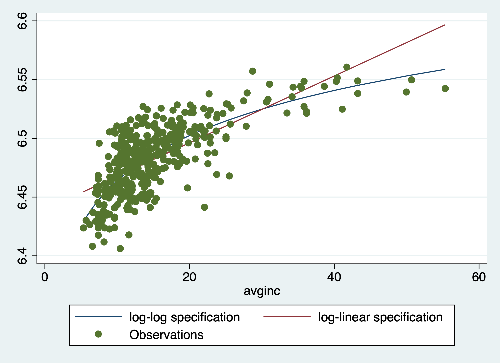

# Modeling in the Social Sciences {#modeling}

## Why more independent variables?

Directed Acyclical Graphs (DAG)
Pearl, Judea. Causality. Cambridge university press, 2009

```{r, echo=FALSE, fig.cap = "Unrelated omitted variables", label='unknown'}
knitr::include_graphics("./figures/unknown.png")
```

The confounding fork

```{r, echo=FALSE, fig.cap = "Related omitted variables", label='unobshet'}
knitr::include_graphics("./figures/Unobshet.png")
```

**U** is a *common* cause for both student teacher ratio and testscores!
\begin{equation}
Y_i = \beta_0 + \beta_1 X_i + u_i
\end{equation}

The error $u$ arises because of factors that influence $Y$ but are not included in the regression function; so, there are *always* omitted variables.

The omission of those variables can lead to **bias** in the OLS estimator.

The bias in the OLS estimator that occurs as a result of an omitted factor is called omitted variable bias. For omitted variable bias to occur, the omitted factor $Z$ must be:

1. A **determinant** of $Y$ (i.e. $Z$ is part of $u$)
2. **Correlated** with the regressor $X$ (i.e. $corr(Z,X) \neq 0$)

Both conditions must hold for the omission of $Z$ to result in omitted variable bias.

In the test score example:

English language ability (whether the student has English as a second language) plausibly affects standardized test scores: $Z$ is a **determinant** of $Y$.

Immigrant communities tend to be less affluent and thus have smaller school budgets---and higher $STR$: $Z$ is **correlated** with $X$.

Accordingly, $\hat{\beta}_1$ is biased. What is the direction of this bias?

What does common sense suggest?
If common sense fails you, there is a formula

\begin{equation}
\hat{\beta}_1 \overset{p}{\to} \beta_1 + \frac{\sigma_u}{\sigma_X}\rho_{Xu}
\end{equation}
If an omitted factor $Z$ is both:

- a determinant of $Y$ (that is, it is contained in $u$); and
- correlated with $X$,

then $\rho_{XU} \neq 0$ and the OLS estimator $\hat{\beta}_1$ is biased (and is not consistent).

So, districts with more English learning students (*i*) do worse on standardized tests and (*ii*) have bigger classes (smaller budgets), so ignoring the English learning factor results in overstating the class size effect.

Is this is actually going on in the CA data?

```{r, echo=FALSE, fig.cap = "Cross tabulation of test scores by class size and percentage English learners", label='omitca'}

```

*fewer* English Learners have *higher* test scores
Districts with *lower* percent EL ($PctEL$) have *smaller* classes
What is the effect of class size with comparable PctEL?

Three ways to overcome omitted variable bias

1. Run a randomized controlled experiment in which treatment ($STR$) is randomly assigned: then $PctEL$ is still a determinant of $TestScore$, but $PctEL$ is uncorrelated with $STR$.
2. Adopt the cross tabulation approach, with finer gradations of $STR$ and $PctEL$---within each group, all classes have the same $PctEL$, so we control for $PctEL$
3. Use a regression in which the omitted variable ($PctEL$) is no longer omitted: include $PctEL$ as an additional regressor in a multiple regression.

## Multivariate regression analysis


Consider the case of two regressors:
\begin{equation}
Y_i =\beta_0 + \beta_1 X_{1i} + \beta_2 X_{2i} + u_i, i=1,\ldots,n
\end{equation}

- $Y$ is the dependent variable
- $X_1$, $X_2$ are the two independent variables (regressors)
- $(Y_i, X_{1i}, X_{2i})$ denote the i$^{\mathrm{th}}$ observation on $Y$, $X_1$, and $X_2$.
- $\beta_0$ = unknown population intercept
- $\beta_1$ = effect on $Y$ of a change in $X_1$, **holding** $X_2$ constant}
- $\beta_2$ = effect on $Y$ of a change in $X_2$, **holding** $X_1$ constant}
- $u_i$ = the regression error (omitted factors)


\begin{equation}
Y_i = \beta_0 + \beta_1 X_{1i} + \beta_2 X_{2i}+u_i, i=1,\ldots,n
\end{equation}

Consider changing $X_1$ by $\Delta X_1$ while holding $X_2$:

Population regression line before the change:
\begin{equation}
Y = \beta_0 + \beta_1 X_{1} + \beta_2 X_{2}
\end{equation}

Population regression line, after the change:
\begin{equation}
Y + \Delta Y = \beta_0 + \beta_1 (X_{1} + \Delta X_1) + \beta_2 X_{2}
\end{equation}

- So before: $Y = \beta_0 + \beta_1 X_1  + \beta_2 X_2$
- After: $Y + \Delta Y = \beta_0 + \beta_1 (X_{1} + \Delta X_1) + \beta_2 X_{2}$
- Difference: $\Delta Y = \beta_1 \Delta X_1$
- $\beta_1 = \frac{\Delta Y}{\Delta X_1}$ Holding $X_2$ constant
- $\beta_2 = \frac{\Delta Y}{\Delta X_2}$ Holding $X_1$ constant
- $\beta_0$ predicted value of $Y$ when $X_1 = X_2 = 0$

Example: the California test score data

Regression of TestScore against STR:
\begin{equation}
\widehat{TestScore} = 698.9- 2.28 STR
\end{equation}
Now include percent English Learners in the district ($PctEL$):
\begin{equation}
\widehat{TestScore} = 686.0- 1.10 STR - 0.65  PctEL
\end{equation}

What happens to the coefficient on $STR$ Why? (Note: $corr(STR, PctEL) = 0.19$)

Multiple regression in STATA

```{stata, collectcode=TRUE}
reg testscr str el_pct, robust
```

### Measures of Fit for Multiple Regression

Actual = predicted + residual: $Y_i = \hat{Y}_i + \hat{u_i}$
- $SER$ =std. deviation of $\hat{u}_i$ (with d.f. correction)
- $RMSE$ =std. deviation of $\hat{u}_i$ (without d.f. correction)
- $R^2$ = fraction of variance of $Y$ explained by $X$
- $\bar{R}^2$ = ``adjusted $R^2$'' = $R^2$ with a degrees-of-freedom correction that adjusts for estimation uncertainty; $\bar{R}^2 <R^2$

Measures of fit

Test score example:

\begin{eqnarray}
TestScore &= &698.9- 2.28  STR \\
&&R^2 = .05, SER = 18.6
\end{eqnarray}

\begin{eqnarray}
TestScore &=& 686.0 - 1.10  STR - 0.65 PctEL \\
&&R^2=.426, \bar{R}^2=0.424, SER = 14.5
\end{eqnarray}

 What---precisely--does this tell you about the fit of regression (2) compared with regression (1)?
Why are the $R^2$ and the $\bar{R}^2$  so close in (2)?

### The Least Squares Assumptions for Multiple Regression

\begin{equation}
Y_i = \beta_0 + \beta_1 X_{1i} + \beta_2 X_{2i}+\ldots + \beta_k X_{ki}+u_i, i=1,\ldots,n
\end{equation}

1.  The conditional distribution of $u$ given the $X$'s has mean zero, that is, $E(u|X_1 = x_1,\ldots, X_k = x_k) = 0$.
2.  (X$_{1i}$,\ldots,X$_{ki}$,Y$_i$), i =1,\ldots,n, are i.i.d.
3.  Large outliers are rare for $X_1,\ldots, X_k$, and $Y$
4.  There is no perfect multicollinearity.


Assumption 1: the conditional mean of $u$ given the included $X$'s is zero.

\begin{equation}
E(u|X_1 = x_1,\ldots, X_k = x_k) = 0
\end{equation}

- This has the same interpretation as in regression with a single regressor.
- If an omitted variable (1) belongs in the equation (so is in $u$) and (2) is correlated with an included $X$, then this condition fails
- Failure of this condition leads to omitted variable bias
- The solution---if possible---is to include the omitted variable in the regression.

Least squares assumption 4: no perfect multicollinearity

Multicollinearity, Perfect and Imperfect
Examples of perfect multicollinearity

1. First example: you include $STR$ twice.
2. Second example:
    - regress $TestScore$ on a constant, $D$, and $B$, where:$D_i =1$ if $STR \leq 20$, $=0$ otherwise ; $B_i =1$ if $STR>20$, $= 0$ otherwise, so $B_i = 1 - D_i$ and there is perfect multicollinearity
    - Would there be perfect multicollinearity if the intercept (constant) were somehow dropped (that is, omitted or suppressed) in this regression?
   - This example is a special case of dummy variable} trap. Suppose you have a set of multiple binary (dummy) variables, which are mutually exclusive and exhaustive---that is, there are multiple categories and every observation falls in one and only one category (Freshmen, Sophomores, Juniors, Seniors, Other). If you include all these dummy variables and a constant, you will have perfect multicollinearity---the dummy variable trap.
    - Why is there perfect multicollinearity here?

Solutions to the dummy variable trap:
1. Omit one of the groups (e.g. Senior), or
2. Omit the intercept

What are the implications of (1) or (2) for the interpretation of the coefficients?
Perfect multicollinearity usually reflects a mistake in the definitions of the regressors, or an oddity in the data


- If you have perfect multicollinearity, your statistical software will let you know---either by crashing or giving an error message or by ``dropping'' one of the variables arbitrarily
- The solution to perfect multicollinearity is to modify your list of regressors so that you no longer have perfect multicollinearity.

Imperfect multicollinearity
Imperfect and perfect multicollinearity are quite different despite the similarity of the names.
Imperfect multicollinearity occurs when two or more regressors are very highly correlated.
Why this term? If two regressors are very highly correlated, then their scatterplot will pretty much look like a straight line---they are collinear---but unless the correlation is exactly $\pm$ 1, that collinearity is imperfect.

Imperfect multicollinearity implies that one or more of the regression coefficients will be imprecisely estimated.

- the coefficient on $X_1$ is the effect of $X_1$ holding $X_2$ constant
but if $X_1$ and $X_2$ are highly correlated, there is very little variation in $X_1$ once $X_2$ is held constant
- so the data are pretty much uninformative about what happens when $X_1$ changes but $X_2$ doesn't, so the variance of the OLS estimator of the coefficient on $X_1$ will be large.

Imperfect multicollinearity (correctly) results in large standard errors for one or more of the OLS coefficients.

### Testing with multivariate regression models

Hypothesis Tests and Confidence Intervals for a Single Coefficient in Multiple Regression

$\frac{\hat{\beta}_1- E(\hat{\beta}_1)}{\sqrt{var(\hat{\beta}_1)}}$ is approximately distributed $N(0,1)$ (CLT)

Thus hypotheses on $\beta_1$ can be tested using the usual $t$-statistic, and confidence intervals are constructed as $\{\hat{\beta}_1 \pm 1.96 SE (\hat{\beta}_1)\}$

So too for $\beta_2,\ldots, \beta_k$.

$\hat{\beta}_1$ and $\hat{\beta}_2$ are generally not independently distributed---so neither are their $t$-statistics (more on this later).

Example: The California class size data


\begin{equation}
TestScore =\underbrace{698.9}_{10.4} - \underbrace{2.28}_{0.52}  STR
\end{equation}
\begin{equation}
TestScore = \underbrace{686.0}_{8.7} - \underbrace{1.10}_{0.43} STR - \underbrace{0.650}_{0.031} PctEL
\end{equation}

The coefficient on $STR$ in (2) is the effect on $TestScores$ of a unit change in $STR$, holding constant the percentage of English Learners in the district
The 95\% confidence interval for coefficient on $STR$ in (2) is $\{-1.10 \pm 1.96 \times 0.43\} = (-1.95,-0.26)$
The $t$-statistic testing $\beta_{STR} = 0$ is $t = -1.10/0.43 = -2.54$, so we reject the hypothesis at the 5\% significance level
\begin{verbatim}

```{stata, collectcode=TRUE}
reg testscr str el_pct, r
```

Tests of Joint Hypotheses


Let $Expn =$ expenditures per pupil and consider the population
regression model:
\begin{equation}
TestScore_i = \beta0 + \beta_1 STR_i + \beta_2 Expn_i + \beta_3PctEL_i + u_i
\end{equation}
The null hypothesis that "school resources don't matter" and the alternative that they do, corresponds to: 

- $H_0:\beta_1 =0$ and $\beta_2 =0$ vs
- $H_1:$ either $\beta_1 \neq 0$ or $\beta_2 \neq 0$ or both


- $H_0:\beta_1 =0$ and $\beta_2 =0$ vs
- $H_1:$ either $\beta_1 \neq 0$ or $\beta_2 \neq 0$ or both
A joint hypothesis specifies a value for two or more coefficients, that is, it imposes a restriction on two or more coefficients.
- In general, a joint hypothesis will involve $q$ restrictions. In the example above, $q = 2$, and the two restrictions are $\beta_1 = 0$ and $\beta_2 = 0$.
-  A "common sense" idea is to reject if either of the individual $t$-statistics exceeds 1.96 in absolute value.

But this "one at a time" test isn't valid: the resulting test rejects too often under the null hypothesis (more than 5%)!

Therefore, we need the $F$-statistic

The $F$-statistic tests all parts of a joint hypothesis at once.
Formula for the special case of the joint hypothesis $\beta_1 = \beta_{1,0}$ and $\beta_2 = \beta_{2,0}$ in a regression with two regressors:

\begin{equation}
F = \frac{1}{2} \left(\frac{t_1^2 + t_2^2 - 2\hat{\rho}_{t_1,t_2}t_1 t_2}{1-\hat{\rho}^2_{t_1 t_2}}  \right)
\end{equation}

where $\hat{\rho}_{t_1,t_2}$ estimates the correlation between $t_1$ and $t_2$. Reject when $F$ is large (how large?)

The F-statistic testing $\beta_1$ and $\beta_2$:

\begin{equation}
F = \frac{1}{2} \left(\frac{t_1^2 + t_2^2 - 2\hat{\rho}_{t_1,t_2}t_1 t_2}{1-\hat{\rho}^2_{t_1 t_2}}  \right)
\end{equation}

The F-statistic is large when $t_1$ and/or $t_2$ is large
The F-statistic corrects (in just the right way) for the correlation between $t_1$ and $t_2$.

The formula for more than two $\beta$'s is nasty unless you use matrix algebra.

This gives the $F$-statistic a nice large-sample approximate distribution, which is 

Computing the p-value using the $F$-statistic:

$p$-value = tail probability of the $\chi^2_q /q$ distribution beyond the $F$-statistic actually computed.

Use the `test` command **right** after the regression

Example: Test the joint hypothesis that the population coefficients on $STR$ and expenditures per pupil ($expn_{stu}$) are both zero, against the alternative that at least one of the population coefficients is nonzero.

```{stata,}
test str el_pct
```

## Non-linear specifications

The $TestScore$--$STR$ relation looks linear 

```{stata, echo=1, results="hide"}
graph twoway (lfit testscr str) (scatter testscr str)
quietly graph export figures/scatterlfit.png, replace
```

And this provides the following `STATA` output.

```{r, echo=FALSE, fig.cap = "A linear relation", label='scatterlfitcaschool'}
knitr::include_graphics("./figures/scatterlfit.png")
```

But the $TestScore$--$Income$ relation looks 

```{stata, echo=1, results="hide"}
graph twoway (lfit testscr avginc) (scatter testscr avginc)
quietly graph export figures/scatterincome.png, replace
```

And this provides the following `STATA` output.

```{r, echo=FALSE, fig.cap = "A non-linear relation", label='scatterincome'}
knitr::include_graphics("./figures/scatterincome.png")
```

Nonlinear regression population regression functions

If a relation between $Y$ and $X$ is nonlinear:
- The effect on $Y$ of a change in $X$ depends on the value of $X$---that is, the *marginal* effect of $X$ is not constant
- A linear regression is misspecified
- The estimator of the effect on $Y$ of $X$ is biased---it needn't even be right on average.
- The solution to this is to estimate a regression function that is nonlinear in $X$

Nonlinear functions of a single independent variable

We look at two complementary approaches:
- Polynomials in $X$
    - The effect is approximated by a quadratic, cubic, or higher-degree polynomial
- Logarithmic transformations
    - $Y$ and/or $X$ is transformed by taking its logarithm
    - this gives a percentages interpretation which is often useful

### Polynomials

Approximate the regression function by a polynomial:
\begin{equation}
Y_i = \beta_0 + \beta_1 X_1 + \beta_2 X^2_i + \ldots + \beta_r X_i^r + u_i
\end{equation}

This is just the linear regression model---except that the regressors are powers of $X$! Estimation, hypothesis testing, etc. proceeds as in the multiple regression model using OLS

The coefficients are difficult to interpret, but the regression function itself is interpretable

Example: the $TestScore$--$Income$ relation

$Income_i$ = average district income in the $i^{\mathrm{th}}$ district (thousands of dollars per capita)
Quadratic specification:
\begin{equation}
TestScore_i = \beta_0 + \beta_1 Income_i + \beta_2 (Income_i)^2 + u_i
\end{equation}
Cubic specification:
\begin{equation}
TestScore_i = \beta_0 + \beta_1 Income_i + \beta_2 (Income_i)^2 +
\beta_3 (Income_i)^3 + u_i
\end{equation}

Estimation of the quadratic


```{stata, collectcode=TRUE}
reg testscr c.avginc##c.avginc, r
```

Test the null hypothesis of linearity against the alternative that the regression function is a quadratic 

Digression: nonlinearities and plots in stata
	
There are four factor-variable operators:

- `i.` operator to specify indicators (dummies)
- `c.` operator to treat as continuous
- `#` binary operator to specify interactions
- `##` binary operator to specify factorial interactions


```{stata, echo=-3, results="hide"}
predict hat1 
scatter (testscr avginc) || (line hat1 avginc, sort)
quietly graph export figures/scatterqua.png, replace
```

And this provides the following `STATA` output.

```{r, echo=FALSE, fig.cap = "A non-linear relation", label='scatterqua'}
knitr::include_graphics("./figures/scatterqua.png")
```

Compute "effects" for different values of $X$
\begin{equation}
\widehat{TestScore_i} = 607.3 + 3.85 Income_i - 0.0423(Income_i)^2
\end{equation}
Predicted change in TestScore for a change in income from \$5,000 per capita to \$6,000 per capita:
\begin{eqnarray}
\Delta \widehat{TestScore} &=& 607.3 + 3.85 \times 6 -  0.0423 \times 6^2 \\
&& - (607.3 + 3.85\times 5 - 0.0423\times 5^2)\\
&=&3.4
\end{eqnarray}

Predicted "effects" for different values of $X$:}

```{r effectqua, echo = FALSE}
v1 <- c(
"from 5 to 6", "from 25 to 26", "from 45 to 46"
  )
v2 <- c(3.4, 1.7, 0.0)
df <- data.frame( v1, v2 )
kable(df, 
      align="l", 
      booktabs=TRUE, escape = F, 
      caption = 'Effect of $X$',
      col.names = c("Change in Income (1000 dollar per capita)","$\\Delta \\widehat{TestScore}$")
) %>%
  kable_styling(bootstrap_options = "striped")
```

The "effect" of a change in income is greater at low than high income levels (perhaps, a declining marginal benefit of an increase in school budgets?)

Caution! What is the effect of a change from 65 to 66?  Don't extrapolate outside the range of the data!

Estimation of a cubic

```{stata, collectcode=TRUE}
reg testscr c.avginc##c.avginc##c.avginc, r
```
	

Testing the null hypothesis of linearity

Alternative hypothesis: the population regression is quadratic and/or cubic, that is, it is a polynomial of degree up to 3:

- $H_0$: Coefficients on $Income^2$ and $Income^3 = 0$
- $H_1$: at least one of these coefficients is nonzero.

The hypothesis that the population regression is linear is rejected at the 1% significance level against the alternative that it is a polynomial of degree up to 3.

```{stata, collectcode=TRUE}
test avginc#avginc avginc#avginc#avginc  
```

### Interaction variables

Interactions between independent variables

Perhaps a class size reduction is more effective in some
		circumstances than in others 
	
 Perhaps smaller classes help more if there are many English
learners, who need individual attention 

 That is, $\frac{\partial TestScore}{\partial STR}$ might \alert{depend} on $PctEL$

More generally, $\frac{\partial Y}{\partial X_1}$ might \alert{depend} on $X_2$

#### Interactions between two binary variables

\begin{equation}
Y_i =\beta_0 +\beta_1 D_{1i} + \beta_2 D_{2i} +u_i
\end{equation}

$D_{1i}$ and $ D_{2i}$ are binary

$\beta_1$ is the effect of changing $D_1=0$ to $D_1=1$. In this specification, this effect doesn't depend on the value of $D_2$.

To allow the effect of changing $D_1$ to depend on $D_2$, include the interaction term $D_{1i} \times D_{2i}$ as a regressor:\\

\begin{equation}
Y_i =\beta_0 +\beta_1 D_{1i} + \beta_2 D_{2i} + \beta_3 (D_{1i} \times
D_{2i}) + u_i
\end{equation}

Interpreting the coefficients

\begin{equation}
Y_i =\beta_0 +\beta_1 D_{1i} + \beta_2 D_{2i} + \beta_3 (D_{1i} \times
D_{2i}) + u_i
\end{equation}
General rule: compare the various cases:

\begin{eqnarray}
E(Y_i|D_{1i}=0, D_{2i}=d_2) &=& \beta_0 + \beta_2 d_2 \\
E(Y_i|D_{1i}=1, D_{2i}=d_2) &=& \beta_0 + \beta_1 + \beta_2 d_2 + \beta_3 d_2 
\end{eqnarray}

subtract from each other:
\begin{equation}
E(Y_i|D_{1i}=1, D_{2i}=d2) - E(Y_i|D_{1i}=0, D_{2i}=d_2) = \beta_1 +
\beta_3 d_2
\end{equation}


The effect of $D_1$ depends on $d_2$

$\beta_3$ = increment to the effect of $D_1$, when $D_2 = 1$\\

Example: $TestScore$, $STR$, English learners


Let:
\begin{eqnarray}
HiSTR &=& 1 \text{ if } STR \geq 20 \text{ and } HiEL = 1 \text{ if }
PctEL \geq 10 \\
HiSTR &=& 0 \text{ if } STR < 20 \text{ and } HiEL = 0 \text{ if }
PctEL < 10 \\
\end{eqnarray}
\begin{equation}
\widehat{TestScore} = 664.1 - 18.2 HiEL - 1.9 HiSTR - 3.5(HiSTR \times
HiEL)
\end{equation}


"Effect" of $HiSTR$ when $HiEL = 0$ is $-1.9$

"Effect" of $HiSTR$ when $HiEL = 1$ is $-1.9 - 3.5 = -5.4$

Class size reduction is estimated to have a bigger effect when the percent of English learners is large

This interaction isn't statistically significant: $t = 3.5/3.1$


#### Interactions between continuous and binary variables

\begin{equation}
Y_i =\beta_0 +\beta_1 D_i + \beta_2 X_i +u_i
\end{equation}


$D_i$ is binary, $X$ is continuous

As specified above, the effect on $Y$ of $X$ (holding constant $D$) = $\beta_2$, which does not depend on $D$

To allow the effect of $X$ to depend on $D$, include the interaction term $D_i \times X_i$ as a regressor:

\begin{equation}
Y_i =\beta_0 +\beta_1 D_i + \beta_2 X_i + \beta_3 (D_i \times X_i) + u_i
\end{equation}

Binary-continuous interactions: the two regression lines
\begin{equation}
Y_i =\beta_0 +\beta_1 D_i + \beta_2 X_i + \beta_3 (D_i \times X_i) + u_i
\end{equation}
Observations with $D_i= 0$ (the $D = 0$ group or the $D=0$ regression line):
\begin{equation}
Y_i = \beta_0 + \beta_2 X_i  + u_i 
\end{equation}
Observations with $D_i= 1$ (the $D = 1$ group or the $D = 1$ regression line):
\begin{eqnarray}
Y_i &=&   \beta_0 + \beta_1 + \beta_2 X_i + \beta_3 X_i + u_i \\
			&=&  (\beta_0 + \beta_1) + (\beta_2 + \beta_3) X_i + u_i
\end{eqnarray}


Binary-continuous interactions, ctd.

```{r, echo=FALSE, fig.cap = "A non-linear relation", label='interaction'}
knitr::include_graphics("./figures/Sheet44.jpg")
```

Interpreting the coefficients

\begin{equation}
Y_i =\beta_0 +\beta_1 D_i + \beta_2 X_i + \beta_3 (D_i \times X_i) + u_i
\end{equation}

General rule: take the marginal effect of
\begin{equation}
Y =\beta_0 +\beta_1 D + \beta_2 X + \beta_3 (D \times X)
\end{equation}
\begin{equation}
\frac{\partial Y}{\partial X} = \beta_2 + \beta_3 D
\end{equation}
The effect of $X$ depends on $D$ 

$\beta_3=$ increment to the effect of $X$, when $D = 1$

Example: $TestScore$, $STR$, $HiEL$ 

\begin{equation}
\widehat{TestScore} = 682.2 - 0.97 STR + 5.6 HiEL - 1.28(STR \times HiEL) 
\end{equation}


When $HiEL = 0$:\\

\begin{equation}
\widehat{TestScore} = 682.2 - 0.97 STR 
\end{equation}

When $HiEL = 1$:

\begin{eqnarray}
\widehat{TestScore} &=& 682.2 - 0.97 STR + 5.6 - 1.28 STR \\
&=& 687.8 - 2.25 STR
\end{eqnarray}

Two regression lines: one for each $HiSTR$ group.

Class size reduction is estimated to have a larger effect when the percent of English learners is large.

Example, ctd: Testing hypotheses


\begin{equation}
\widehat{TestScore} = 682.2 - 0.97 STR + 5.6 HiEL - 1.28(STR \times HiEL)
\end{equation}


 The two regression lines have the same slope---the coefficient on $STR \times HiEL$ is zero: $t = -1.28/0.97 = -1.32$


 The two regression lines have the same intercept---the coefficient on $HiEL$ is zero: $t = -5.6/19.5 = 0.29$


 The two regression lines are the same---population coefficient on $HiEL = 0$ and population coefficient on $STR \times HiEL = 0$: $F = 89.94 (p-value < .001)$ 
 We reject the joint hypothesis but neither individual hypothesis (how can this be?)
 
#### Interactions between two continuous variables}

\begin{itemize}
Y_i =\beta_0 + \beta1 X_{1i} +\beta_2 {X_{2i}} +u_i
\end{itemize}

$X_1$, $X_2$ are continuous

As specified, the effect of $X_1$ doesn't depend on $X_2$

As specified, the effect of $X_2$ doesn't depend on $X_1$


To allow the effect of $X_1$ to depend on $X_2$, include the "interaction term" $X_{1i} \times X_{2i}$ as a regressor:

Interpreting the coefficients:

\begin{equation}
Y_i = \beta_0 + \beta_1 X_{1i} + \beta_2 X_{2i} + \beta_3 (X_{1i}
\times X_{2i}) + u_i
\end{equation}

General rule: compare the various cases

Now change $X_1$:

subtract from each other

The effect of $X_1$ depends on $X_2$ (what we wanted)

$\beta_3$ = increment to the effect of $X_1$ from a unit change in $X_2$


### Logarithmic transformation

Logarithmic functions of $Y$ and/or $X$

 $\ln(X) =$ the natural logarithm of $X$
Logarithmics permit modeling relations in percentage terms (like elasticities), rather than linearly.

Here's why:

\begin{equation}
\ln(x+\Delta x) - \ln(x) = \ln (1 + \frac{\Delta x}{x}) \cong \frac{\Delta x}{x}
\end{equation}
(calculus: $\frac{d \ln(x)}{dx}=\frac{1}{x})$ 
Numerically: $\ln(1.01) = .00995 \cong .01$;
    - $\ln(1.10) = .0953 \cong .10$ (sort of)

Rules for natural logarithms
1. $\ln(a\times b)= \ln(a)+\ln(b)$
2. $\ln(\frac{a}{b}) =\ln(a) - \ln(b)$
3. $\ln(a^\alpha) = \alpha \ln(a)$

If nonlinear models: try log-linearizing!

\begin{equation}
Y = A K^\alpha L^{1-\alpha} \rightarrow \ln(Y) = \ln(A) + \alpha \ln(K) + (1-\alpha) \ln(L)
\end{equation}
Note: similar operations to LHS and RHS!

```{r logspecifications, echo = FALSE}
v1 <- c(
"linear-log", "log_linear", "log-log"
  )
v2 <- c("$Y_i=\\beta_0 + \\beta_1 \\ln(X_i) + u_i$", "$\\ln(Y_i)=\\beta_0 + \\beta_1 (X_i) + u_i$ ", "$\\ln(Y_i)=\\beta_0 + \\beta_1 \\ln(X_i) + u_i$")
df <- data.frame( v1, v2 )
kable(df, 
      align="l", 
      booktabs=TRUE, escape = F, 
      caption = 'Three logarithmic transformation',
      col.names = c("Case","Population regression model")
) %>%
  kable_styling(bootstrap_options = "striped")
```

The interpretation of the slope coefficient differs in each case.
The interpretation is finding the marginal effect of X using the first derivative

#### Linear-log population regression model

The linear-log population regression model is specified as:	

\begin{equation}
	Y = \beta_0 + \beta_1 \ln(X)
\end{equation}
	
Now take first derivative:
	
\begin{equation}
	\frac{\partial Y}{\partial X} = \frac{\beta_1}{X} 
\end{equation}
so 
\begin{equation}
	\beta_1  = \frac{\partial Y}{\partial X / X} 
\end{equation}

Example: TestScore vs. ln(Income)

First defining the new regressor, $\ln(Income)$

The model is now linear in $\ln(Income)$, so the linear-log model can be estimated by OLS:
\begin{equation}
		\widehat{TestScore} = 557.8 + 36.42\times \ln(Income_i)
\end{equation}
so a 1\% increase in $Income$ is associated with an increase in TestScore of 0.36 points on the test.
Standard errors, confidence intervals, $R^2$---all the usual tools of regression apply here.

```{stata, echo=-5, results="hide"}
gen lninc = ln(avginc)
reg testscr lninc, r
predict testhat
graph twoway (line testhat avginc, sort) (scatter testscr avginc)
quietly graph export figures/scatterlnincome.png, replace
```

And this provides the following `STATA` output.

```{r, echo=FALSE, fig.cap = "A non-linear relation", label='scatterlnincome'}

```
#### Log-linear population regression model

\begin{equation}
	\ln(Y) = \beta_0 + \beta_1 X
\end{equation}
	
Now take first derivative $\frac{\partial Y}{\partial X}$:
\begin{equation}
	Y = exp( \beta_0 + \beta_1 X )
\end{equation}
So
\begin{equation}
	\frac{\partial Y}{\partial X} = \beta_1  exp( \beta_0 + \beta_1 X ) = \beta_1 Y
\end{equation}
Thus
\begin{equation}
	\beta_1  = \frac{\partial Y / Y}{\partial X } 
\end{equation}

#### Log-log population regression model

\begin{equation}
	\ln(Y) = \beta_0 + \beta_1 \ln(X)
\end{equation}

Now take first derivative $\frac{\partial Y}{\partial X}$:
\begin{equation}
	Y = exp( \beta_0 + \beta_1 \ln(X) )
\end{equation}
So
\begin{equation}
	\frac{\partial Y}{\partial X} = \beta_1 /X  exp( \beta_0 + \beta_1 \ln(X) ) = \beta_1 Y /X
\end{equation}
Thus an **elasticity**
\begin{equation}
	\beta_1  = \frac{\partial Y / Y}{\partial X / X } 
\end{equation}

Example: ln( TestScore) vs. ln(Income)

First define a new dependent variable, ln(TestScore), and the new regressor, ln(Income)
The model is now a linear regression of ln(TestScore) against ln(Income), which can be estimated by OLS:
\begin{equation}
\widehat{ln(TestScore)} = 6.336 + 0.0554 \times ln(Income_i)
\end{equation}
		
- An 1\% increase in $Income$ is associated with an increase of .0554\% in $TestScore$ ($Income$ up by a factor of 1.01, $TestScore$ up by a factor of 1.000554)

```{stata, echo=-8, results="hide"}
gen lninc = ln(avginc)
gen lntestscr = ln(testscr)
reg lntestscr lninc, r
predict testhat1
reg lntestscr avginc, r
predict testhat2
graph twoway (line testhat1 avginc, sort) (line testhat2 avginc, sort) (scatter lntestscr avginc), legend(order(1 "log-log specification" 2 "log-linear specification" 3 "Observations")) 
quietly graph export figures/scattercompare.png, replace
```

And this provides the following `STATA` output.

```{r, echo=FALSE, fig.cap = "A non-linear relation", label='scattercompare'}

```

Summary: Logarithmic transformations

Three cases, differing in whether $Y$ and/or $X$ is transformed by taking logarithms.
- The regression is linear in the new variable(s) $\ln(Y)$ and/or $\ln(X)$, and the coefficients can be estimated by OLS.
- Hypothesis tests and confidence intervals are now implemented and interpreted "as usual".
- The interpretation of $\beta_1$  differs from case to case.
- Choice of specification should be guided by judgment (which interpretation makes the most sense in your application?), tests, and plotting predicted values

## Using fixed effects in panel data

## Conclusion and discussion


