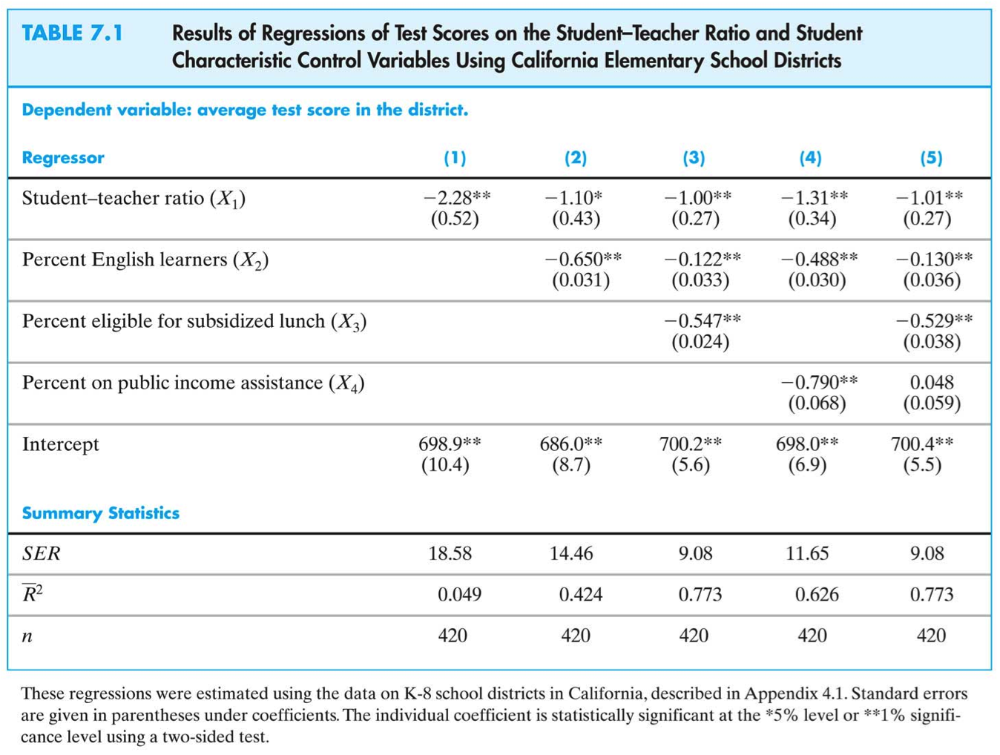

# Specification and Assessment Issues {#specification}

## Specification of your model

How to decide which variables to include in a regression\

A closer look at the test score data. We want to get an unbiased estimate of the effect on test scores of changing class size, holding constant student and school characteristics but not necessarily holding constant the budget (*why*)

To do this we need to think about what variables to include and what regressions to run---and we should do this before we actually sit down at the computer. Think beforehand about your model specification.

general approach to variable selection and "model specification"
- Specify a base or benchmark model.
- Specify a range of plausible alternative models, which include additional candidates
- Does a candidate variable change the coefficient of interest ($\hat{\beta}_1$)?
- Is a candidate variable statistically significantly different from zero?
- Use judgment, not a mechanical recipe 
- Don't just try to maximize \alert{$\bar{R^2}$}!

Digression about measures of fit

It is easy to fall into the trap of maximizing the $\bar{R^2}$---but this loses sight of our real objective, an unbiased estimator of the class size effect. A high $\bar{R^2}$ means that the regressors explain the variation in $Y$.
- A high $\bar{R^2}$ does not mean that you have eliminated omitted variable bias.
- A high $\bar{R^2}$ does not mean that you have an unbiased estimator of a causal effect $(\beta_1)$.
- A high $\bar{R^2}$ does not mean that the included variables are statistically significant


Back to the test score application:
What variables would you want---ideally---to estimate the effect on test scores of $STR$ using school district data?

Variables actually in the California class size data set:
- student-teacher ratio ($STR$)
- percent English learners in the district ($PctEL$)
- school expenditures per pupil
- name of the district (so we could look up average rainfall, for example)
- percent eligible for subsidized/free lunch
- percent on public income assistance
- average district income

Which of these variables would you want to include?

More California data

```{r, echo=FALSE, fig.cap = "Test scores versus various independent variables", label='cadata'}
knitr::include_graphics("./figures/cadata.png")
```

## Presentation of results

Digression on presentation of regression results. We have a number of regressions and we want to report them. It is awkward and difficult to read regressions written out in equation form, so instead it is conventional to report them in a table.

A table of regression results should include:
- estimated regression coefficients
- standard errors
- measures of fit
- number of observations
- relevant $F$-statistics, if any
- any other pertinent information.

Find this information in the following table:

```{r, echo=FALSE, fig.cap = "Various specifications of test score models", label='catable'}

```

## Potential sources of bias

Is there a systematic way to assess regression studies?
Multiple regression has some key virtues:

1. It provides an estimate of the marginal effect of $X$ on $Y$.
2. It resolves the problem of omitted variable bias, if an omitted variable can be measured and included.
3. It can handle nonlinear relations (effects that vary with the $X$'s)

Still, OLS might yield a **biased** estimator of the true causal effect---it might not yield valid inferences

A framework for assessing statistical studies: internal and external validity}
- **Internal validity** the statistical inferences about causal effects are valid for the population being studied.
- **External validity**: the statistical inferences can be generalized from the population and setting studied to other populations and setting.

Threats to external validity

How far can we generalize class size results from California school districts?

- Differences in populations
    - California in 2005?
    - Massachusetts in 2005?
    - Mexico in 2005?
    
Differences in settings
    - different legal requirements concerning special education
    - different treatment of bilingual education
    - differences in teacher characteristics
    
Threats to \alert{internal} validity of multiple regression analysis

**Internal validity**: the statistical inferences about causal effects are valid for the population being studied.

Five Threats to the internal validity of regression studies:

1. Omitted variable bias
2. Wrong functional form
3. Errors-in-variables bias
4. Sample selection bias
5. Simultaneous causality bias

All of these imply that $E(u_i|X_{1i},\ldots,X_{ki}) \neq 0$---in which case OLS is **biased**.

Omitted variable bias

Omitted variable bias arises if an omitted variable is both: a determinant of $Y$ and correlated with at least one included regressor.
We first discussed omitted variable bias in regression with a single $X$, but OV bias will arise when there are multiple $X$'s as well, if the omitted variable satisfies the two conditions above.

Potential solutions to omitted variable bias

- If the variable can be measured, include it as an additional regressor in multiple regression;
- Possibly, use panel data in which each entity (individual) is observed more than once;
- If the variable cannot be measured, use instrumental variables regression (for later courses);
- Run a randomized controlled experiment.

Wrong functional form

Arises if the functional form is incorrect---for example, an interaction term is incorrectly omitted; then inferences on causal effects will be biased.

Potential solutions to functional form misspecification
- use the appropriate nonlinear specifications in $X$ (logarithms, interactions, etc.)

Measurement error

So far we have assumed that $X$ is measured without error. In reality, (economic) data often have measurement error

Recollection errors in surveys (when did you start your current job?)

Ambiguous questions problems (what was your income last year?)

Intentionally false response problems with surveys (What is the current value of your financial assets? How often do you drink and drive?)

Potential solutions to errors-in-variables bias

- Obtain better data (duh) 
- Develop a specific model of the measurement error process. This is only possible if a lot is known about the nature of the measurement error---for example a subsample of the data are cross-checked using administrative records and the discrepancies are analyzed and modelled. 
- Instrumental variables regression.

Sample selection bias

So far we have assumed simple random sampling of the population. In some cases, simple random sampling is thwarted because the sample, in effect, **selects itself**.


Sample selection bias arises when a selection process:
- influences the availability of data and
- that process is related to the dependent variable.

```{r, echo=FALSE, fig.cap = "Relation heigh fathers and height children", label='Rplot'}
knitr::include_graphics("./figures/Rplot.png")
```

```{r, echo=FALSE, fig.cap = "Relation heigh fathers and height children", label='Rplot01'}
knitr::include_graphics("./figures/Rplot01.png")
```

Example 1: aircraft noise externality

To what extent do people ``value'' aircraft noise ?
Empirical strategy
Sampling scheme: collect housing prices close to Schiphol airport (Zwanenburg) and compare them with identical houses further away (Schagen) 

Data: Housing prices for North-Holland since 1985 

- Estimator: average mean difference between Zwanenburg and Schagen location 
- Is there sample selection bias?

Example 2: returns to education
- What is the return to an additional year of education?
- Empirical strategy:
    - Sampling scheme: simple random sample of employed college grads (employed, so we have wage data)
    - Data: earnings and years of education
    - Estimator: regress $\ln(Earnings)$ on $YearsEducation$

Ignore issues of omitted variable bias and measurement error---is there sample selection bias?

Potential solutions to sample selection bias
- Collect the sample in a way that avoids sample selection.
    - aircraft noise: look at people who moved between Schagen and Zwanenburg. 
    - Returns to education example: sample college graduates, not workers (include the unemployed)

Randomized controlled experiment.

- Construct a model of the sample selection problem and estimate that model (we won't do this).

Simultaneous causality bias in equations

- Causal effect on $Y$ of $X$: $Y_i = \beta_0 + \beta_1 X_i + u_i$
- Causal effect on $X$ of $Y$: $X_i = \gamma_0 + \gamma_1 Y_i + v_i$
\
Large $u_i$ means large $Y_i$, which implies large $X_i$ (if $\gamma_1>0$)
Thus $corr(X_i,u_i) \neq 0$
Thus $\hat{\beta_1}$ is biased and inconsistent.
Example: A district with particularly bad test scores given the $STR$ (negative $u_i$) receives extra resources, thereby lowering its $STR$; so $STR_i$ and $u_i$ are correlated

Potential solutions to simultaneous causality bias
Randomized controlled experiment. Because $X_i$ is chosen at random by the experimenter, there is no feedback from the outcome variable to $Y_i$ (assuming perfect compliance).
Develop and estimate a complete model of both directions of causality. This is the idea behind many large macro models (e.g. Federal Reserve Bank-US). This is extremely difficult in practice.

- Use instrumental variables regression to estimate the causal effect of interest (effect of $X$ on $Y$, ignoring effect of $Y$ on $X$).


OLS is a powerful tool and often used in all social sciences, but it hinges upon three assumptions from which $E(u_i|X_{1i},\ldots,X_{ki}) = 0$ is difficult to satisfy in reality because:

1. Omitted variable bias
2. Wrong functional form
3. Errors-in-variables bias
4. Sample selection bias
5. Simultaneous causality bias
